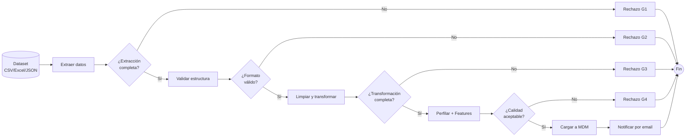

# Sistema Data Wrangling — Predicción de Precios de Vivienda en Bogotá


Pipeline ETL automatizado que transforma datasets inmobiliarios heterogéneos en una tabla maestra limpia y unificada, lista para análisis y modelos de predicción de precios.

---

## Descripción

El sistema resuelve el problema de calidad de datos en el sector inmobiliario de Bogotá. Toma datasets de múltiples fuentes (CSV, Excel, JSON) con esquemas inconsistentes, valores nulos, duplicados y ubicaciones fuera del dominio, y ejecuta un pipeline ETL con 4 gateways de validación BPMN 2.0 para producir un Master Data Management (MDM) unificado.



---

## Arquitectura

```
┌─────────────────────────────────────────────────────────┐
│                     PRESENTATION                         │
│          VistaCargaDataset  VistaEstadoPipeline          │
│                VistaResultado  DatasetController          │
├─────────────────────────────────────────────────────────┤
│                     APPLICATION                          │
│         PipelineFacade  IngestionService  CleaningService │
│                PredictionService  DTOs                    │
├─────────────────────────────────────────────────────────┤
│                      DOMAIN                              │
│    Dataset  CleaningReport  RejectionLog  Prediccion     │
│    DatasetValidator  QualityValidator  PredictionValidator│
│    Interfaces: IDataRepository  IEmailService  IDataCleaner│
│    Enums: DatasetStatus  Formato  TipoVariable            │
├─────────────────────────────────────────────────────────┤
│                   INFRASTRUCTURE                          │
│    JsonRepository  FolderStorage  MDMService             │
│    EmailService + Decorators  NotificationService        │
│    NullCleaner  FormatCleaner  DuplicateCleaner          │
│    FeatureAnalyzer  PredictionEngine  Preprocessor        │
└─────────────────────────────────────────────────────────┘
```

### Patrones de Diseño Aplicados

| Patrón | Tipo | Componente |
|--------|------|------------|
| **Facade** | Estructural GoF | `PipelineFacade` |
| **Repository** | GRASP | `JsonRepository`, `IDataRepository` |
| **Strategy** | Comportamiento GoF | `NullCleaner`, `FormatCleaner`, `DuplicateCleaner` |
| **Decorator** | Estructural GoF | `EmailDecorator`, `ValidacionEmailDecorator`, `NotificacionInsercionDecorator` |
| **Observer** | Comportamiento GoF | `NotificationService`, `DatasetController` |
| **Factory Method** | Creacional GoF | `IngestionService` |
| **Controller** | GRASP | `DatasetController` |

---

## Características Clave

- **Pipeline ETL** con 4 gateways XOR de decisión (BPMN 2.0)
- **Soporte multi-dataset**: procesa múltiples archivos en batch con tabla maestra única
- **Validaciones de negocio**: ubicación Bogotá (RB-001), estrato [1-6] (RB-002), duplicados (RB-003), formato/columnas (RB-004), coherencia semántica (RB-005)
- **Feature engineering automático**: `precio_unitario`, `puntaje_entorno`, `densidad_comercial`, `bano_por_hab`, `parqueadero_ratio`, estadísticas temporales por año
- **Columna temporal (fecha/año)**: cada registro incluye el año del registro inmobiliario como feature
- **MDM unificado**: tabla maestra única sin duplicados con metadatos JSON
- **Notificaciones por email**: decoradores que validan y enriquecen los mensajes
- **UI gráfica Tkinter**: selección múltiple, barra de progreso batch, visualización de resultados
- **Trazabilidad completa**: cada rechazo se persiste con gateway, motivo y regla de negocio

---

## Stack Tecnológico

| Componente | Tecnología |
|------------|-----------|
| Lenguaje | Python 3.13 |
| UI | Tkinter / ttk |
| Testing | pytest 8.x, pytest-cov |
| Persistencia | JSON (Repository Pattern) |
| Procesamiento | openpyxl, pandas |
| Notificaciones | smtplib + Decorator Pattern |

---

## Instalación

```bash
git clone https://github.com/asanchez/sistema-data-wrangling-bogota.git
cd sistema-data-wrangling-bogota
python -m venv venv
source venv/bin/activate  # Windows: venv\Scripts\activate
pip install -r requirements.txt
```

## Uso

```bash
python main.py
```

1. **Cargar datasets**: selecciona uno o varios archivos CSV, Excel o JSON
2. **Configurar**: email destino y factor de precio (ej: 1000000 para millones COP)
3. **Procesar**: el pipeline ejecuta automáticamente todas las etapas
4. **Resultados**: visualiza estadísticas, gateways y reporte de limpieza

---

## Estructura del Proyecto

```
sistema-data-wrangling/
├── presentation/              # MVC - Vista y Controladores
│   ├── views/                 # Tkinter Views
│   └── controllers/           # DatasetController, SolicitudController
├── application/               # Servicios de aplicación
│   └── services/              # PipelineFacade, IngestionService, CleaningService
├── domain/                    # Núcleo del negocio
│   ├── entities/              # Dataset, CleaningReport, RejectionLog
│   ├── exceptions/            # Excepciones personalizadas por dominio
│   ├── interfaces/            # Contratos (IDataRepository, IEmailService, etc.)
│   ├── enums/                 # DatasetStatus, Formato, TipoVariable
│   └── validators/            # DatasetValidator, QualityValidator
├── infrastructure/            # Implementaciones técnicas
│   ├── repositories/          # JsonRepository, FolderStorage
│   ├── cleaning/              # NullCleaner, FormatCleaner, DuplicateCleaner
│   ├── notifications/         # EmailService, decorators
│   ├── mdm/                   # MDMService
│   ├── analytics/             # FeatureAnalyzer, PredictionEngine
│   └── ingestion/             # DataLoader
├── tests/                     # Pruebas unitarias
│   ├── unit/
│   │   ├── domain/            # Tests de entidades y validadores
│   │   └── ...
│   └── integration/           # Tests de integración
├── docs/                      # Documentación técnica
├── main.py                    # Punto de entrada
└── .env                       # Configuración SMTP
```

---

## Pruebas

```bash
# Ejecutar todas las pruebas
pytest tests/ -v

# Con cobertura
pytest tests/ --cov=domain --cov=application --cov=infrastructure --cov-report=term-missing

# Tests específicos
pytest tests/unit/test_pipeline_bpmn_flow.py -v
```

**Resultado actual: 46 tests, 0 fallos, cobertura >80%.**

---

## Reglas de Negocio

| ID | Regla | Descripción | Validación |
|----|-------|-------------|------------|
| **RB-001** | Solo Bogotá | Ubicación debe ser Bogotá | `DatasetValidator.validar_ubicacion()` |
| **RB-002** | Estrato [1-6] | Estrato entero en rango 1-6 | `DatasetValidator.validar_estrato()` |
| **RB-003** | Sin duplicados | No duplicados por (ubicacion, tamano_m2) | `DuplicateCleaner.clean()` |
| **RB-004** | Formato válido | Archivo CSV/Excel/JSON con columnas mínimas | `DatasetValidator.validar_formato_archivo()` |
| **RB-005** | Coherencia semántica | Valores dentro de rangos lógicos | `QualityValidator.validar_consistencia_semantica()` |
| **RB-006** | Notificación | Toda inserción notifica por email | `EmailDecorator`, `NotificationService` |

---

## Licencia

MIT License — ver archivo `LICENSE` para detalles.

---

## Autor

**Adán Y. Sánchez Cubillos** — [danysancubi@gmail.com](mailto:danysancubi@gmail.com)

Universidad de La Salle — Lenguaje de Programación 2 / Ciencia de Datos — 2026
