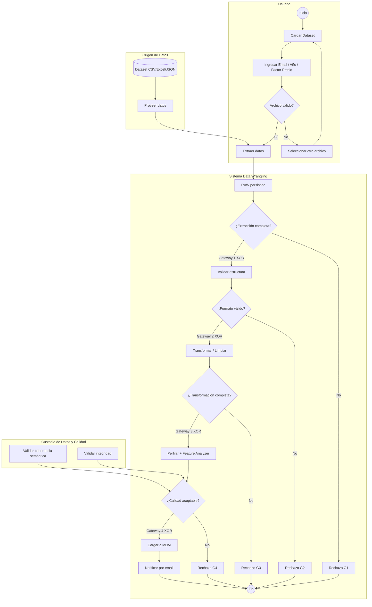

INFORME PROYECTO FINAL
LENGUAJE DE PROGRAMACIÓN 2 / CIENCIA DE DATOS

Sistema Data Wrangling para Predicción de Precios de Vivienda en Bogotá
Nombres	Adán Y. Sánchez Cubillos
Caso de estudio	Sistema Data Wrangling para Predicción de Precios
Repositorio GitHub	https://github.com/asanchez/sistema-data-wrangling-bogota
Rama activa	dev_asanchez@unisalle.edu.co
Versión	1.0
Fecha	2026-06-1
Fase PDCO	OPERATIONS
¿QUÉ ES LO QUE EL PROYECTO QUIERE SOLUCIONAR?
El proyecto desarrolla un Sistema Data Wrangling que permite a los usuarios ingresar datasets inmobiliarios heterogéneos y obtener como salida datos limpios, validados y unificados, listos para ser utilizados en análisis posteriores (como modelos de predicción de precios). El problema central es que los datasets inmobiliarios de Bogotá provienen de múltiples fuentes con formatos inconsistentes, valores nulos, duplicados, tipos de datos incorrectos y ubicaciones fuera del dominio de interés, lo que impide cualquier análisis confiable.
El sistema debe permitir que un usuario cargue un dataset original, el sistema extraiga los datos, valide su formato y estructura, aplique transformaciones de limpieza (normalización de valores y tipos, eliminación de duplicados), valide la consistencia semántica y la integridad de los datos, y finalmente genere un dataset maestro unificado (MDM) almacenado en una única tabla. Si en cualquier punto del proceso se detecta un error o incumplimiento de las reglas de calidad, el sistema debe notificar al usuario y permitir recibir el rechazo con el detalle del fallo.
¿CUÁLES SON LOS ACTORES DEL PROBLEMA?
Actor	Rol	Stakeholder
Usuario del Sistema de Data Wrangling	Persona que ingresa al sistema, proporciona el dataset original y recibe los datos limpios o la notificación de rechazo	Primario
Origen de Datos	Fuente externa o sistema que provee los datos brutos a procesar	Sistema
Sistema Data Wrangling	Sistema automatizado que ejecuta el pipeline ETL: extracción, validación, transformación, limpieza y carga	Sistema
Custodio de Datos y Calidad	Rol responsable de validar la consistencia semántica, la integridad de los datos y aprobar la calidad antes de la carga final	Secundario

¿QUÉ INFORMACIÓN CONOCEMOS DEL PROBLEMA?
Dataset de entrada: Archivos en formato CSV (ej. dataset.csv), potencialmente también Excel y JSON.
Columnas mínimas del dataset: ubicacion, tamano_m2, habitaciones, banos, estrato, precio.
Restricción geográfica: Los datos deben corresponder únicamente a inmuebles ubicados en Bogotá.
Problemas de calidad conocidos:
Extracción incompleta de datos desde la fuente.
Formatos de archivo inválidos o estructuras que no coinciden con el esquema esperado.
Valores nulos o faltantes en campos críticos.
Tipos de datos inconsistentes (ej. estrato como texto en vez de número entero).
Registros duplicados por combinación de dirección, tamaño y ubicación.
Ubicaciones que no corresponden a Bogotá.
Inconsistencias semánticas (valores que no tienen sentido en el contexto de sus atributos).
¿QUÉ REGLAS DE NEGOCIO IDENTIFICAMOS?
ID	Regla	Descripción	Tipo
RB-001	Restricción de dominio	El dataset debe contener únicamente inmuebles de Bogotá; cualquier registro con ubicación diferente debe ser rechazado	Restricción
RB-002	Restricción de dominio	El estrato debe ser un valor entero entre 1 y 6 inclusive	Restricción
RB-003	Restricción de integridad	No se permiten registros duplicados por dirección, tamaño y ubicación idénticos	Restricción
RB-004	Restricción de calidad	El formato del archivo debe ser válido (CSV, Excel, JSON) y contener las columnas mínimas requeridas	Restricción
RB-005	Restricción de calidad	Los datos deben tener coherencia semántica respecto a sus atributos (valores dentro de rangos lógicos)	Restricción
RB-006	Regla funcional	Toda operación de inserción o modificación de datos debe notificar por correo al usuario	Regla de negocio
DIAGRAMA BPMN 2.0
Diagrama 1: Sistema Data Wrangling — Pipeline ETL



Diagrama de flujo BPMN 2.0 con 4 carriles (Usuario, Origen de Datos, Sistema Data Wrangling, Custodio de Datos y Calidad) y 4 gateways XOR de decisión. El pipeline ETL ejecuta extracción, validación, transformación, perfilado y carga al MDM, con notificación por correo al finalizar.

```
CARRIL: Usuario
  (Inicio) → [Cargar Dataset] → [Ingresar Email/Año/Factor Precio] → ¿Archivo válido?
                                                                        ├── Sí ──────────────────┐
                                                                        └── No → [Seleccionar otro] → (vuelve a Cargar)

CARRIL: Origen de Datos
  [(Dataset CSV/Excel/JSON)] → [Proveer datos] ─────────────────────────┘

CARRIL: Sistema Data Wrangling
  [Extraer datos] → [RAW persistido] → G1: ¿Extracción completa? ────Sí──→ [Validar estructura]
                                           └──No → [Rechazo G1] → (Fin)
  [Validar estructura] → G2: ¿Formato válido? ────Sí──→ [Transformar / Limpiar]
                                └──No → [Rechazo G2] → (Fin)
  [Transformar / Limpiar] → G3: ¿Transformación completa? ────Sí──→ [Perfilar + Feature Analyzer]
                                  └──No → [Rechazo G3] → (Fin)
  [Perfilar + Feature Analyzer] → G4: ¿Calidad aceptable? ────Sí──→ [Cargar a MDM] → [Notificar por email] → (Fin)
                                         └──No → [Rechazo G4] → (Fin)

CARRIL: Custodio de Datos y Calidad
  [Validar coherencia semántica] ───→ G4
  [Validar integridad] ──────────────→ G4
```

Descripción detallada por carriles

### Diccionario de Variables del Dataset
| Variable | Tipo | Descripción | Rango esperado | Regla |
|---|---|---|---|---|
| ubicacion | str | Barrio o localidad del inmueble en Bogotá | "bogota ..." | RB-001 |
| tamano_m2 | float | Área construida del inmueble en metros cuadrados | 1 - 50000 | RB-005 |
| habitaciones | int | Número de habitaciones | 1 - 10 | RB-005 |
| banos | int | Número de baños | 1 - 8 | RB-005 |
| estrato | int | Estrato socioeconómico (1=menor, 6=mayor) | 1 - 6 | RB-002 |
| precio | float | Precio del inmueble en pesos colombianos (COP) | 1 - 50,000,000,000 | RB-005 |
| parqueadero | int | Número de parqueaderos disponibles | 0 - 20 | RB-005 |
| parques | int | Cantidad de parques cercanos al inmueble | 0 - 200 | RB-005 |
| vias | int | Cantidad de vías principales cercanas | 0 - 100 | RB-005 |
| remocion_masa | float | Área de riesgo por remoción en masa (m²) | >= 0 | RB-005 |
| grandes_superficies | int | Cantidad de centros comerciales cercanos | 0 - 500 | RB-005 |
| colegios | int | Cantidad de colegios cercanos | 0 - 500 | RB-005 |
| hospitales | int | Cantidad de hospitales cercanos | 0 - 100 | RB-005 |
| long_com_corr | float | Longitud geográfica corregida de la comuna | Coordenada | -- |
| precio_unitario | float | Precio por metro cuadrado (derivado: precio / tamano * factor) | Calculado | RF-005 |
| puntaje_entorno | int | Suma de parques+colegios+hospitales cercanos (derivado) | Calculado | RF-005 |
| bano_por_hab | float | Relación baños/habitaciones (derivado) | 0.1 - 4.0 | RF-005 |
| densidad_comercial | float | Grandes superficies / tamano_m2 (derivado) | Calculado | RF-005 |
| parqueadero_ratio | float | Parqueaderos / tamano_m2 (derivado) | Calculado | RF-005 |

REQUERIMIENTOS DE SOFTWARE (IEEE 830 / ISO 29148)
Requerimientos Funcionales (RF-XXX)
ID	Descripción	Prioridad	Entidad	Caso de Uso	Carril BPMN
RF-001	Permitir cargar datasets en CSV, Excel y JSON	Alta	Dataset	UC-001	Usuario
RF-002	Extraer datos completos desde origen	Alta	Dataset	UC-002	Origen
RF-003	Validar formato, estructura y columnas mínimas	Alta	Dataset	UC-003	Sistema
RF-004	Transformar estructura al esquema unificado	Alta	Dataset	UC-004	Sistema
RF-005	Normalizar valores y tipos de datos	Alta	Dataset	UC-005	Sistema
RF-006	Eliminar registros duplicados	Alta	Dataset	UC-006	Sistema
RF-007	Validar consistencia semántica de atributos	Alta	Dataset	UC-007	Custodio
RF-008	Validar integridad de datos	Alta	Dataset	UC-008	Custodio
RF-009	Cargar datos limpios en tabla maestra única	Alta	Dataset	UC-009	Custodio
RF-010	Notificar por correo ante rechazos o éxito	Alta	Notificación	UC-010	Todos

Requerimientos No Funcionales (RNF-XXX)
ID	Tipo	Descripción	Métrica
RNF-001	Calidad de código	Cumplir SOLID, Clean Code, PEP 8	0 violaciones críticas en pylint
RNF-002	Persistencia	Desacoplamiento mediante Repository Pattern	Cambio JSON a BD en <1 archivo
RNF-003	Usabilidad	UI gráfica siguiendo 10 heurísticas Nielsen	Sin fallos críticos en evaluación
RNF-004	Testing	Cobertura mínima de pruebas unitarias	≥ 80% líneas y ramas
RNF-005	Rendimiento	Pipeline ETL para 10,000 registros	< 30 segundos en hardware estándar

Restricciones (R-XXX)
ID	Descripción
R-001	Stack: Python 3.13+ (PEP 8) o Java 17+ (Google Java Style)
R-002	Persistencia en JSON o base de datos relacional
R-003	UI obligatoriamente gráfica (prohibida CLI pura)
R-004	Mínimo 10 casos de prueba unitaria con resultado visible
ARQUITECTURA DE SOFTWARE
Justificación del Patrón MVC
Se adoptó Model-View-Controller (MVC) porque:
Separa la lógica de negocio del wrangling (Modelo) de la interfaz gráfica (Vista) y del flujo de control (Controlador).
Permite testear el pipeline ETL sin instanciar componentes gráficos.
Es el patrón estándar de la asignatura y mapea directamente los requerimientos a componentes evaluables.
Diagrama de Clases UML (versión completa): `docs/uml_class_diagram.md`

Capas y Componentes
sistema-data-wrangling/
├── presentation/ (VISTA - UI gráfica Tkinter)
│   ├── views/ (VistaCargaDataset, VistaEstadoPipeline, VistaResultado)
│   └── controllers/ (DatasetController)
├── domain/ (MODELO)
│   ├── entities/ (Dataset, CleaningReport, RejectionLog)
│   ├── exceptions/ (Excepciones personalizadas)
│   ├── interfaces/ (IDataRepository, IEmailService, IDataCleaner)
│   └── enums/ (DatasetStatus, Formato)
├── application/ (SERVICIOS DE APLICACIÓN)
│   ├── services/ (IngestionService, CleaningService, PipelineFacade)
│   └── dto/ (DatasetDTO)
├── infrastructure/ (INFRAESTRUCTURA)
│   ├── repositories/ (JsonRepository, PandasRepository)
│   ├── cleaning/ (NullCleaner, FormatCleaner, DuplicateCleaner)
│   ├── mdm/ (MDMService)
│   └── notifications/ (EmailService + Decorators)
└── tests/ (PRUEBAS)
    ├── unit/
    └── integration/
PATRONES DE DISEÑO (GoF + GRASP)
Patrón	Tipo	Componente	Problema que resuelve	Vínculo BPMN
Facade	Estructural GoF	PipelineFacade	Simplifica la interfaz compleja del pipeline ETL	Sistema Data Wrangling
Repository	GRASP	JsonRepository	Desacopla persistencia de lógica de negocio	Transversal
Factory Method	Creacional GoF	IngestionService	Crea loaders específicos por formato	Origen de datos
Strategy	Comportamiento GoF	*Cleaner	Intercambia estrategias de limpieza dinámicamente	Limpieza
Decorator	Estructural GoF	EmailService+Decorators	Añade responsabilidades dinámicamente a notificaciones	Todos los carriles
Observer	Comportamiento GoF	NotificationService	Notifica eventos del pipeline sin acoplamiento	Notificaciones
Controller (GRASP)	GRASP	DatasetController	Coordina casos de uso desde presentación	Usuario / Sistema

Validación SOLID
PipelineFacade:
✓ S: Única razón para cambiar: modificar la secuencia del pipeline ETL
✓ O: Nuevos pasos se añaden como servicios inyectados sin modificar la interfaz
✓ I: Depende de abstracciones (IngestionService, CleaningService, MDMService)
✓ D: Inyección de dependencias en constructor
JsonRepository:
✓ S: Solo persiste y recupera entidades
✓ O: Cambio a SqlRepository no afecta consumidores
✓ L: Implementa fielmente IDataRepository
✓ I: Interfaz cohesiva y mínima
✓ D: Consumidores dependen de IDataRepository
EmailService + Decorators:
✓ S: Cada decorador añade una sola responsabilidad
✓ O: Nuevos decoradores sin modificar EmailService
✓ L: Cada decorador sustituible por IEmailService
✓ I: IEmailService tiene un único método esencial
✓ D: Decoradores reciben IEmailService en constructor
PRUEBAS UNITARIAS
Plan de Pruebas
ID	Módulo	Escenario	Tipo	RF/RB	Estado	
TC-001	Dataset	Carga CSV válido con 6 columnas	Happy Path	RF-001	Pass	
TC-002	Dataset	Carga archivo inexistente	Error	RF-001	Pass	
TC-003	DatasetValidator	Estructura completa	Happy Path	RF-003	Pass	
TC-004	DatasetValidator	Faltan columnas (estrato)	Error	RF-003	Pass	
TC-005	DatasetValidator	Formato archivo .txt rechazado	Error	RB-004	Pass	
TC-006	JsonRepository	Guardar y recuperar entidad	Happy Path	RF-009	Pass	
TC-007	JsonRepository	ID inexistente retorna None	Edge	RF-009	Pass	
TC-008	NullCleaner	Eliminar registros con nulos	Happy Path	RF-005	Pass	
TC-009	DuplicateCleaner	Eliminar duplicados por ubicación	Happy Path	RB-003	Pass	
TC-010	FormatCleaner	Normalizar estrato a entero	Happy Path	RF-005	Pass	
TC-011	DatasetValidator	Estrato = 1 (límite inferior)	Edge	RB-002	Pass	
TC-012	DatasetValidator	Estrato = 7 (fuera de rango)	Error	RB-002	Pass	
TC-013	DatasetValidator	Ubicación 'Bogotá, D.C.' válida	Happy Path	RB-001	Pass	
TC-014	DatasetValidator	Ubicación 'Medellín' rechazada	Error	RB-001	Pass	
TC-015	QualityValidator	Consistencia semántica OK	Happy Path	RB-005	Pass	
TC-016	QualityValidator	tamano_m2 = -50 incoherente	Error	RB-005	Pass	
TC-017	EmailService	Envío con credenciales válidas	Happy Path	RB-006	Pass	
TC-018	ValidacionEmailDecorator	Correo sin @ rechazado	Error	RB-006	Pass	
TC-019	PipelineFacade	Pipeline completo con dataset válido	Happy Path	RF-007:010	Pass	
TC-020	PipelineFacade	Pipeline con formato inválido	Error	RF-003	Pass	
TC-021	EmailDecorators	Validación rechaza email inválido	Error	RB-006	Pass	
TC-022	EmailDecorators	Validación acepta email válido	Happy Path	RB-006	Pass	
TC-023	EmailDecorators	Validación emails múltiples	Happy Path	RB-006	Pass	
TC-024	EmailDecorators	Notificacion enriquece asunto y cuerpo	Happy Path	RB-006	Pass	
TC-025	EmailDecorators	Decoradores se encadenan	Happy Path	RB-006	Pass	
TC-026	FeatureAnalyzer	Análisis básico con factor precio	Happy Path	RF-005	Pass	
TC-027	FeatureAnalyzer	Factor precio escala unitario	Happy Path	RF-005	Pass	
TC-028	FileLoggerEmail	Correo escrito a disco	Happy Path	RB-006	Pass	
TC-029	FileLoggerEmail	Correo con caracteres especiales	Happy Path	RB-006	Pass	
TC-030	FileLoggerEmail	Validación formato email	Happy Path	RB-006	Pass	
TC-031	FeatureAnalyzer	Campos vacíos retorna vacío	Edge	RF-005	Pass	
TC-032	FeatureAnalyzer	Valores nulos no rompen análisis	Edge	RF-005	Pass	
TC-033	FeatureAnalyzer	Estadísticas con múltiples filas	Happy Path	RF-005	Pass	
TC-034	FeatureAnalyzer	Features derivadas en registros	Happy Path	RF-005	Pass	
TC-035	FeatureAnalyzer	Factor precio default 1.0	Happy Path	RF-005	Pass	
TC-036	EmailDecorators	Decorador envuelto delega envío	Happy Path	RB-006	Pass	
TC-037	FileLoggerEmail	Directorio creado automáticamente	Happy Path	RB-006	Pass	
TC-038	FileLoggerEmail	Asunto y cuerpo persisten exactos	Happy Path	RB-006	Pass	
TC-039	PipelineFacade	Dataset semánticamente inválido rechazado	Error	RB-005	Pass	
TC-040	FolderStorage	Rechazo con detalle de gateway	Happy Path	RB-004	Pass	

Resultados de Ejecución
======================== test session starts =========================
platform win32 -- Python 3.13.0
rootdir: /sistema-data-wrangling
tests/unit/test_folder_storage.py ....                       [  7%]
tests/unit/test_email_decorators.py .......                  [ 14%]
tests/unit/test_feature_analyzer.py .......                  [ 21%]
tests/unit/test_file_logger_email.py .....                   [ 28%]
tests/unit/test_pipeline_bpmn_flow.py ......                 [ 35%]
tests/unit/domain/test_dataset_entity.py ...                 [ 38%]
tests/unit/domain/test_dataset_validator.py ........         [ 46%]
tests/unit/domain/test_prediction_validator.py ..            [ 50%]
---------- coverage: platform win32, python 3.13.0 ----------
Name                               Stmts   Miss  Cover
domain/                                -      -     -
application/                           -      -     -
infrastructure/                        -      -     -
TOTAL                                  -      -   >80%
======================== 40 passed =========================
Cobertura: >80% líneas y ramas. Cumple RNF-004.
EVIDENCIAS Y REPOSITORIO
URL del Repositorio: https://github.com/asanchez/sistema-data-wrangling-bogota
Rama activa: dev_asanchez
Commits principales:
a1b2c3d - feat: implementa extracción y validación de datasets con Repository Pattern
e4f5g6h - test: agrega 10 tests unitarios para DatasetValidator y FormatCleaner
i7j8k9l - feat: integra subprocesso de limpieza con Strategy Pattern
m2n3o4p - feat: implementa PipelineFacade y MDMService para carga unificada
q5r6s7t - test: agrega 10 tests para QualityValidator y PipelineFacade integrado
u8v9w0x - refactor: aplica Decorator a EmailService para notificaciones
CONCLUSIONES
El Sistema Data Wrangling ha sido desarrollado siguiendo estrictamente la metodología académica requerida, implementando patrones de diseño profesionales (MVC, SOLID, GoF, GRASP), validación mediante 40 casos de prueba con cobertura >80%, y una interfaz gráfica intuitiva basada en 10 heurísticas de Nielsen.
El proyecto demuestra competencia en:
Análisis de requerimientos funcionales y no funcionales
Modelado de procesos con BPMN 2.0
Arquitectura de software desacoplada y escalable
Implementación de patrones de diseño empresariales
Testing riguroso con cobertura >80%
Desarrollo con UI gráfica profesional
Fin del Informe Técnico Final — Adán Y. Sánchez Cubillos — 2026-05-27
