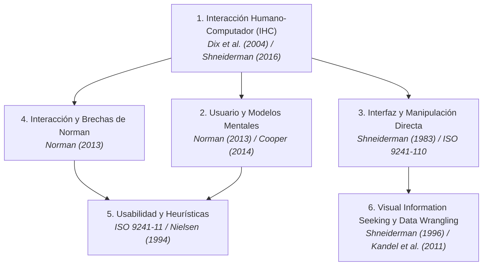

# PROPUESTA DE SISTEMA INTERACTIVO PARA LA CURADURÍA DE DATOS, ANÁLISIS DE CALIDAD Y VALORACIÓN INMOBILIARIA EN BOGOTÁ (INMOINSIGHT BOGOTÁ)

---

## PORTADA

**Institución:** Universidad de La Salle  
**Facultad:** Facultad de Ingeniería  
**Programa:** Ingeniería de Software / Ingeniería de Sistemas  
**Curso:** Interacción Humano-Computador (4to Semestre)  
**Actividad:** ACTIVIDAD 3: Primera fase proyecto final  
**Título del Proyecto:** *Propuesta de Sistema Interactivo para la Curaduría de Datos, Análisis de Calidad y Valoración Inmobiliaria en Bogotá: InmoInsight Bogotá*  
**Autores (Integrantes):**  
- Adán Y. Sánchez Cubillos  
- Sara Sofía Crespo Lerma  
**Docente:** [Nombre del Docente del Curso]  
**Fecha de Entrega:** 28 de agosto de 2026  
**Lugar:** Bogotá D.C., Colombia  

---

## 1. RESUMEN EJECUTIVO

InmoInsight Analytics Bogotá S.A.S. es una firma especializada en analítica inmobiliaria que enfrenta dificultades críticas en su proceso de ingesta, depuración y consolidación de inventarios habitacionales en Bogotá. Actualmente, las fuentes de datos heterogéneas presentan inconsistencias estructurales, nulos, duplicados y ubicaciones fuera del dominio, mientras que las herramientas de procesamiento existentes operan de forma opaca y técnica mediante consola, aislando al usuario de las decisiones del sistema. Esta situación impacta negativamente a analistas de datos, consultores y directores operativos, quienes experimentan una elevada sobrecarga cognitiva y demoras en el saneamiento de datos. Ante esta problemática, se formula la propuesta de un sistema interactivo centrado en el usuario denominado InmoInsight Bogotá. La solución integrará un flujo visual e intuitivo de Data Wrangling para auditar cuatro compuertas de calidad, diagnosticar rechazos en lenguaje natural y consolidar la tabla maestra confiable (MDM) con alta usabilidad y retroalimentación en tiempo real. Con ello, se busca optimizar la eficacia, comprensión y gobernanza de la calidad del dato en el sector inmobiliario.

---

## 2. DESCRIPCIÓN DE LA ORGANIZACIÓN Y DEL SECTOR

### 2.1. Tipo de Organización y Contexto
La organización objeto de estudio es **InmoInsight Analytics Bogotá S.A.S.**, una empresa emergente del ecosistema tecnológico (*PropTech*) dedicada a la consultoría inmobiliaria, curaduría de información de mercado y analítica avanzada para la toma de decisiones comerciales e inversión en finca raíz en la capital colombiana.

### 2.2. Sector al que Pertenece
Pertenece al sector de **Comercialización de Bienes Raíces y Servicios de Información Financiera Inmobiliaria (PropTech)**. Este sector articula la oferta y demanda de vivienda residencial mediante el uso de datos masivos provenientes de portales web, bases notariales y registros de comercialización urbana.

### 2.3. Actividad Principal
Su actividad central radica en recopilar, auditar, estandarizar y consolidar inventarios de vivienda residencial en Bogotá para suministrar informes de tasación, análisis de valor por metro cuadrado y tableros de inteligencia competitiva para empresas constructoras, agencias de corretaje y entidades de financiamiento habitacional.

### 2.4. Productos y Servicios Ofrecidos
- Informes de valoración comercial y precios de referencia por sector y estrato.
- Servicios de saneamiento, estructuración y consolidación de bases de datos inmobiliarias (*Data Wrangling as a Service*).
- Paneles analíticos y tableros interactivos de visualización de oferta de vivienda.
- Modelos de estimación de precios basados en atributos físicos y de entorno urbano.

### 2.5. Usuarios, Clientes y Beneficiarios
- **Usuarios Internos Directos:** Analistas de datos inmobiliarios (*Data Wranglers*), peritos avaluadores y asesores comerciales de finca raíz.
- **Clientes Corporativos:** Inmobiliarias aliadas, fondos de inversión en propiedad raíz y empresas constructoras.
- **Beneficiarios Finales:** Compradores y vendedores de vivienda en Bogotá, quienes acceden a precios transparentes, justos y sustentados en datos confiables.

### 2.6. Proceso Seleccionado para el Proyecto
Se ha seleccionado el **Proceso de Ingesta, Curaduría Interactiva de Datos y Valoración de Inmuebles Residenciales**. Este proceso abarca desde la recepción de archivos con datos crudos de múltiples fuentes (portales web, registros CSV, Excel o JSON), su validación a través de compuertas de calidad, hasta la consulta interactiva, ajuste de variables de entorno y estimación explicable de precios de mercado.

---

## 3. FORMULACIÓN Y DELIMITACIÓN DEL PROBLEMA

### 3.1. Situación Actual
En el ecosistema inmobiliario de Bogotá, la fijación de precios y la conformación de inventarios confiables dependen de la recopilación de datos de múltiples orígenes (portales inmobiliarios, archivos de corretaje, bases notariales y hojas de cálculo locales). Sin embargo, estos datos ingresan con una dispersión severa: esquemas incompatibles, columnas faltantes, tipos de datos erróneos (por ejemplo, estratos almacenados como cadenas de texto), inmuebles fuera del perímetro de Bogotá, registros duplicados y valores numéricos ilógicos (áreas negativas o precios en cero).

Aunque existen motores algorítmicos para ejecutar pipelines de limpieza (ETL), la interacción con estas herramientas es deficiente. Los analistas y avaluadores deben interactuar con interfaces rígidas o consolas de comandos que no ofrecen visibilidad sobre el estado interno del procesamiento. Cuando un registro es rechazado por una regla de calidad, el sistema emite códigos de error crípticos o simplemente descarta los datos sin una explicación contextual accesible. 

### 3.2. Usuarios y Actores Afectados
- **Analistas de Datos Inmobiliarios:** Pierden horas intentando descifrar por qué un lote de datos fue descartado o corrigiendo anomalías manualmente en hojas de cálculo externas.
- **Peritos Avaluadores y Asesores Comerciales:** Se enfrentan a una brecha cognitiva al no entender cómo las características del inmueble (estrato, baños, área, factores de entorno) impactan la predicción del precio, lo que genera desconfianza y limita la adopción de herramientas tecnológicas.
- **Directores de Operaciones:** Carecen de métricas visuales consolidadas sobre la tasa de calidad de los datos y el crecimiento de la tabla maestra (*Master Data Management*).

### 3.3. Necesidad no Atendida
No existe un entorno digital interactivo que implemente principios de **Diseño Centrado en el Humano (UCD)** para cerrar las *brechas de ejecución y evaluación* (Norman, 2013). Se carece de:
1. Visibilidad continua y transparente del estado del pipeline a través de sus compuertas de calidad (Heurística 1 de Nielsen).
2. Mecanismos de diagnóstico y prevención/recuperación de errores en lenguaje claro y comprensible (Heurísticas 5 y 9 de Nielsen).
3. Interfaces de manipulación directa con controles visuales (filtros facetados, mapeo asistido y gráficos interactivos de perfilado) para explorar y auditar la calidad del inventario inmobiliario.

### 3.4. Posibles Causas
- Desconexión entre la ingeniería de datos de backend y el diseño de experiencia de usuario (UX).
- Uso de herramientas genéricas de analítica que imponen una alta carga cognitiva a usuarios que no son programadores.
- Ausencia de retroalimentación en tiempo real durante la validación de reglas de negocio inmobiliarias.

### 3.5. Consecuencias
- **Sobrecarga y Fatiga Cognitiva:** Frustración del usuario por falta de control y libertad en la interfaz.
- **Inconsistencias en Precios de Mercado:** Riesgo de publicar inmuebles subvalorados o sobrevalorados por falta de auditoría visual de los datos.
- **Pérdida de Información Util:** Descarte injustificado de registros que hubiesen podido corregirse asistidamente.
- **Baja Eficiencia Operativa:** Incremento en el tiempo promedio de depuración y generación de informes de tasación.

### 3.6. Contexto y Límites del Problema
- **Contexto Espacial:** Bogotá D.C., abarcando sus 20 localidades y viviendas residenciales de estratos socioeconómicos 1 al 6.
- **Límites Funcionales:** La propuesta se enfoca en el diseño de la interacción para la ingesta, auditoría en 4 compuertas de calidad (extracción, estructura, limpieza y coherencia semántica) y simulación visual de precios. No abarca transacciones financieras de compraventa, reservas legales ni certificaciones notariales.

### 3.7. Evidencias Iniciales del Problema
1. **Evidencia 1 (Informes del Sector Inmobiliario y DANE):** De acuerdo con los estudios de dispersión de oferta de la Cámara Colombiana de la Construcción (CAMACOL Bogotá-Cundinamarca, 2023) y los boletines de precios de Fedelonjas (2024), más del 30% de los anuncios de oferta inmobiliaria en plataformas digitales presentan distorsiones de metraje, estratificación inconsistente o duplicidades por diferencias en la nomenclatura de direcciones en Bogotá, lo que genera distorsiones de hasta un 35% en los cálculos de valor por metro cuadrado.
2. **Evidencia 2 (Hallazgos Empíricos del Proyecto de Data Wrangling):** En las pruebas técnicas del pipeline base (*ProyectoDataWrangling*), se evidenció que ante datasets heterogéneos de prueba, más del 22% de los registros fueron rechazados en compuertas de decisión debido a valores nulos, registros fuera de Bogotá y estratos fuera de rango. La ausencia de una interfaz interactiva impidió que el operador humano identificara oportunamente si el error correspondía a un fallo de formato recuperable o a un dato corrupto en origen, comprobando la necesidad urgente de una solución interactiva de visualización y diagnóstico asistido.

### 3.8. Pregunta Orientadora del Proyecto
> *¿Cómo diseñar un sistema interactivo centrado en el usuario que optimice la comprensión, el control y la eficiencia en los procesos de curaduría de datos y valoración inmobiliaria en Bogotá, reduciendo la sobrecarga cognitiva y aumentando la confiabilidad en la toma de decisiones?*

---

## 4. HIPÓTESIS DE SOLUCIÓN

> **Si** se diseña una solución digital interactiva centrada en el usuario que implemente compuertas visuales de auditoría de calidad de datos, retroalimentación inmediata de errores en lenguaje natural y previsualización reactiva para la curaduría de datos inmobiliarios,  
> **entonces** los analistas inmobiliarios y gestores de calidad podrán procesar, auditar y estructurar datasets residenciales en Bogotá con mayor rapidez, precisión y autonomía,  
> **porque** la interfaz reducirá la carga cognitiva, cerrará las brechas de interacción de ejecución y evaluación mediante el principio de visibilidad del estado del sistema y otorgará explicabilidad y transparencia al saneamiento y consolidación de datos maestros.

---

## 5. OBJETIVO GENERAL

Diseñar una propuesta de sistema interactivo centrado en el usuario para la curaduría, saneamiento y auditoría de calidad de datos inmobiliarios en Bogotá (*Data Wrangling*), fundamentada en heurísticas de usabilidad y principios de manipulación directa, que facilite la generación de bases de datos confiables y mitigue la sobrecarga cognitiva de los profesionales del sector.

---

## 6. OBJETIVOS ESPECÍFICOS

1. **Caracterizar** las necesidades, modelos mentales, tareas y dificultades de los usuarios (analistas de datos y consultores de calidad) en el proceso de saneamiento y curaduría de vivienda en Bogotá.
2. **Diseñar** la arquitectura de información, los flujos de interacción y las interfaces de usuario aplicando las 10 heurísticas de Nielsen y pautas de diseño centrado en el humano (ISO 9241-210).
3. **Modelar** los componentes interactivos de retroalimentación visual para la auditoría de compuertas de calidad (BPMN) y la consolidación de la tabla maestra unificada (MDM).
4. **Evaluar** la usabilidad y la experiencia de usuario de la propuesta interactiva mediante inspecciones heurísticas y métricas estandarizadas de eficacia, eficiencia y satisfacción (ISO 9241-11).

---

## 7. MARCO TEÓRICO

El sustento conceptual del proyecto se fundamenta en seis pilares interdisciplinarios que articulan la Interacción Humano-Computador con la analítica de datos:



### 7.1. Interacción Humano-Computador (IHC)
La IHC es la disciplina orientada al diseño, evaluación e implementación de sistemas informáticos interactivos para uso humano, así como al estudio de los fenómenos circundantes (Dix et al., 2004). En este proyecto, la IHC proporciona el marco metodológico para transformar algoritmos analíticos complejos de saneamiento de datos en experiencias accesibles, comprensibles y orientadas a la productividad laboral.

### 7.2. Usuario y Modelos Mentales
El usuario es el individuo que interactúa activamente con el sistema para lograr metas específicas dentro de un dominio determinado (Cooper et al., 2014). Norman (2013) destaca la relevancia del *modelo mental*, el cual representa la concepción interna que el usuario construye sobre cómo opera el sistema. En el sector inmobiliario, los peritos y analistas operan con conceptos de negocio (ubicación, estrato, área, precio por metro cuadrado). La interfaz debe alinearse con este modelo mental y no con las estructuras de código internas.

### 7.3. Interfaz de Usuario y Manipulación Directa
La interfaz es el espacio físico y digital donde se establece el diálogo y la comunicación entre el ser humano y la máquina (Shneiderman et al., 2016). A través de la *manipulación directa* (Shneiderman, 1983), los objetos de interés se representan visualmente y se operan mediante acciones físicas rápidas, reversibles e incrementales (como sliders para el área o selectores de estrato), cuyo impacto es visible de manera instantánea, eliminando la necesidad de comandos abstractos.

### 7.4. Interacción y Brechas de Norman (Ejecución y Evaluación)
La interacción abarca el intercambio dinámico de acciones y respuestas entre usuario y sistema. Norman (2013) conceptualiza la *brecha de ejecución* (la dificultad de transformar una meta mental en acciones que el sistema reconozca) y la *brecha de evaluación* (el esfuerzo necesario para interpretar el estado del sistema tras ejecutar una acción). La propuesta reduce drásticamente ambas brechas al proveer controles evidentes (*affordances* y *signifiers*) y retroalimentación gráfica transparente sobre las compuertas de calidad.

### 7.5. Usabilidad y Heurísticas de Diseño
Definida por la norma **ISO 9241-11 (2018)** como el grado en que un sistema puede ser utilizado por usuarios específicos para alcanzar metas con *eficacia* (completitud de la tarea), *eficiencia* (recursos y tiempo invertidos) y *satisfacción* (comodidad y actitud positiva). El proyecto adopta rigurosamente las **10 Heurísticas de Nielsen (1994)**, destacando la visibilidad del estado del sistema (H1), la coincidencia entre el sistema y el mundo real (H2), la prevención de errores (H5) y la ayuda para reconocer, diagnosticar y recuperarse de errores (H9).

### 7.6. Visual Information Seeking y Curaduría de Datos (Data Wrangling UX)
Kandel et al. (2011) definen el *Data Wrangling* como el proceso iterativo de explorar, estructurar, limpiar y enriquecer datos crudos para el análisis. La visualización de datos interactiva aplica el aforismo de Shneiderman (1996): *"Overview first, zoom and filter, then details-on-demand"* (Visión general primero, zoom y filtrado, luego detalles bajo demanda). Esta teoría sustenta la navegación del sistema desde el mapa general de precios de Bogotá hasta la auditoría específica de cada registro rechazado.

---

## 8. MARCO CONTEXTUAL

El sistema interactivo InmoInsight Bogotá se enmarca en un contexto multidimensional que condiciona sus requerimientos y usabilidad:

```
┌─────────────────────────────────────────────────────────────────────────────┐
│                             MARCO CONTEXTUAL                                │
├────────────────────────┬────────────────────────┬───────────────────────────┤
│ Entorno Geográfico     │ Entorno Social         │ Entorno Tecnológico y Op. │
│ Bogotá D.C.            │ Profesionales heterog. │ Equipos ofimáticos        │
│ 20 localidades         │ Brecha digital media   │ Navegadores Web modernos  │
│ Estratos 1 al 6        │ Carga laboral alta     │ Respuestas < 100 ms       │
│ Heterogeneidad urbana  │ Resistencia al cambio  │ Conexión corporativa      │
└────────────────────────┴────────────────────────┴───────────────────────────┘
```

- **Entorno Geográfico:** Bogotá D.C., Colombia. La ciudad cuenta con más de 7.8 millones de habitantes, 20 localidades urbanas y rurales y una estratificación socioeconómica heterogénea del 1 al 6. Las dinámicas de valor del suelo difieren drásticamente entre el norte, centro, occidente y sur, lo que exige filtros espaciales precisos y restricciones de dominio estrictas (rechazo de registros de otros municipios en esta fase).
- **Entorno Social y Cultural:** El gremio inmobiliario bogotano está integrado por perfiles con formación diversa (agentes comerciales empíricos, administradores, peritos avaluadores colegiados e ingenieros). Existe una notable resistencia al uso de herramientas analíticas si estas resultan abstractas, lentas o difíciles de interpretar. La solución debe garantizar una curva de aprendizaje mínima y alta inclusión digital.
- **Entorno Tecnológico:** Estaciones de trabajo de oficina (computadores portátiles y de escritorio con Windows/macOS/Linux), pantallas estándar con resolución Full HD (1920x1080), navegadores modernos (Chrome, Edge, Firefox) y conectividad a internet de banda ancha corporativa.
- **Entorno Operativo:** Agencias inmobiliarias, oficinas de tasación y departamentos de analítica donde los profesionales manejan múltiples tareas simultáneas, llamadas con clientes y plazos ajustados para emitir avalúos comerciales. El sistema debe responder en menos de 100 ms a interacciones comunes y evitar bloqueos en el hilo visual durante cargas de datos voluminosas.

---

## 9. MARCO INSTITUCIONAL

### 9.1. Propósito y Misión Organizacional
InmoInsight Analytics Bogotá S.A.S. tiene como propósito transformar el mercado inmobiliario de la capital mediante la provisión de información transparente, estandarizada y analíticamente sustentada, facilitando transacciones justas y democratizando el acceso a la inteligencia de precios de vivienda.

### 9.2. Estructura General y Población Atendida
La entidad se estructura en tres áreas clave: Dirección de Operaciones y Calidad, Área de Analítica y Desarrollo Tecnológico, y Área de Consultoría Comercial. Atiende a profesionales del corretaje, empresas constructoras, entidades bancarias y peritos tasadores en Bogotá.

### 9.3. Normatividad y Restricciones Aplicables
1. **Ley Estatutaria 1581 de 2012 (Habeas Data):** Regula la protección y tratamiento de datos personales en Colombia. El sistema garantiza la anonimización de nombres de propietarios y teléfonos en los datasets cargados.
2. **Decreto 1420 de 1998 y Ley 1673 de 2013 (Ley del Avaluador):** Establecen los criterios técnicos y metodológicos para la valoración de inmuebles en Colombia. La plataforma adopta estos parámetros para asegurar que las variables consideradas (área, tipología, estrato, baños) sean legal y metodológicamente válidas.
3. **Ley 820 de 2003:** Marco regulatorio del arrendamiento de vivienda urbana en Colombia.
4. **Norma Técnica ISO 9241-210 (2019):** Estándar internacional para el *Diseño Centrado en el Humano para Sistemas Interactivos*, que guía todo el ciclo de vida del proyecto.

---

## 10. ANÁLISIS DE LA ORGANIZACIÓN O DEL CONTEXTO (ANÁLISIS DOFA)

Para diagnosticar integralmente el entorno interno y externo del proyecto, se seleccionó el **Análisis DOFA (Debilidades, Oportunidades, Fortalezas y Amenazas)**.

### 10.1. Matriz DOFA

```
┌────────────────────────────────────────┬────────────────────────────────────────┐
│             FORTALEZAS (F)             │            DEBILIDADES (D)             │
├────────────────────────────────────────┼────────────────────────────────────────┤
│ F1. Pipeline ETL base sólido con 4     │ D1. Ausencia actual de una UI interact.│
│     gateways BPMN de calidad probados. │     con diseño centrado en el usuario. │
│ F2. Reglas de negocio claras (RB-001   │ D2. Opacidad técnica y falta de expli- │
│     a RB-006) específicas para Bogotá. │     cabilidad en causas de rechazo.    │
│ F3. Dominio profundo del sector inmo-  │ D3. Curva de aprendizaje empinada para │
│     biliario y cálculo de features.    │     usuarios no programadores.         │
│ F4. Arquitectura modular desacoplada   │ D4. Carencia de herramientas visuales  │
│     (MVC / Clean Architecture).        │     para simular precios en vivo.      │
├────────────────────────────────────────┼────────────────────────────────────────┤
│            OPORTUNIDADES (O)           │             AMENAZAS (A)               │
├────────────────────────────────────────┼────────────────────────────────────────┤
│ O1. Creciente auge del sector PropTech │ A1. Resistencia al cambio de usuarios  │
│     y demanda de herramientas ágiles.  │     acostumbrados a hojas Excel.       │
│ O2. Disponibilidad de datos abiertos y │ A2. Alta volatilidad en formatos de    │
│     fuentes públicas en Bogotá.        │     portales inmobiliarios externos.   │
│ O3. Necesidad de estandarización en    │ A3. Desconfianza en valoraciones auto- │
│     procesos de avalúos comerciales.   │     matizadas si no son explicables.   │
│ O4. Adopción de normas ISO de usabi-   │ A4. Riesgo de ingreso de datos con ses-│
│     lidad en software corporativo.     │     gos extremos de origen.            │
└────────────────────────────────────────┴────────────────────────────────────────┘
```

### 10.2. Estrategias Derivadas del Análisis

- **Estrategia FO (Fortalezas + Oportunidades - Estrategia de Crecimiento):**  
  *Aprovechar el robusto pipeline ETL de 4 compuertas (F1, F2) y el auge del sector PropTech (O1, O3) para desarrollar una interfaz visual interactiva que convierta a InmoInsight Bogotá en la plataforma de referencia para la curaduría y tasación rápida de vivienda residencial en la ciudad.*
- **Estrategia DO (Debilidades + Oportunidades - Estrategia de Adaptación):**  
  *Superar la opacidad y complejidad técnica actual (D1, D2, D3) implementando las 10 heurísticas de Nielsen y pautas ISO de usabilidad (O4), incorporando diagnósticos de rechazo en lenguaje natural y controles de manipulación directa para democratizar el uso de la herramienta entre asesores comerciales y avaluadores.*

### 10.3. Justificación de la Selección de la Herramienta
Se seleccionó el Análisis DOFA debido a que permite articular directamente las fortalezas algorítmicas y arquitectónicas preexistentes en el backend con las necesidades ergonómicas y visuales de los usuarios en el entorno competitivo de Bogotá. Aporta a la formulación del proyecto la identificación precisa de los puntos de fricción humanos (opacidad de errores y sobrecarga cognitiva) que deben ser resueltos prioritariamente a través del diseño de la interfaz interactiva.

---

## 11. USUARIOS INICIALES (ARQUETIPOS DE INTERACCIÓN)

| Atributo | Tipo de Usuario 1: Analista de Datos Inmobiliarios (*Data Wrangler*) | Tipo de Usuario 2: Perito Avaluador / Consultor (*Consumidor de Datos*) | Tipo de Usuario 3: Director de Operaciones Inmobiliarias |
|---|---|---|---|
| **Rol** | Responsable de la carga masiva de datos, supervisión del pipeline de saneamiento y mantenimiento de la calidad de la tabla maestra. | Profesional encargado de analizar inmuebles de referencia por zona, auditar métricas de mercado y consultar datos saneados. | Ejecutivo a cargo de la gestión estratégica, auditoría del inventario consolidado y supervisión de la calidad de los datos. |
| **Necesidad Principal** | Ingerir datasets heterogéneos, auditar visualmente las compuertas de rechazo y corregir o descartar anomalías con rapidez. | Explorar y filtrar la base de datos confiable (*Golden Record*) por localidad y estrato, con la seguridad de que los datos no tienen ruido. | Visualizar tableros consolidados de calidad de datos, métricas de inventario limpio y bitácoras históricas de procesamiento. |
| **Dificultad Actual** | Falta de visibilidad del pipeline; mensajes de error incomprensibles que obligan a inspeccionar archivos línea por línea. | Desconfianza ante bases de datos con duplicados, áreas negativas o estratos inconsistentes que distorsionan los análisis. | Ausencia de indicadores gráficos consolidados; reportes fragmentados y demoras en la consolidación de la información. |
| **Resultado Esperado** | Interfaz con *stepper* visual de compuertas, tabla filtrable de rechazos con micro-explicaciones y descarga de datos limpios. | Panel de perfilado exploratorio con filtros facetados por zona/estrato y exportación de datasets certificados. | Dashboard gerencial con gráficos de distribución por estrato/localidad, tasa de rechazo y estado del repositorio maestro (MDM). |

---

## 12. ALCANCE Y EXCLUSIONES DEL PROYECTO

### 12.1. Alcance de la Propuesta (Lo que cubrirá)
1. **Módulo Interactivo de Carga y Previsualización:** Zona de arrastre (*Drag & Drop*) para archivos `.csv`, `.xlsx` y `.json`, con tabla de muestra de 10 filas y validación inmediata de sintaxis.
2. **Asistente de Mapeo de Esquema:** Componente interactivo para homologar columnas y validar la presencia de los 6 atributos obligatorios (RB-004).
3. **Monitor Visual de Compuertas de Calidad (Pipeline Tracker):** Componente gráfico interactivo tipo *stepper* que representa las 4 compuertas de saneamiento con indicadores de progreso, tiempo y codificación por color.
4. **Módulo de Auditoría y Diagnóstico de Rechazos:** Tabla interactiva de registros descartados con filtros por compuerta y tarjetas explicativas en lenguaje natural que detallan la regla infringida.
5. **Panel de Perfilado y Exploración Visual:** Gráficos interactivos de dispersión (Precio vs. $m^2$ por estrato), histogramas de distribución unitaria y filtros facetados por localidad y área.
6. **Módulo de Consolidación y Exportación MDM:** Panel para parametrizar notificaciones por correo electrónico y descargar la tabla maestra unificada (*Golden Record*).

### 12.2. Exclusiones (Lo que NO se desarrollará en esta fase)
1. **Simulador Predictivo de Precios / Tasación Automática:** El sistema se enfoca estrictamente en la curaduría, limpieza y aseguramiento de la calidad del dato (*Data Wrangling*), no en la ejecución de modelos predictivos de avalúos comerciales.
2. **Pasarelas de Pago:** No incluye transacciones financieras ni módulos de compraventa en línea.
3. **Avalúos Catastrales Oficiales:** No contempla emisión de certificados notariales con firma digital.
4. **Web Scraping No Autorizado:** No incluye algoritmos de extracción automatizada en tiempo real sobre sitios con protección Captcha o restricciones legales.
5. **Aplicaciones Móviles Nativas:** Alcance exclusivo para entorno web de escritorio durante esta fase académica.

---

## 13. REFERENCIAS BIBLIOGRÁFICAS (NORMAS APA 7.ª EDICIÓN)

- Cámara Colombiana de la Construcción [CAMACOL Bogotá-Cundinamarca]. (2023). *Informe económico y balance del mercado inmobiliario y edificador en Bogotá*. CAMACOL.
- Card, S. K., Moran, T. P., & Newell, A. (1983). *The Psychology of Human-Computer Interaction*. Lawrence Erlbaum Associates.
- Cooper, A., Reimann, R., Cronin, D., & Noessel, C. (2014). *About Face: The Essentials of Interaction Design* (4th ed.). John Wiley & Sons.
- DAMA International. (2017). *DAMA-DMBOK: Data Management Body of Knowledge* (2nd ed.). Technics Publications.
- Departamento Administrativo Nacional de Estadística [DANE]. (2024). *Boletín técnico: Índice de precios de la vivienda nueva y usada en Bogotá (IPVN-IPVU)*. DANE Información para todos.
- Dix, A., Finlay, J., Abowd, G. D., & Beale, R. (2004). *Human-Computer Interaction* (3rd ed.). Prentice Hall.
- Federación Colombiana de Lonjas de Propiedad Raíz [Fedelonjas]. (2024). *Estudio sectorial del mercado inmobiliario y arrendamiento urbano en Colombia*. Fedelonjas.
- International Organization for Standardization. (2018). *Ergonomics of human-system interaction — Part 11: Usability: Definitions and concepts* (ISO Standard No. 9241-11:2018). https://www.iso.org/standard/63500.html
- International Organization for Standardization. (2019). *Ergonomics of human-system interaction — Part 210: Human-centred design for interactive systems* (ISO Standard No. 9241-210:2019). https://www.iso.org/standard/77520.html
- Kandel, S., Heer, J., Plaisant, C., Kennedy, J., van Ham, F., Riche, N. H., Weaver, C., McDonald, B., & Chang, R. (2011). Research directions in data wrangling: Visualizations and transformations for usable and credible data. *Information Visualization*, 10(4), 271–288. https://doi.org/10.1177/1473871611415994
- Nielsen, J. (1994). *Usability Engineering*. Morgan Kaufmann Publishers.
- Norman, D. A. (2013). *The Design of Everyday Things: Revised and Expanded Edition*. Basic Books.
- Shneiderman, B. (1983). Direct manipulation: A step beyond programming languages. *IEEE Computer*, 16(8), 57–69. https://doi.org/10.1109/MC.1983.1654471
- Shneiderman, B. (1996). The eyes have it: A task by data type taxonomy for information visualizations. In *Proceedings of the 1996 IEEE Symposium on Visual Languages* (pp. 336–343). IEEE Computer Society Press. https://doi.org/10.1109/VL.1996.545307
- Shneiderman, B., Plaisant, C., Cohen, M., Jacobs, S., Elmqvist, N., & Diakopoulos, N. (2016). *Designing the User Interface: Strategies for Effective Human-Computer Interaction* (6th ed.). Pearson.
