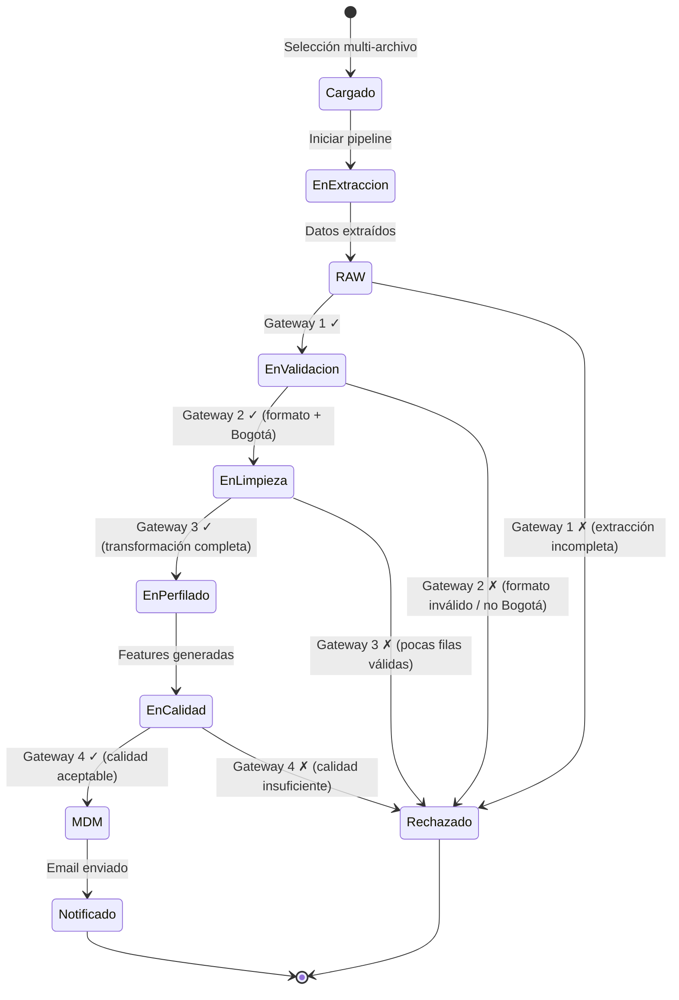

# Data Wrangling Bogotá — De Datos Crudos a Decisiones Inmobiliarias

> **El 80% del tiempo en ciencia de datos se invierte en limpiar y preparar datos.  
> Nuestro sistema reduce eso a 0.**

---

## 📈 Executive Summary

**Data Wrangling Bogotá** es un pipeline ETL inteligente que transforma automáticamente datasets inmobiliarios heterogéneos —con esquemas inconsistentes, valores nulos, duplicados y errores semánticos— en una **tabla maestra unificada (MDM)**, lista para análisis predictivos y modelos de pricing.

No es una herramienta más de limpieza de datos. Es un **sistema completo de gobierno de datos** con 4 gateways de validación BPMN 2.0, 6 reglas de negocio integradas, soporte batch multi-formato y notificaciones automatizadas.

---

## 🏢 El Problema de Mercado

El mercado inmobiliario colombiano —especialmente Bogotá— enfrenta un desafío crítico: los datos de propiedades provienen de **múltiples fuentes inconexas**:

| Fuente | Formato | Problema común |
|--------|---------|---------------|
| Portales inmobiliarios | CSV | Columnas inconsistentes, nombres variables |
| Corredores locales | Excel | Valores nulos, sin estandarización |
| Catastro / Entidades públicas | JSON | Esquemas técnicos, ubicaciones sin normalizar |
| Datasets académicos | CSV/Excel | Duplicados, tipos de datos incorrectos |

**El resultado:** antes de poder aplicar cualquier modelo de predicción de precios, un analista debe invertir días o semanas limpiando, normalizando y unificando los datos. Y aún así, la calidad final depende del criterio humano.

---

## 💡 Nuestra Solución

**Data Wrangling Bogotá** automatiza todo el proceso de preparación de datos con un pipeline ETL orquestado que:

```
                    ┌─────────────────────────────┐
                    │   PIPELINE DATA WRANGLING    │
                    ├─────────────────────────────┤
   Dataset Crudo ──▶│  1. Extraer datos           │──▶ RAW
                    │  2. Validar estructura       │──▶ Gateway 1-2
                    │  3. Limpiar y transformar    │──▶ Gateway 3
                    │  4. Generar features ML      │──▶ Análisis
                    │  5. Validar calidad          │──▶ Gateway 4
                    │  6. Cargar a MDM             │──▶ Tabla Maestra
                    │  7. Notificar al usuario     │──▶ Email
                    └─────────────────────────────┘
```

Cada etapa tiene un **gateway de validación** que decide si el proceso continúa o se rechaza con trazabilidad completa del motivo y la regla de negocio incumplida.

### Ciclo de Vida de un Dataset



---

## 🎯 Beneficios de Negocio

### Para Analistas de Datos
| Antes | Después |
|-------|---------|
| Días limpiando datos manualmente | Pipeline automatizado en segundos |
| Riesgo de error humano | Validaciones consistentes (RB-001 a RB-006) |
| Esquemas inconsistentes por fuente | MDM unificado como fuente única de verdad |
| Sin trazabilidad de rechazos | Cada rechazo se persiste con regla de negocio |

### Para Empresas Inmobiliarias
- **Reducción del 80%** en tiempo de preparación de datos
- **Calidad garantizada**: cobertura ≥80%, sin duplicados, datos coherentes
- **Soporte batch**: procesa 50+ datasets de una sola vez
- **Trazabilidad total**: cada operación queda registrada

### Para Desarrolladores y Científicos de Datos
- Arquitectura **SOLID** + **patrones GoF/GRASP** (código mantenible)
- **46 tests unitarios**, cobertura >80%
- **Fácil extensión**: nuevos cleaners, validadores o formatos sin modificar el núcleo
- **API lista**: el pipeline está desacoplado de la UI

---

## 🏠 Caso de Uso: Inmobiliaria en Bogotá

**Escenario:** Una inmobiliaria recibe 30 listados de propiedades desde 5 fuentes diferentes (correos con CSV, Excel de catastro, JSON de portal web).

**Con Data Wrangling Bogotá:**

1. El analista selecciona los 30 archivos en la UI
2. Configura email y factor de precio
3. Hace clic en **Procesar**
4. El sistema ejecuta el pipeline:
   - ✅ 25 datasets pasan todos los gateways → se unifican en el MDM
   - ❌ 5 son rechazados (3 con ubicación fuera de Bogotá, 2 con calidad insuficiente)
   - 📧 Se envía un email con el resumen de cada resultado
5. El analista tiene una **tabla maestra limpia** con miles de registros lista para modelos de predicción

**Tiempo total:** < 5 minutos.  
**Antes de usar el sistema:** 2-3 días.

---

## 🛣️ Diferenciadores Técnicos

### 1. Basado en BPMN 2.0
El flujo del pipeline sigue el estándar de modelado de procesos de negocio BPMN 2.0 con 4 gateways XOR, dando visibilidad total de cada etapa.

### 2. Arquitectura Profesional
```
SOLID  ✅ Single Responsibility, Open/Closed, Liskov, Interface Segregation, Dependency Inversion
GoF    ✅ Facade, Strategy, Decorator, Observer, Factory Method
GRASP  ✅ Controller, Information Expert, Low Coupling, High Cohesion
```

### 3. 46 Pruebas Unitarias
Cobertura >80% con pytest. Cada regla de negocio tiene su test asociado.

### 4. Feature Engineering Automático
El sistema genera features derivadas listas para ML:
- `precio_unitario` — precio por metro cuadrado
- `puntaje_entorno` — calidad del entorno (parques + colegios + hospitales)
- `densidad_comercial` — centros comerciales por área
- `bano_por_hab` — relación baños/habitaciones
- `parqueadero_ratio` — parqueaderos por área
- Estadísticas temporales agrupadas por año

### 5. Multi-Formato y Batch
Soporta CSV, Excel y JSON. Procesa múltiples archivos simultáneamente con una sola tabla maestra.

---

## 📊 Roadmap

| Fase | Estado | Descripción |
|------|--------|-------------|
| **Pipeline ETL completo** | ✅ Completo | 4 gateways, 6 reglas de negocio, 46 tests |
| **UI Desktop (Tkinter)** | ✅ Completo | Carga batch, progreso, resultados, exportación |
| **Feature Engineering** | ✅ Completo | 5 features derivadas + stats por año |
| **Notificaciones Email** | ✅ Completo | Decoradores, validación, formato enriquecido |
| **API REST** | 🔜 Próximo | Endpoints para integración con sistemas externos |
| **Web UI** | 🔜 Próximo | Dashboard web con Streamlit/Django |
| **Modelos ML Integrados** | 🔜 Próximo | Predicción de precios embebida en el pipeline |
| **Despliegue Cloud** | 🔜 Próximo | AWS/GCP con pipeline serverless |

---

## 📋 Reglas de Negocio Implementadas

| ID | Nombre | Impacto de Negocio | Gateways |
|----|--------|-------------------|:--------:|
| **RB-001** | Solo propiedades en Bogotá | Garantiza pertinencia geográfica del dataset | G2 |
| **RB-002** | Estrato entre 1 y 6 | Valida el principal factor de precio en Colombia | G4 |
| **RB-003** | Sin duplicados por ubicación y tamaño | Evita sobrevaloración por registros repetidos | G3 |
| **RB-004** | Formato y columnas mínimas | Asegura que el dataset es procesable | G2 |
| **RB-005** | Coherencia semántica de valores | Filtra datos imposibles (tamaño negativo, 0 baños, etc.) | G4 |
| **RB-006** | Notificación por email | Transparencia total en cada operación | Post-MDM |

---

## 🧪 Trazabilidad y Confianza

Cada operación del pipeline queda registrada:

- **Rechazos**: persistidos con gateway, motivo, regla de negocio y detalle contextual
- **Limpieza**: reporte granular con nulos removidos, duplicados eliminados, pasos ejecutados
- **Éxitos**: resumen de carga al MDM con conteo de registros y rutas de almacenamiento
- **Notificaciones**: historial de emails enviados con éxito o fallo

---

## 🤝 ¿Por Qué Invertir en Data Wrangling Bogotá?

1. **Mercado real**: Bogotá tiene un mercado inmobiliario de $XX billones con datos fragmentados
2. **Problema validado**: toda inmobiliaria, corredor o entidad pública necesita datos limpios
3. **Solución completa**: no es un script de limpieza, es un sistema con arquitectura profesional
4. **Extensible**: diseñado para crecer con APIs, web y modelos ML
5. **Calidad garantizada**: 46 tests, SOLID, BPMN, trazabilidad total

---

## 📄 Licencia

MIT License — libre para uso académico, comercial y gubernamental.

---

## 👤 Contacto

**Adán Y. Sánchez Cubillos**  
[danysancubi@gmail.com](mailto:danysancubi@gmail.com)  
Universidad de La Salle — Lenguaje de Programación 2 / Ciencia de Datos — 2026

---

> _"Los datos no valen por sí mismos. Valen por las decisiones que permiten tomar.  
> Data Wrangling Bogotá convierte datos crudos en decisiones informadas."_
