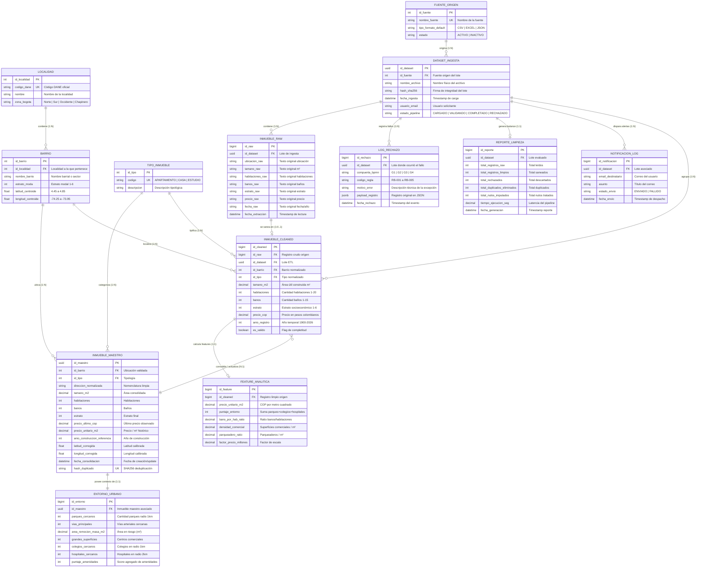

# 01. Diagrama Conceptual Entidad-Relación Extendido (EER)
**Estándares**: DAMA-DMBOK v2 (Conceptual Data Model - CDM) · SWEBOK v4 · ISO/IEC 11179  
**Fase PDCO**: `PLAN` | **SDLC Stage**: Requirements & Conceptual Modeling  
**Proyecto**: Sistema Data Wrangling & MDM Inmobiliario (Bogotá Real Estate)  

---

## 1. Abstracción y Taxonomía Semántica de Entidades

Bajo el marco de gobernanza y modelado de datos de **DAMA-DMBOK v2**, las entidades del sistema se categorizan rigurosamente según su rol en el ciclo de vida de la información:

```
┌────────────────────────────────────────────────────────────────────────────────────────┐
│                              TAXONOMÍA DE ENTIDADES (DAMA)                             │
├───────────────────────┬────────────────────────┬───────────────────────────────────────┤
│  DATOS DE REFERENCIA  │     MASTER DATA (MDM)  │   TRANSACCIONAL / PIPELINE & AUDITORÍA│
│                       │                        │                                       │
│• LOCALIDAD            │• INMUEBLE_MAESTRO      │• DATASET_INGESTA                      │
│• BARRIO               │• ENTORNO_URBANO        │• INMUEBLE_RAW                         │
│• TIPO_INMUEBLE        │                        │• INMUEBLE_CLEANED                     │
│• FUENTE_ORIGEN        │                        │• FEATURE_ANALITICA                    │
│                       │                        │• LOG_RECHAZO, REPORTE, NOTIFICACION   │
└───────────────────────┴────────────────────────┴───────────────────────────────────────┘
```

### 1.1 Catálogos y Datos de Referencia (Reference Data)
- **`LOCALIDAD`** (*Entidad Fuerte*): Representa las 20 divisiones territoriales político-administrativas de Bogotá D.C.
  - *Clave Primaria*: `id_localidad` (Entero subrogado).
  - *Clave Alterna*: `codigo_dane` (Código oficial de 4 a 10 caracteres alfanuméricos según DANE).
  - *Atributos Semánticos*: `nombre`, `zona_bogota` (Norte, Sur, Centro, Occidente, Chapinero).
- **`BARRIO`** (*Entidad Fuerte / Dependiente de Localidad*): Delimitación barrial o de comuna en Bogotá.
  - *Clave Primaria*: `id_barrio`.
  - *Clave Foránea*: `id_localidad` (Asociación obligatoria $1..1$).
  - *Atributos*: `nombre_barrio`, `estrato_moda` ($\in [1, 6]$), `latitud_centroide`, `longitud_centroide`.
- **`TIPO_INMUEBLE`** (*Entidad de Dominio*): Catálogo normalizado de clasificación física (Apartamento, Casa, Penthouse, Casa Lote).
  - *Clave Primaria*: `id_tipo`.
  - *Clave Alterna*: `codigo` (Cadena unívoca).
- **`FUENTE_ORIGEN`** (*Entidad de Dominio*): Origen institucional o comercial del archivo (ej. MetroCuadrado, FincaRaíz, Catastro Distrital, Portales Open Data).

### 1.2 Datos Maestros (Master Data Management - Golden Records)
- **`INMUEBLE_MAESTRO`** (*Entidad Principal del Negocio*): Registro unificado y consolidado que representa el *Golden Record* de un inmueble en Bogotá. Se obtiene tras superar los 4 gateways BPMN (G1 a G4) y aplicar el algoritmo de deduplicación.
  - *Clave Primaria*: `id_maestro` (UUIDv4 unívoco).
  - *Clave Alterna / Hash de Deduplicación*: `hash_duplicado` ($\text{SHA256}(\text{direccion} \parallel \text{tamano} \parallel \text{id\_barrio})$).
  - *Atributos*: `direccion_normalizada`, `tamano_m2`, `habitaciones`, `banos`, `estrato`, `precio_ultimo_cop`, `precio_unitario_m2`, `anio_construccion_referencia`, `latitud_corregida`, `longitud_corregida`, `fecha_consolidacion`.
- **`ENTORNO_URBANO`** (*Entidad Asociada 1 a 1*): Características contextuales y de infraestructura del entorno espacial donde se ubica el inmueble.
  - *Clave Primaria / Foránea*: `id_entorno` asociada a `id_maestro` ($1..1$).
  - *Atributos*: `parques_cercanos`, `vias_principales`, `area_remocion_masa_m2`, `grandes_superficies`, `colegios_cercanos`, `hospitales_cercanos`, `puntaje_amenidades`.

### 1.3 Entidades Transaccionales y de Pipeline ETL
- **`DATASET_INGESTA`** (*Entidad Fuerte de Proceso*): Metadatos de cada lote o archivo cargado al sistema.
  - *Clave Primaria*: `id_dataset` (UUIDv4).
  - *Atributos*: `nombre_archivo`, `hash_sha256`, `usuario_email`, `estado_pipeline`, `fecha_ingesta`.
- **`INMUEBLE_RAW`** (*Entidad Débil de Staging*): Registros originales tal y como fueron leídos en la fuente, antes de transformaciones.
  - *Clave Primaria*: `id_raw` (Bigint subrogado).
  - *Clave Foránea*: `id_dataset` ($N..1$ obligatoria).
  - *Atributos*: Campos de tipo texto (`ubicacion_raw`, `tamano_raw`, `precio_raw`, etc.).
- **`INMUEBLE_CLEANED`** (*Entidad Procesada*): Registro que ha superado la normalización de tipos, imputación y saneamiento de dominio.
  - *Clave Primaria*: `id_cleaned`.
  - *Claves Foráneas*: `id_raw` ($1..1$), `id_dataset`, `id_barrio`, `id_tipo`.
  - *Atributos*: Medidas cuantitativas validadas con restricciones `CHECK`.
- **`FEATURE_ANALITICA`** (*Entidad de Enriquecimiento / ML*): Variables calculadas para alimentar los modelos predictivos de precios.
  - *Clave Primaria*: `id_feature`.
  - *Clave Foránea*: `id_cleaned` ($1..1$).
  - *Atributos*: `precio_unitario_m2`, `puntaje_entorno`, `bano_por_hab_ratio`, `densidad_comercial`, `parqueadero_ratio`.

### 1.4 Entidades de Calidad, Auditoría y Notificaciones
- **`LOG_RECHAZO`** (*Entidad de Auditoría*): Registra cada fallo de compuerta BPMN (G1 a G4), el código de regla violada (RB-001 a RB-005) y la carga útil errónea en formato estructurado JSONB.
- **`REPORTE_LIMPIEZA`** (*Entidad de Métricas*): Consolida los indicadores agregados por ejecución ETL (filas procesadas, nulos corregidos, duplicados eliminados, tiempos de CPU).
- **`NOTIFICACION_LOG`** (*Entidad de Trazabilidad*): Registra el despacho de notificaciones hacia el correo electrónico del usuario (RB-006).

---

## 2. Diagrama Conceptual Entidad-Relación Extendido (EER)



---

## 3. Matriz de Cardinalidades y Reglas de Participación

| Entidad Origen | Cardinalidad | Entidad Destino | Tipo de Participación | Justificación del Negocio |
|---|:---:|---|:---:|---|
| `LOCALIDAD` | $1 \to (1..N)$ | `BARRIO` | Total en Destino | Una localidad contiene obligatoriamente al menos un barrio; un barrio pertenece exactamente a una localidad. |
| `BARRIO` | $1 \to (0..N)$ | `INMUEBLE_MAESTRO` | Parcial en Origen | Un barrio puede tener cero o múltiples inmuebles maestros registrados. |
| `DATASET_INGESTA` | $1 \to (1..N)$ | `INMUEBLE_RAW` | Total en Destino | Todo lote de ingesta debe contener al menos un registro crudo para ser procesado. |
| `INMUEBLE_RAW` | $1 \to (0..1)$ | `INMUEBLE_CLEANED` | Parcial en Origen | Un registro crudo solo pasa a registro limpio si supera las compuertas G1, G2 y G3; de lo contrario se rechaza. |
| `INMUEBLE_CLEANED`| $1 \to (1..1)$ | `FEATURE_ANALITICA` | Total en Ambos | Todo registro limpio genera obligatoriamente su vector de variables analíticas para entrenamiento y scoring. |
| `INMUEBLE_MAESTRO`| $1 \to (1..1)$ | `ENTORNO_URBANO` | Total en Ambos | Todo inmueble maestro cuenta con su perfil de entorno urbano (parques, hospitales, colegios, riesgos). |
| `DATASET_INGESTA` | $1 \to (0..N)$ | `LOG_RECHAZO` | Parcial en Origen | Un lote exitoso no genera registros de rechazo; si ocurren violaciones de reglas se insertan N registros. |
| `DATASET_INGESTA` | $1 \to (1..1)$ | `REPORTE_LIMPIEZA` | Total en Ambos | Cada ejecución de pipeline produce un balance consolidado único de métricas de limpieza. |
