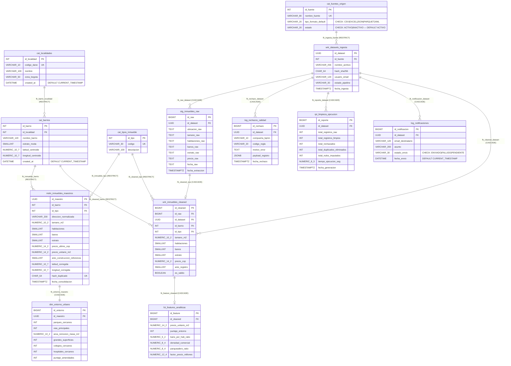

# 02. Diagrama Lógico Relacional y Proceso de Normalización
**Estándares**: DAMA-DMBOK v2 (Logical Data Model - LDM) · SWEBOK v4 (Data Persistence Design) · ISO/IEC 9075  
**Fase PDCO**: `PLAN → DEVELOPMENT` | **SDLC Stage**: Detailed Database Design  
**Proyecto**: Sistema Data Wrangling & MDM Inmobiliario (Bogotá Real Estate)  
**Última revisión**: 2026-09-28 — Actividad 4: Corrección de coherencia diagrama ↔ script SQL (observación docente)  

> **Corrección Actividad 4**: Se agregaron los campos `created_at DATETIME` a las tablas `cat_localidades` y `cat_barrios` para reflejar exactamente la estructura implementada en `instalacion.sql`. Se añadieron también las restricciones `CHECK` faltantes en `cat_fuentes_origen` y `log_notificaciones`.

---

## 1. Demostración Formal del Proceso de Normalización (1NF → BCNF)

Para garantizar la eliminación total de redundancias, anomalías de inserción, borrado y actualización, el esquema relacional fue derivado mediante análisis formal de **Dependencias Funcionales (DF)** hasta alcanzar la **Forma Normal de Boyce-Codd (BCNF)**.

```
┌────────────────────────────────────────────────────────────────────────────────────────┐
│                        ESCALA DE NORMALIZACIÓN RELACIONAL                              │
├───────────────────┬───────────────────┬───────────────────┬────────────────────────────┤
│       1NF         │       2NF         │       3NF         │           BCNF             │
│                   │                   │                   │                            │
│• Valores Atómicos │• Cumple 1NF       │• Cumple 2NF       │• Cumple 3NF                │
│• No arrays/listas │• Sin dependencias │• Sin dependencias │• Para toda DF X → Y,       │
│• Clave Primaria   │  parciales de PK  │  transitivas      │  X es una Superclave       │
│  definida         │  compuesta        │  (X → Y → Z)      │  estricta                  │
└───────────────────┴───────────────────┴───────────────────┴────────────────────────────┘
```

### 1.1 Dependencias Funcionales en el Dominio Inmobiliario
Definimos el conjunto de atributos del dominio:
$$U = \{\text{id\_maestro}, \text{direccion}, \text{tamano\_m2}, \text{habitaciones}, \text{banos}, \text{estrato}, \text{precio}, \text{id\_barrio}, \text{nombre\_barrio}, \text{id\_localidad}, \text{nombre\_localidad}, \text{codigo\_dane}\}$$

Conjunto canónico de Dependencias Funcionales ($F$):
1. $DF_1: \text{id\_maestro} \to \{\text{direccion}, \text{tamano\_m2}, \text{habitaciones}, \text{banos}, \text{estrato}, \text{precio}, \text{id\_barrio}\}$
2. $DF_2: \{\text{direccion}, \text{tamano\_m2}, \text{id\_barrio}\} \to \text{id\_maestro}$ *(Clave Candidata / Hash de Unicidad)*
3. $DF_3: \text{id\_barrio} \to \{\text{nombre\_barrio}, \text{estrato\_moda}, \text{latitud}, \text{longitud}, \text{id\_localidad}\}$
4. $DF_4: \text{id\_localidad} \to \{\text{codigo\_dane}, \text{nombre\_localidad}, \text{zona\_bogota}\}$
5. $DF_5: \text{codigo\_dane} \to \{\text{id\_localidad}, \text{nombre\_localidad}, \text{zona\_bogota}\}$

---

### 1.2 Etapas de Descomposición

#### Paso 1: Primera Forma Normal (1NF)
- **Problema en datos crudos**: En el dataset de origen, el atributo `ubicacion` contiene información compuesta no atómica: `"Bogotá, Chapinero, Carrera 7 # 45-10"`.
- **Acción**: Se descompone en componentes atómicos normalizados:
  - `id_localidad` (Identificador discreto)
  - `id_barrio` (Identificador discreto)
  - `direccion_normalizada` (Vía y nomenclatura estandarizada)
- **Resultado 1NF**: Todas las columnas contienen valores escalares indivisibles; no existen listas ni grupos repetitivos.

#### Paso 2: Segunda Forma Normal (2NF)
- **Condición**: Todo atributo no-primo debe tener dependencia funcional completa de la clave primaria (no de subconjuntos de claves primarias compuestas).
- **Acción**: En las tablas del pipeline (`wrk_inmuebles_cleaned`, `fct_features_analiticas`, `mdm_inmuebles_maestros`), se emplean claves primarias subrogadas sintéticas (`BIGINT`, `UUID`) o claves naturales simples.
- **Resultado 2NF**: No existen dependencias parciales de claves compuestas.

#### Paso 3: Tercera Forma Normal (3NF)
- **Problema detectado**: En un diseño desnormalizado inicial existiría la transitividad:
  $$\text{id\_maestro} \xrightarrow{DF_1} \text{id\_barrio} \xrightarrow{DF_3} \text{id\_localidad} \xrightarrow{DF_4} \text{nombre\_localidad}$$
  Esto causaría anomalías de actualización: cambiar el nombre de una localidad obligaría a actualizar millones de filas de inmuebles.
- **Acción**: Descomposición en relaciones independientes sin pérdida de información (*Lossless Join Decomposition*):
  - $R_1(\underline{\text{id\_localidad}}, \text{codigo\_dane}, \text{nombre}, \text{zona\_bogota})$
  - $R_2(\underline{\text{id\_barrio}}, \text{id\_localidad}^*, \text{nombre\_barrio}, \text{estrato\_moda}, \text{latitud}, \text{longitud})$
  - $R_3(\underline{\text{id\_maestro}}, \text{id\_barrio}^*, \text{id\_tipo}^*, \text{direccion\_normalizada}, \text{tamano\_m2}, \dots)$
- **Resultado 3NF**: Se eliminan todas las dependencias transitivas.

#### Paso 4: Forma Normal de Boyce-Codd (BCNF)
- **Condición**: Para cada dependencia funcional no trivial $X \to Y$, el determinante $X$ debe ser una **superclave**.
- **Evaluación**:
  - En $R_1$: $\{\text{id\_localidad}\}$ y $\{\text{codigo\_dane}\}$ son superclaves (ambas únicas). $\checkmark$
  - En $R_2$: $\{\text{id\_barrio}\}$ es superclave. $\checkmark$
  - En $R_3$: $\{\text{id\_maestro}\}$ y $\{\text{hash\_duplicado}\}$ son superclaves. $\checkmark$
- **Resultado BCNF**: El esquema completo satisface BCNF.

---

## 2. Diagrama Lógico Relacional (Mermaid Relational ERD)

A continuación se presenta el esquema relacional con sus tablas, tipos de datos físicos estándar (ISO/IEC 9075), llaves primarias (`PK`), llaves foráneas (`FK`), restricciones de unicidad (`UK`) y relaciones de integridad referencial:



---

## 3. Políticas de Integridad Referencial

1. **`ON DELETE RESTRICT` (Protección de Integridad Maestra y Catálogos)**:
   - No es posible eliminar una localidad si existen barrios asociados (`cat_barrios.id_localidad`).
   - No es posible eliminar un barrio si existen inmuebles limpios o maestros asociados (`mdm_inmuebles_maestros.id_barrio`).
2. **`ON DELETE CASCADE` (Ciclo de Vida de Ingesta y Limpieza)**:
   - Si se elimina un lote de ingesta en `wrk_datasets_ingesta`, automáticamente se eliminan sus filas en staging (`stg_inmuebles_raw`), sus registros limpios (`wrk_inmuebles_cleaned`), sus features analíticas (`fct_features_analiticas`) y sus reportes/rechazos asociados, evitando registros huérfanos.
   - Si se elimina un inmueble maestro (`mdm_inmuebles_maestros`), su dimensión de entorno (`dim_entorno_urbano`) se elimina en cascada.
3. **`ON UPDATE CASCADE`**:
   - Cualquier actualización en claves primarias o códigos de referencia se propaga automáticamente a todas las tablas dependientes.
