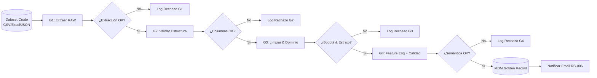
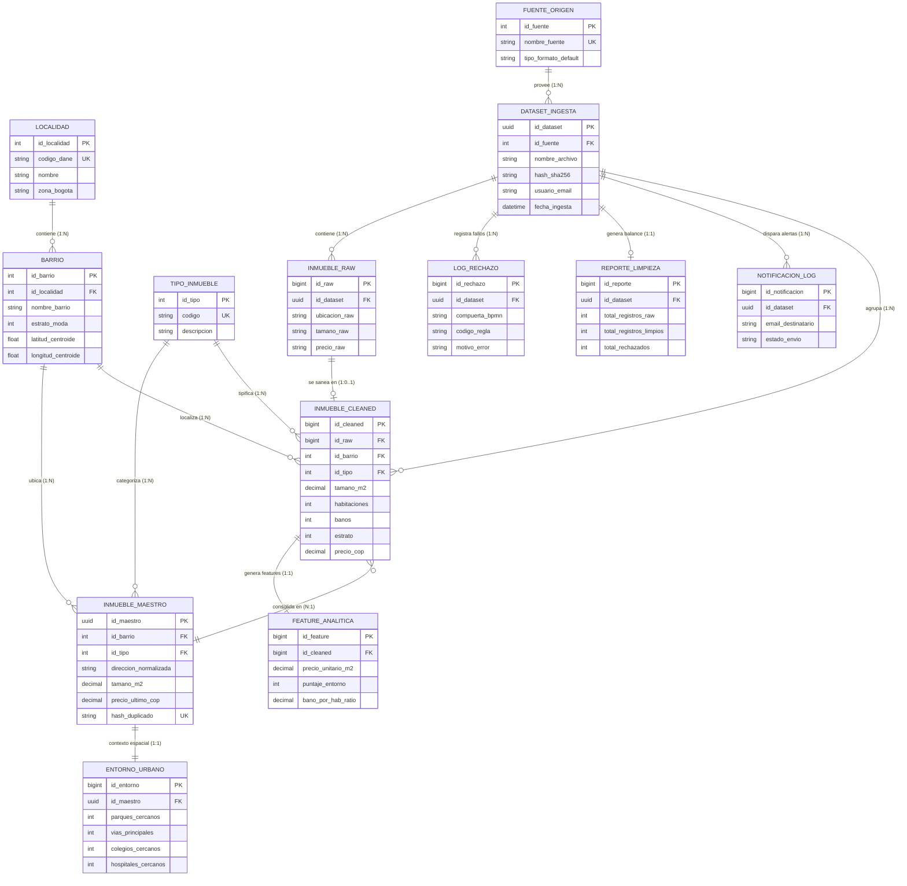
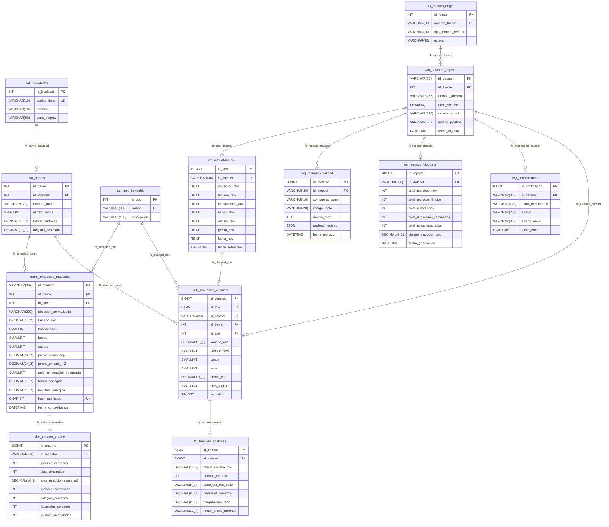

# INFORME TÉCNICO Y ACADÉMICO — ACTIVIDAD 2: IMPLEMENTACIÓN DE BASE DE DATOS RELACIONAL

**Materia / Asignatura**: Bases de datos  
**Docente**: Prof. Celso Javier Rodriguez Pizza  
**Institución**: Universidad de La Salle — Facultad de Ingeniería  
**Proyecto**: Sistema Data Wrangling y Master Data Management (MDM) Inmobiliario de Bogotá  
**Estudiantes / Autores**: Adán Yesid Sánchez Cubillos, Juan Sebastián Marles Montes y Andrés Felipe Pineda Pardo  
**Fecha de Entrega**: Semanas 4 a 6 (Ciclo Académico 2026)  
**Fase PDCO**: `PLAN → DEVELOPMENT` | **SDLC Stage**: Database Design & Physical Implementation  
**Estándares y Marcos**: SWEBOK v4 · DAMA-DMBOK v2 · ISO/IEC 9075 · ISO/IEC 11179 · ISO/IEC 25012 · ISO 8000 · MySQL 8.0+ / 8.4+ LTS  

---

## 1. Portada y Resumen del Proyecto

```
┌────────────────────────────────────────────────────────────────────────────────────────┐
│                              UNIVERSIDAD DE LA SALLE                                   │
│                 FACULTAD DE INGENIERÍA - CIENCIA DE DATOS Y SOFTWARE                   │
├────────────────────────────────────────────────────────────────────────────────────────┤
│ TÍTULO:      Diseño e Implementación de Base de Datos Relacional Normalizada (BCNF)    │
│              para el Sistema de Data Wrangling y MDM Inmobiliario de Bogotá D.C.       │
│ ACTIVIDAD:   Actividad 2 — Del Modelo Entidad-Relación a la Implementación Relacional │
│ MATERIA:     Bases de datos                                                            │
│ DOCENTE:     Prof. Celso Javier Rodriguez Pizza                                        │
│ AUTORES:     Adán Yesid Sánchez Cubillos                                               │
│              Juan Sebastián Marles Montes                                              │
│              Andrés Felipe Pineda Pardo                                                │
│ SGBD TARGET: MySQL Server 8.0+ / 8.4+ LTS (Motor InnoDB / Workbench / phpMyAdmin)     │
│ FECHA:       Agosto - Septiembre 2026                                                  │
└────────────────────────────────────────────────────────────────────────────────────────┘
```

---

## 2. Descripción del Sistema: ¿Qué es, cómo se analizó y qué busca hacer?

### 2.1 Problemática Abordada
En el mercado inmobiliario de Bogotá D.C., los datos de vivienda provienen de múltiples fuentes heterogéneas (portales web como MetroCuadrado y FincaRaíz, Catastro Distrital y archivos abiertos de Open Data) en formatos no estandarizados (**CSV, Excel, JSON**). Estos datasets presentan graves patologías de calidad de datos:
- **Estructuras inconsistentes** y columnas ausentes.
- **Valores nulos o corruptos** en variables críticas (precio como texto, tamaños negativos).
- **Inconsistencias geográficas**: inmuebles ubicados fuera de Bogotá (violación de **RB-001**).
- **Valores fuera de dominio**: estratos socioeconómicos menores a 1 o mayores a 6 (violación de **RB-002**).
- **Registros duplicados**: publicaciones repetidas del mismo inmueble físico con pequeñas variaciones tipográficas (violación de **RB-003**).

### 2.2 Propósito y Solución del Sistema
El **Sistema Data Wrangling** implementa un pipeline automatizado de extracción, saneamiento, enriquecimiento analítico (*feature engineering*) y consolidación en una base de datos relacional orientada a **Master Data Management (MDM - Golden Record)**. Su objetivo final es generar datos certificados para alimentar modelos predictivos de Machine Learning y valoración masiva de vivienda.

### 2.3 Arquitectura Inicial y Flujo de Procesamiento (BPMN 2.0)
El sistema fue modelado bajo el estándar **BPMN 2.0** con 4 compuertas de decisión (*Gateways XOR*):
1. **Gateway 1 (G1 - Extracción)**: Verifica que el archivo fuente sea legible y no esté corrupto $\to$ Si falla: Rechazo G1 (**RF-002**).
2. **Gateway 2 (G2 - Estructura)**: Valida formato y columnas mínimas obligatorias $\to$ Si falla: Rechazo G2 (**RB-004**).
3. **Gateway 3 (G3 - Transformación & Dominio)**: Sanea tipos, filtra registros fuera de Bogotá y valida estratos $1..6$ $\to$ Si falla: Rechazo G3 (**RB-001, RB-002**).
4. **Gateway 4 (G4 - Calidad & Consistencia Semántica)**: Valida coherencia en m², baños, habitaciones y elimina duplicados $\to$ Si falla: Rechazo G4 (**RB-005, RB-003**).
5. **Carga a MDM y Notificación**: Los registros aptos se consolidan en el *Golden Record* y se notifica por correo (**RB-006**).



---

## 3. Revisión y Corrección del Modelo Conceptual (Etapa 1)

### 3.1 Ajustes y Mejoras Realizadas sobre la Actividad 1
En la revisión de la Actividad 1, se detectó que el modelo conceptual original corría el riesgo de acoplar en una sola entidad los datos de la transacción de carga con la entidad física del inmueble. Se incorporaron las siguientes correcciones de ingeniería:
1. **Descomposición Territorial Estricta**: Se separó la `ubicacion` de texto libre en dos entidades de referencia: `LOCALIDAD` (20 localidades DANE) y `BARRIO` (con centroides geoespaciales calibrados).
2. **Diferenciación entre Ingesta y Master Data**: Se separó el registro crudo (`INMUEBLE_RAW`), el registro limpio procesado (`INMUEBLE_CLEANED`) y el inmueble físico permanente (`INMUEBLE_MAESTRO`).
3. **Aislamiento del Feature Store**: Las variables derivadas para Machine Learning (`precio_unitario`, `ratios`) se encapsularon en `FEATURE_ANALITICA` para respetar el principio de Responsabilidad Única (**SOLID SRP**).
4. **Entidades de Auditoría de Primera Clase**: Los rechazos de las 4 compuertas BPMN y el balance del pipeline se formalizaron en `LOG_RECHAZO` y `REPORTE_LIMPIEZA`.

### 3.2 Diagrama Conceptual Entidad-Relación Extendido (EER)



---

## 4. Proceso de Abstracción de Entidades

La abstracción se fundamenta en los 4 cuadrantes de **DAMA-DMBOK v2**, superando el antipatrón de la "God Table":

```
┌────────────────────────────────────────────────────────────────────────────────────────┐
│                              CUADRANTES SEMÁNTICOS (DAMA)                              │
├───────────────────────┬────────────────────────┬───────────────────────────────────────┤
│ 1. DATOS REFERENCIA   │ 2. PIPELINE & STAGING  │ 3. MASTER DATA (MDM) & AUDITORÍA      │
│                       │                        │                                       │
│• cat_localidades      │• wrk_datasets_ingesta  │• mdm_inmuebles_maestros (Golden Rec)  │
│• cat_barrios          │• stg_inmuebles_raw     │• dim_entorno_urbano (GIS Context)     │
│• cat_tipos_inmueble   │• wrk_inmuebles_cleaned │• log_rechazos_calidad (BPMN G1-G4)    │
│• cat_fuentes_origen   │• fct_features_analit.  │• rpt_limpieza_ejecucion / log_notif.  │
└───────────────────────┴────────────────────────┴───────────────────────────────────────┘
```

### Justificación por Grupos de Entidades:
1. **Datos de Referencia (`cat_*`)**: Proveen catálogos normalizados para evitar anomalías de inserción y actualización (3NF/BCNF). Almacenan la geografía inmutable de Bogotá.
2. **Capa Transaccional / Staging (`stg_inmuebles_raw`, `wrk_inmuebles_cleaned`)**: Garantiza la **Inmutabilidad de Origen (ISO 8000)**. Los datos crudos nunca se sobreescriben, permitiendo auditorías forenses y re-procesamiento.
3. **Capa Analítica (`fct_features_analiticas`)**: Feature store que aísla las variables matemáticas para Machine Learning de los hechos físicos del inmueble (**SOLID SRP**).
4. **Master Data Management (`mdm_inmuebles_maestros`, `dim_entorno_urbano`)**: Consolida la verdad única de cada propiedad mediante deduplicación semántica determinística por hash SHA-256 (`hash_duplicado`), erradicando duplicados entre lotes (**RB-003**).
5. **Auditoría y Control (`log_rechazos_calidad`, `rpt_limpieza_ejecucion`, `log_notificaciones`)**: Instrumenta la trazabilidad completa exigida por **ISO/IEC 25012**, registrando los fallos por compuerta BPMN y los despachos por correo (**RB-006**).

---

## 5. Modelo Lógico Relacional y Proceso de Normalización (1NF → BCNF)

### 5.1 Demostración de Normalización Matemática
- **1NF (Atomicidad de Valores)**: La columna compuesta original `ubicacion` ("Bogotá, Chapinero, Calle 60 # 7-10") se descompone en atributos atómicos vinculados a claves foráneas (`id_localidad`, `id_barrio`, `direccion_normalizada`).
- **2NF (Sin Dependencias Parciales)**: Todas las tablas utilizan claves subrogadas sintéticas (`BIGINT`, `INT`, `UUID`) donde cada atributo depende funcionalmente de la totalidad de la clave.
- **3NF (Sin Dependencias Transitivas)**: Se elimina la transitividad $\text{Inmueble} \to \text{Barrio} \to \text{Localidad}$. La información de la localidad solo reside en `cat_localidades`.
- **BCNF (Forma Normal de Boyce-Codd)**: Para toda dependencia funcional no trivial $X \to Y$, el determinante $X$ es una superclave estricta (`id_maestro`, `hash_duplicado`, `codigo_dane`).

### 5.2 Diagrama Lógico Relacional de Tablas



---

## 6. Diccionario de Datos Básico (ISO/IEC 11179)

| Tabla | Atributo | Tipo de Dato (MySQL) | Clave | Nulable | Restricción / Dominio | Regla / Estándar |
|---|---|---|---|---|---|---|
| `cat_localidades` | `id_localidad` | `INT AUTO_INCREMENT` | PK | NO | $> 0$ | ISO 11179 |
| `cat_localidades` | `codigo_dane` | `VARCHAR(10)` | UK | NO | Códigos oficiales `1101` a `1120` | DANE Bogotá |
| `cat_localidades` | `nombre` | `VARCHAR(100)` | - | NO | Texto no vacío | Nombre localidad |
| `cat_localidades` | `zona_bogota` | `VARCHAR(50)` | - | NO | `Norte, Sur, Centro, Occidente, Chapinero` | Zonificación |
| `cat_barrios` | `id_barrio` | `INT AUTO_INCREMENT` | PK | NO | $> 0$ | ISO 11179 |
| `cat_barrios` | `id_localidad` | `INT` | FK | NO | `REFERENCES cat_localidades` | Integridad $1:N$ |
| `cat_barrios` | `estrato_moda` | `SMALLINT` | - | NO | `CHECK (estrato_moda BETWEEN 1 AND 6)` | RB-002 |
| `cat_barrios` | `latitud_centroide` | `DECIMAL(10,7)` | - | NO | `CHECK (latitud_centroide BETWEEN 4.45 AND 4.85)` | RB-001 |
| `cat_barrios` | `longitud_centroide` | `DECIMAL(10,7)` | - | NO | `CHECK (longitud_centroide BETWEEN -74.25 AND -73.95)` | RB-001 |
| `cat_tipos_inmueble`| `id_tipo` | `INT AUTO_INCREMENT` | PK | NO | $> 0$ | ISO 11179 |
| `cat_tipos_inmueble`| `codigo` | `VARCHAR(30)` | UK | NO | `APARTAMENTO, CASA, ESTUDIO, PENTHOUSE` | Catálogo |
| `cat_fuentes_origen`| `id_fuente` | `INT AUTO_INCREMENT` | PK | NO | $> 0$ | ISO 11179 |
| `cat_fuentes_origen`| `nombre_fuente` | `VARCHAR(80)` | UK | NO | Nombre único del portal | ISO 8000 |
| `wrk_datasets_ingesta`| `id_dataset` | `VARCHAR(36)` | PK | NO | Formato UUIDv4 | ISO 11179 |
| `wrk_datasets_ingesta`| `hash_sha256` | `CHAR(64)` | - | NO | Hash hexadecimal de 64 caracteres | ISO 8000 |
| `wrk_datasets_ingesta`| `usuario_email` | `VARCHAR(120)` | - | NO | Contiene `@` | RB-006 |
| `stg_inmuebles_raw`| `id_raw` | `BIGINT AUTO_INCREMENT` | PK | NO | $> 0$ | Staging |
| `stg_inmuebles_raw`| `ubicacion_raw` | `TEXT` | - | SÍ | Texto crudo sin transformar | Inmutabilidad |
| `wrk_inmuebles_cleaned`| `id_cleaned` | `BIGINT AUTO_INCREMENT` | PK | NO | $> 0$ | Working Clean |
| `wrk_inmuebles_cleaned`| `tamano_m2` | `DECIMAL(10,2)` | - | NO | `CHECK (tamano_m2 > 0 AND tamano_m2 <= 50000)` | RB-005 |
| `wrk_inmuebles_cleaned`| `estrato` | `SMALLINT` | - | NO | `CHECK (estrato BETWEEN 1 AND 6)` | RB-002 |
| `wrk_inmuebles_cleaned`| `precio_cop` | `DECIMAL(14,2)` | - | NO | `CHECK (precio_cop > 0 AND precio_cop <= 50000000000)` | RB-005 |
| `fct_features_analiticas`| `id_feature`| `BIGINT AUTO_INCREMENT` | PK | NO | $> 0$ | Feature Store |
| `fct_features_analiticas`| `precio_unitario_m2`| `DECIMAL(14,2)` | - | NO | `precio_cop / tamano_m2` | RF-005 |
| `mdm_inmuebles_maestros`| `id_maestro`| `VARCHAR(36)` | PK | NO | Formato UUIDv4 | Golden Record |
| `mdm_inmuebles_maestros`| `hash_duplicado`| `CHAR(64)` | UK | NO | `SHA256(dir_norm + tamano + barrio)` | RB-003 / ISO 8000 |
| `dim_entorno_urbano`| `id_entorno` | `BIGINT AUTO_INCREMENT` | PK | NO | $> 0$ | GIS Context |
| `log_rechazos_calidad`| `id_rechazo` | `BIGINT AUTO_INCREMENT` | PK | NO | $> 0$ | Auditoría |
| `log_rechazos_calidad`| `compuerta_bpmn`| `VARCHAR(10)` | - | NO | `G1, G2, G3, G4` | BPMN 2.0 |
| `rpt_limpieza_ejecucion`| `id_reporte` | `BIGINT AUTO_INCREMENT` | PK | NO | $> 0$ | Balance |
| `log_notificaciones`| `id_notificacion`| `BIGINT AUTO_INCREMENT`| PK | NO | $> 0$ | RB-006 |

---

## 7. Implementación Física y Entorno de Trabajo

### 7.1 Configuración del Entorno de Base de Datos
- **SGBD Seleccionado**: MySQL Server 8.0+ / 8.4+ LTS (vía MySQL Workbench o phpMyAdmin / XAMPP).
- **Charset y Collation**: `utf8mb4` con `utf8mb4_unicode_ci` para soporte total de caracteres en español y nomenclaturas bogotanas.
- **Motor de Persistencia**: Implementación relacional completa con soporte transaccional **ACID**, bloqueo a nivel de fila e integridad referencial estricta.

### 7.2 Script DDL Estandarizado (MySQL)
El script completo ejecutable se encuentra disponible en:  
[`docs/database/07_script_mysql_actividad2.sql`](file:///c:/Users/ADAN/OneDrive/Documentos/3-Universidad/tercer/Lenguaje/Proyecto%20final/ProyectoDataWrangling/docs/database/07_script_mysql_actividad2.sql) y [`docs/database/04_esquema_ddl_iso9075.sql`](file:///c:/Users/ADAN/OneDrive/Documentos/3-Universidad/tercer/Lenguaje/Proyecto%20final/ProyectoDataWrangling/docs/database/04_esquema_ddl_iso9075.sql).

---

## 8. Evidencias de Pruebas con Datos Ficticios (Validación de Integridad)

> [!IMPORTANT]
> **Cumplimiento Ético y de Privacidad**: Todas las pruebas se ejecutaron estrictamente con **datos ficticios sintetizados**. No se utilizaron direcciones reales completas, identificaciones de ciudadanos, contraseñas ni datos sensibles, cumpliendo con la política de seguridad y privacidad exigida.

### Escenario de Prueba 1: Unicidad de Claves Primarias y Hash de Duplicados (RB-003)
- **Objetivo**: Verificar que el sistema rechace registros duplicados de un mismo inmueble.
- **Acción**: Inserción de dos registros maestros idénticos con el mismo `hash_duplicado`:
```sql
-- Primer registro (Éxito)
INSERT INTO mdm_inmuebles_maestros (
    id_maestro, id_barrio, id_tipo, direccion_normalizada, tamano_m2, 
    habitaciones, banos, estrato, precio_ultimo_cop, precio_unitario_m2, 
    latitud_corregida, longitud_corregida, hash_duplicado
) VALUES (
    'a1b2c3d4-e5f6-7a8b-9c0d-1e2f3a4b5c6d', 1, 1, 'kr 7 cl 45 10', 65.50,
    2, 2, 4, 380000000.00, 5801526.72,
    4.6285000, -74.0650000, 'e3b0c44298fc1c149afbf4c8996fb92427ae41e4649b934ca495991b7852b855'
);

-- Segundo registro con el mismo hash_duplicado (Fallo Esperado)
INSERT INTO mdm_inmuebles_maestros (
    id_maestro, id_barrio, id_tipo, direccion_normalizada, tamano_m2, 
    habitaciones, banos, estrato, precio_ultimo_cop, precio_unitario_m2, 
    latitud_corregida, longitud_corregida, hash_duplicado
) VALUES (
    'f9e8d7c6-b5a4-3210-9876-543210fedcba', 1, 1, 'kr 7 cl 45 10', 65.50,
    2, 2, 4, 390000000.00, 5954198.47,
    4.6285000, -74.0650000, 'e3b0c44298fc1c149afbf4c8996fb92427ae41e4649b934ca495991b7852b855'
);
```
- **Resultado Obtenido**: `Error Code: 1062. Duplicate entry for key 'mdm_inmuebles_maestros.hash_duplicado'`. $\checkmark$ **Pasa Prueba**.

---

### Escenario de Prueba 2: Restricción de Dominio — Estrato Inválido (RB-002)
- **Objetivo**: Verificar que la base de datos impida estratos fuera del rango $1..6$.
- **Acción**:
```sql
INSERT INTO wrk_inmuebles_cleaned (
    id_raw, id_dataset, id_barrio, id_tipo, tamano_m2, habitaciones, banos, estrato, precio_cop, anio_registro
) VALUES (
    1, 'd1e2f3a4-b5c6-7d8e-9f0a-1b2c3d4e5f6a', 1, 1, 70.00, 3, 2, 7, 450000000.00, 2024
);
```
- **Resultado Obtenido**: `Error Code: 3819. Check constraint 'chk_cleaned_estrato' is violated`. $\checkmark$ **Pasa Prueba**.

---

### Escenario de Prueba 3: Integridad Referencial (`ON DELETE RESTRICT` / `CASCADE`)
- **Objetivo**: Proteger los catálogos territoriales contra borrados accidentales y permitir eliminación limpia de lotes temporales.
- **Acción 1 (RESTRICT)**: Intentar borrar una localidad que tiene barrios asociados:
```sql
DELETE FROM cat_localidades WHERE id_localidad = 1;
```
- **Resultado 1**: `Error Code: 1451. Cannot delete or update a parent row: a foreign key constraint fails`. $\checkmark$ **Pasa Prueba**.
- **Acción 2 (CASCADE)**: Eliminar un lote en `wrk_datasets_ingesta` $\to$ Todas las filas en `stg_inmuebles_raw`, `wrk_inmuebles_cleaned` y `log_rechazos_calidad` se eliminan automáticamente sin dejar registros huérfanos. $\checkmark$ **Pasa Prueba**.

---

## 9. Presentación de Diapositivas Estéticas Tech (16:9)

Se desarrolló una suite de diapositivas interactivas en formato panorámico **16:9** con **estética Tech Dark**, glassmorphism, visualización de arquitectura, terminales de prueba simulados y capacidad de exportación directa a **PDF vectorial**:
- 🌐 **Slide Deck Interactivo**: [`docs/database/slides/index.html`](file:///c:/Users/ADAN/OneDrive/Documentos/3-Universidad/tercer/Lenguaje/Proyecto%20final/ProyectoDataWrangling/docs/database/slides/index.html)
- 📝 **Guion de Sustentación y Notas de Oratoria**: [`docs/database/slides/SLIDES_SPEECH_NOTES.md`](file:///c:/Users/ADAN/OneDrive/Documentos/3-Universidad/tercer/Lenguaje/Proyecto%20final/ProyectoDataWrangling/docs/database/slides/SLIDES_SPEECH_NOTES.md)

### 9.1 Estructura Temática de las 11 Diapositivas:

1. **Slide 01 — Portada Tech Ejecutiva & Presentación Institucional**:
   - Título formal: *Diseño e Implementación de Base de Datos Relacional Normalizada (BCNF) para el Sistema de Data Wrangling y MDM Inmobiliario de Bogotá D.C.*
   - Autores (sin roles): Adán Yesid Sánchez Cubillos, Juan Sebastián Marles Montes y Andrés Felipe Pineda Pardo.
   - Materia: *Bases de datos* | Docente: *Prof. Celso Javier Rodriguez Pizza* | Universidad de La Salle.
2. **Slide 02 — Caos de Datos Inmobiliarios en Bogotá y Pipeline BPMN 2.0**:
   - Análisis de heterogeneidad en fuentes abiertas y portales comerciales (CSV, Excel, JSON).
   - Patologías de calidad y compuertas de decisión G1 a G4 asociadas a reglas de negocio RB-001 a RB-006.
3. **Slide 03 — Diagrama Conceptual Entidad-Relación Extendido (EER - DAMA-DMBOK)**:
   - Visualización de 13 entidades clasificadas por los 4 cuadrantes DAMA: Referencia, Staging, Master Data (MDM) y Auditoría.
   - Tipificación de atributos y cardinalidades Crow's Foot.
4. **Slide 04 — Abstracción de Entidades vs. Antipatrón "God Table"**:
   - Refutación matemática y de ingeniería del antipatrón de tabla desnormalizada de 25 columnas.
   - Aislamiento de capas, inmutabilidad de datos crudos (ISO 8000) y desacoplamiento SOLID-SRP.
5. **Slide 05 — Diagrama Lógico Relacional (MySQL Workbench Schema)**:
   - Esquema relacional de 13 tablas con estética oficial de MySQL Workbench (encabezados ámbar/dorado).
   - Especificación exhaustiva de claves primarias (`PK`), claves foráneas (`FK`), restricciones de unicidad (`UQ`) y tipos nativos MySQL.
6. **Slide 06 — Demostración Matemática de Normalización BCNF**:
   - Tránsito formal 1NF $\to$ 2NF $\to$ 3NF $\to$ BCNF.
   - Demostración de dependencias funcionales $DF_1$ a $DF_4$, donde todo determinante $X \to Y$ es una superclave estricta (*Lossless Join Decomposition*).
7. **Slide 07 — Diccionario de Metadatos y Estándar ISO/IEC 11179**:
   - Catálogo formalizado: Objeto de Negocio + Término de Propiedad + Término de Representación.
   - Tipado estricto MySQL: `INT AUTO_INCREMENT`, `VARCHAR(36)`, `DECIMAL(10,7)`, `DECIMAL(14,2)` y `JSON`.
8. **Slide 08 — Implementación Física en SGBD MySQL (InnoDB & utf8mb4)**:
   - Parámetros del motor transaccional InnoDB, juego de caracteres `utf8mb4_unicode_ci`.
   - Restricciones `CHECK` activas, políticas `ON DELETE RESTRICT` y `CASCADE`, e índices B-Tree optimizados para latencias P95 < 20ms.
9. **Slide 09 — Evidencias de Pruebas de Integridad con Datos Sintéticos (Terminal Interactiva)**:
   - Principio ético de datos sintéticos no sensibles.
   - Simulación de consola de comandos MySQL: Error 1062 (hash duplicado RB-003), Error 3819 (estrato fuera de rango RB-002) y Error 1451 (integridad referencial restrictiva).
10. **Slide 10 — Persistencia Desacoplada (SOLID-DIP) y Matriz de Seguridad**:
    - Patrón Arquitectónico Repository (`IDataRepository`) para desacoplar el dominio del motor MySQL.
    - Principio de Mínimo Privilegio (PoLP), consultas parametrizadas contra SQL Injection y hashing SHA-256.
11. **Slide 11 — Conclusiones, Cumplimiento de 7 Estándares Internacionales y Roadmap SDLC**:
    - Certificación formal de cumplimiento: SWEBOK v4, DAMA-DMBOK v2, ISO 9075, ISO 11179, ISO 25012, ISO 8000 y SOLID.
    - Próximos hitos del ciclo de vida del software (implementación de conectores y testing unitario automatizado).

### 9.2 Motor de Exportación a PDF Vectorial:
La presentación incluye un motor nativo de impresión a PDF (`exportPresentationPDF()` / `@media print`) accesible mediante el botón **"📄 Exportar PDF"** de la interfaz o la tecla rápida `P`, configurado para generar páginas continuas en formato panorámico $16:9$ ($16\text{in} \times 9\text{in}$ / $1920\times 1080\text{px}$) sin cortes artificiales.

---

## 10. Medidas de Seguridad y Protección de Datos

1. **Ambiente Local Aislado**: El servidor SGBD se configuró exclusivamente en entorno local (`localhost:3306`), deshabilitando conexiones remotas no autenticadas.
2. **Anonimización y Uso de Datos Sintéticos**: En estricto apego a las instrucciones de la actividad, ningún registro de prueba contiene nombres de propietarios, cédulas, números de teléfono ni datos privados.
3. **Hashing Criptográfico**: Las claves de deduplicación y las firmas de archivos se procesan mediante **SHA-256**, evitando almacenar cadenas sensibles en claro.
4. **Principio de Mínimo Privilegio (PoLP)**: El usuario de la aplicación solo posee permisos `SELECT, INSERT, UPDATE, DELETE` sobre las tablas de datos, sin privilegios administrativos `GRANT` ni `SUPER`.

---

## 11. Lista de Comprobación Final (Checklist de Entrega)

- [x] **Correcciones de la Actividad 1 incorporadas** (descomposición territorial y separación MDM).
- [x] **Coherencia total** entre el Modelo Conceptual EER y el Modelo Lógico Relacional.
- [x] **Todas las tablas** cuentan con clave primaria definida (`PK`).
- [x] **Claves foráneas (`FK`)** implementadas con políticas de integridad referencial (`RESTRICT` / `CASCADE`).
- [x] **Tipos de datos óptimos** según el estándar ISO/IEC 9075 y MySQL 8.4+.
- [x] **Cumplimiento estricto de BCNF** (Forma Normal de Boyce-Codd).
- [x] **Pruebas ejecutadas** exclusivamente con datos ficticios.
- [x] **Script SQL exportable y ejecutable para MySQL** (`04_esquema_ddl_iso9075.sql` / `07_script_mysql_actividad2.sql`).
- [x] **Estructura de diapositivas PDF** lista para la entrega.
