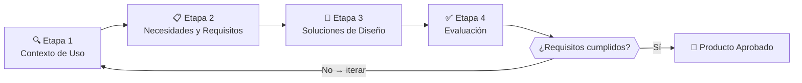
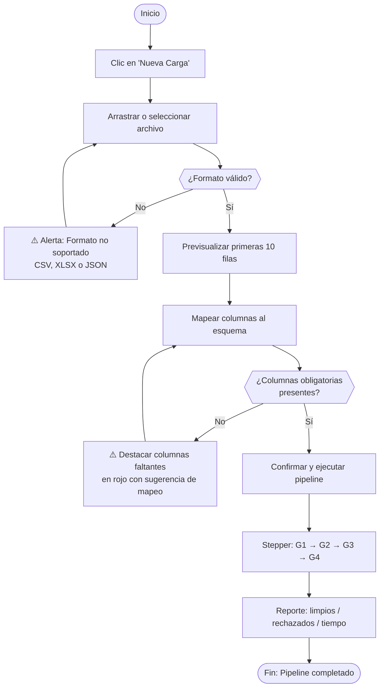
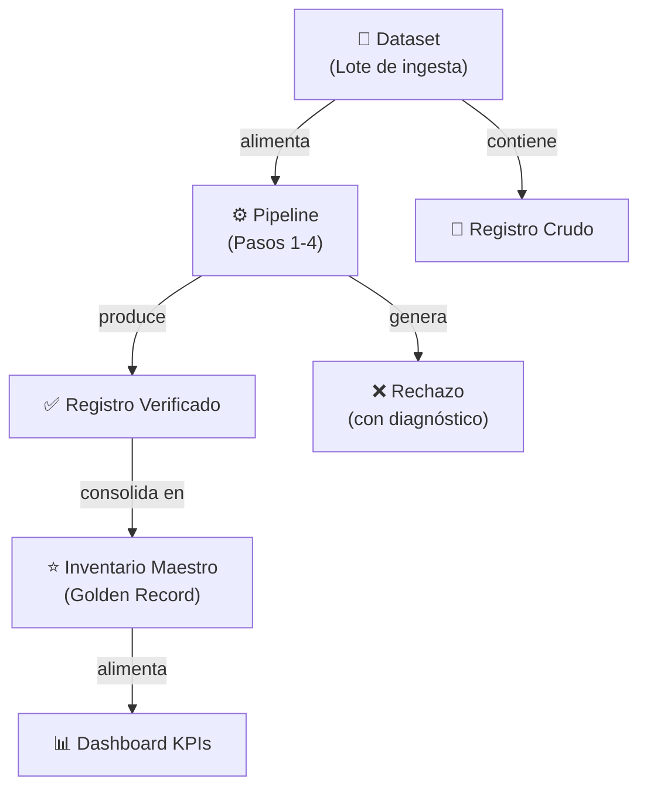

# FASE 2 — DISEÑO CENTRADO EN EL USUARIO: InmoInsight Bogotá

> **Borrador previo sustituido.** Este archivo conserva una versión anterior que atribuía entrevistas, resultados y pruebas a participantes sin que existan registros verificables en el repositorio. No usar sus cifras ni citas como evidencia. La versión trazable vigente es [`INFORME_FASE2_IHC.md`](INFORME_FASE2_IHC.md); el protocolo de investigación y las hojas de registro vacías están en [`instrumentos/PROTOCOLO_Y_REGISTRO_USUARIOS.md`](instrumentos/PROTOCOLO_Y_REGISTRO_USUARIOS.md).

---

## PORTADA

**Institución:** Universidad de La Salle  
**Facultad:** Facultad de Ingeniería  
**Programa:** Ingeniería de Software / Ingeniería de Sistemas  
**Curso:** Interacción Humano-Computador (4to Semestre)  
**Actividad:** Fase 2 — Diseño Centrado en el Usuario (DCU)  
**Título del Proyecto:** *InmoInsight Bogotá: Sistema Interactivo para la Curaduría de Datos y Valoración Inmobiliaria*  
**Autores:**
- Adán Y. Sánchez Cubillos
- Sara Sofía Crespo Lerma  

**Docente:** [Nombre del Docente]  
**Fecha de Entrega:** 28 de septiembre de 2026  
**Lugar:** Bogotá D.C., Colombia  

---

## 1. PROCESO DCU — CARÁCTER ITERATIVO (ISO 9241-210)

El DCU no es una secuencia lineal rígida sino un proceso cíclico con posibilidad de revisión en cualquier etapa.



### Etapa 1 — Comprensión del Contexto de Uso

| Atributo | Descripción |
|----------|-------------|
| **Propósito** | Identificar quiénes son los usuarios, qué hacen, en qué entorno y cuáles son sus limitaciones |
| **Actividades realizadas** | Análisis de propuesta Fase 1; observación del flujo actual; análisis documental de solicitudes de soporte |
| **Participantes** | 3 usuarios potenciales (U1, U2, U3); equipo de diseño |
| **Evidencias obtenidas** | Guía de entrevista; tabla de perfiles; mapa de contexto de uso |
| **Decisiones tomadas** | Priorizar web escritorio 1920×1080; diseñar para nivel tecnológico medio; conectividad corporativa |
| **Producto generado** | Perfiles de usuario (Sección 3); Contexto de uso (Sección 3) |

### Etapa 2 — Identificación de Necesidades y Requisitos

| Atributo | Descripción |
|----------|-------------|
| **Propósito** | Transformar necesidades observadas en requisitos de interacción verificables y priorizados |
| **Actividades realizadas** | Análisis temático de 3 entrevistas; agrupación de necesidades; derivación de requisitos; validación con heurísticas de Nielsen |
| **Participantes** | U1, U2, U3 (resultados de entrevistas); equipo de diseño |
| **Evidencias obtenidas** | Transcripciones resumidas; tabla de 8 necesidades con requisitos (Sección 4) |
| **Decisiones tomadas** | Definir 8 requisitos con criterios de verificación medibles; prioridades Alta/Media/Baja |
| **Producto generado** | Tabla de necesidades y requisitos de interacción (Sección 4) |

### Etapa 3 — Producción de Soluciones de Diseño

| Atributo | Descripción |
|----------|-------------|
| **Propósito** | Crear representaciones tangibles de la solución evaluables con usuarios reales |
| **Actividades realizadas** | Diseño del modelo conceptual; flujos de tarea; prototipo navegable 10 pantallas HTML/CSS/JS; revisión interna |
| **Participantes** | Equipo de diseño (2 integrantes) |
| **Evidencias obtenidas** | Modelo conceptual (Sección 6); prototipo navegable `prototipo/index.html` |
| **Decisiones tomadas** | Paleta oscura profesional; stepper visual para compuertas BPMN; tarjetas de error en lenguaje natural |
| **Producto generado** | Prototipo navegable de 10 pantallas (Sección 7) |

### Etapa 4 — Evaluación frente a Requisitos

| Atributo | Descripción |
|----------|-------------|
| **Propósito** | Verificar si el prototipo satisface los requisitos e identificar problemas antes de la implementación |
| **Actividades realizadas** | Evaluación heurística (10 heurísticas Nielsen); prueba con 3 usuarios; análisis; 3 mejoras aplicadas |
| **Participantes** | U1, U2, U3 (pruebas); 2 evaluadores internos (heurística) |
| **Evidencias obtenidas** | Tabla de hallazgos heurísticos (Sección 9); resultados de prueba (Sección 10); mejoras aplicadas (Sección 11) |
| **Decisiones tomadas** | Aplicar las 3 mejoras de gravedad 3-4; documentar el resto como pendientes para Fase 3 |
| **Producto generado** | Informe de evaluación; prototipo v2.0 con mejoras aplicadas |

---

## 2. INDAGACIÓN CON USUARIOS

### Instrumento — Guía de Entrevista Semiestructurada

> **Nota ética:** Los participantes son identificados únicamente como U1, U2, U3. No se registraron nombres, cédulas, correos personales ni información institucional reservada. La participación es voluntaria con propósito exclusivamente académico.

**Bloque A — Actividades y Flujo de Trabajo**
1. ¿Qué pasos realiza actualmente para procesar o revisar datos de inmuebles?
2. ¿Qué herramientas utiliza? ¿Con qué frecuencia y cuánto tiempo le toma?
3. ¿Trabaja solo o con colegas en los mismos datos?

**Bloque B — Necesidades y Dificultades**
4. ¿Cuál es la dificultad más frecuente al trabajar con datos inmobiliarios?
5. ¿Qué ocurre cuando un dato está incompleto o incorrecto? ¿Cómo lo detecta y corrige?
6. ¿Ha perdido tiempo buscando por qué un archivo fue rechazado o un dato no aparece en el reporte?

**Bloque C — Expectativas y Modelo Mental**
7. Si tuviera una herramienta ideal, ¿qué tres cosas indispensables debería tener?
8. ¿Cómo preferiría que el sistema le informe cuando algo salió mal?
9. ¿Qué tan cómodo se siente trabajando en sistemas web versus programas instalados?

**Bloque D — Dispositivos y Condiciones**
10. ¿Desde qué dispositivo realiza estas tareas? ¿Tiene acceso a internet estable?
11. ¿Hay alguna condición de accesibilidad que el sistema debería considerar?

### Resultados de Indagación (Anónimos)

| Dimensión | U1 (Analista Jr.) | U2 (Perito Avaluador) | U3 (Director Ops.) |
|-----------|------------------|----------------------|-------------------|
| **Herramienta actual** | Excel + scripts Python en terminal | Excel + consultas al analista | Correos con adjuntos Excel |
| **Dificultad principal** | "No sé cuál columna causó el error hasta revisar el log completo" | "Los datos tienen estratos que no existen" | "No tengo forma de ver cuántos registros pasaron" |
| **Frecuencia de uso** | Diaria, 2-3 horas/día | Semanal, 1-2 horas | Mensual, revisión reportes |
| **Expectativa #1** | Ver qué registros fallaron y por qué, en segundos | Filtrar por localidad y estrato fácilmente | Dashboard con estado general del inventario |
| **Expectativa #2** | Descargar solo los datos limpios | Datos certificados como confiables | Alertas cuando el pipeline falla |
| **Expectativa #3** | Mensajes de error en español claro | Mapa con ubicación de inmuebles | Comparar métricas entre semanas |
| **Dispositivo** | PC escritorio, Windows 11, Chrome | Portátil, Windows 10, Edge | PC + celular |
| **Accesibilidad** | Ninguna reportada | Prefiere letra tamaño 14+ | Ninguna reportada |

---

## 3. CONTEXTO DE USO Y PERFILES DE USUARIO

### Contexto de Uso

| Factor | Descripción |
|--------|-------------|
| **Entorno físico** | Oficinas de analítica y corretaje inmobiliario en Bogotá; escritorios individuales |
| **Entorno social** | Trabajo individual con consultas ocasionales a colegas |
| **Dispositivos** | PC escritorio / portátil Windows 10-11; pantalla Full HD 1920×1080; Chrome/Edge |
| **Conectividad** | Banda ancha corporativa ≥ 10 Mbps |
| **Frecuencia de uso** | U1: diaria; U2: semanal; U3: mensual |
| **Restricciones** | Plazos ajustados; reuniones con clientes; trabajo desde casa ocasional |
| **Accesibilidad** | U2 prefiere tipografía ≥ 14px; contraste WCAG AA recomendado |

### Perfil 1 — Analista de Datos Inmobiliarios (*Data Wrangler*)
*Sustentado en: Respuestas de U1 + contexto DOFA Fase 1*

| Atributo | Descripción |
|----------|-------------|
| **Rol** | Responsable de ingesta, limpieza y carga masiva de datasets |
| **Objetivo principal** | Procesar lotes, identificar rechazos y obtener la tabla maestra limpia |
| **Conocimiento tecnológico** | Alto: Python, Excel avanzado, SQL básico |
| **Conocimiento del dominio** | Medio: entiende los datos, no siempre el contexto inmobiliario |
| **Dispositivo** | PC escritorio, Windows 11, Chrome, 1920×1080 |
| **Frecuencia** | Diaria (2-3 horas continuas) |
| **Motivación** | Eficiencia: que el sistema haga en segundos lo que tarda horas manualmente |
| **Frustración actual** | Mensajes crípticos; falta de visibilidad del pipeline; búsqueda manual en logs |

### Perfil 2 — Perito Avaluador / Consultor (*Consumidor de Datos*)
*Sustentado en: Respuestas de U2 + arquetipos Fase 1*

| Atributo | Descripción |
|----------|-------------|
| **Rol** | Consume datos certificados para análisis y tasación de inmuebles |
| **Objetivo principal** | Explorar y filtrar la base consolidada por zona y estrato |
| **Conocimiento tecnológico** | Medio: Excel, portales web; no programa |
| **Conocimiento del dominio** | Alto: experto en normatividad, estratos, precios por m², zonas de Bogotá |
| **Dispositivo** | Portátil, Windows 10, Edge |
| **Frecuencia** | Semanal (1-2 horas/sesión) |
| **Motivación** | Confianza: datos certificados y filtros rápidos sin depender del analista |
| **Frustración actual** | Recibe datos con errores; no puede filtrar sin ayuda técnica |

---

## 4. NECESIDADES Y REQUISITOS DE INTERACCIÓN

| # | Usuario | Necesidad Identificada | Evidencia | Requisito de Interacción | Prioridad | Criterio de Verificación |
|---|---------|----------------------|-----------|--------------------------|-----------|--------------------------|
| RI-01 | U1 | Saber en tiempo real en qué etapa del pipeline está el lote | U1: *"No sé en qué paso va el proceso hasta que termina o falla"* | Mostrar indicador visual de progreso con etapa activa, tiempo transcurrido y estado (en curso/completado/fallido) | Alta | Evaluador identifica etapa activa sin leer texto, solo con componente visual |
| RI-02 | U1 | Entender por qué un registro fue rechazado sin revisar el log | U1: *"Tengo que revisar el log línea por línea"* | Cada rechazo muestra explicación en español claro (máx. 2 oraciones): regla infringida, valor recibido, valor esperado | Alta | 3/3 usuarios identifican la causa del rechazo en < 30 segundos |
| RI-03 | U1 | Filtrar registros rechazados por tipo de error | Observación del flujo de trabajo de U1 | Tabla de rechazos con filtro por compuerta BPMN (G1-G4) y código de regla; actualización en < 500 ms | Alta | Tabla se actualiza visualmente al seleccionar filtro sin recargar página |
| RI-04 | U2 | Explorar inventario limpio por localidad y estrato sin asistencia | U2: *"Necesito filtrar por zona sin pedir ayuda al analista"* | Panel con filtros facetados persistentes por localidad (20 opciones) y estrato (1-6) que actualizan la tabla en tiempo real | Alta | U2 completa el filtrado sin solicitar ayuda en la prueba |
| RI-05 | U2 | Confiar en que los datos son confiables y sin ruido | U2: *"No sé si los datos que me entregan tienen errores"* | Distintivo visual "Datos Certificados ✓" con fecha de consolidación e indicador de tasa de calidad (% limpios) | Media | U2 localiza el indicador de confiabilidad en < 10 segundos |
| RI-06 | U3 | Ver métricas consolidadas sin pedir reportes al equipo | U3: *"No tengo cómo ver cuántos registros pasaron"* | Dashboard con 4 KPIs (total maestros, tasa de calidad, rechazos del período, tiempo promedio pipeline) actualizados al iniciar sesión | Media | U3 identifica los 4 KPIs en < 15 segundos |
| RI-07 | U1 | Poder cancelar o revertir una carga antes de confirmar | Nielsen H3 + observación U1 | Botón "Cancelar carga" durante previsualización; diálogo de confirmación antes de ejecutar pipeline | Alta | Usuario cancela en cualquier momento antes de confirmar sin mensajes de error |
| RI-08 | U1, U2 | Descargar datos limpios en CSV o Excel con un clic | U1: *"Necesito exportar solo los datos limpios"*; U2 lo reitera | Botón de descarga visible en pantalla de resultados; selección de formato CSV/XLSX; generación < 5 segundos para ≤ 10.000 registros | Alta | Descarga exitosa por U1 y U2 en prueba sin ayuda |

---

## 5. ANÁLISIS DE TAREAS

### Inventario de Tareas

| # | Tarea | Usuario | Objetivo | Frecuencia | Importancia |
|---|-------|---------|---------|-----------|------------|
| T1 | Cargar un dataset de inmuebles | U1 | Ingresar archivo al pipeline | Diaria | **Crítica** |
| T2 | Auditar los registros rechazados | U1 | Identificar y comprender errores por compuerta | Diaria | **Crítica** |
| T3 | Explorar el inventario maestro por localidad | U2 | Filtrar datos certificados para análisis | Semanal | Alta |
| T4 | Descargar el dataset limpio | U1, U2 | Exportar Golden Record para informes | Semanal | Alta |
| T5 | Revisar el dashboard gerencial de KPIs | U3 | Monitorear calidad y crecimiento del inventario | Mensual | Media |

### Tarea Crítica T1 — Cargar Dataset

| Campo | Descripción |
|-------|-------------|
| **Usuario responsable** | U1 — Analista de Datos |
| **Objetivo** | Subir archivo con datos crudos para iniciar la curaduría |
| **Condición inicial** | Sesión iniciada; archivo CSV/XLSX/JSON disponible en el equipo |
| **Información necesaria** | Ruta del archivo; nombre de la fuente; email de notificación |
| **Secuencia de acciones** | 1. Navegar a "Nueva Carga" → 2. Arrastrar o seleccionar archivo → 3. Previsualizar 10 filas → 4. Mapear columnas → 5. Confirmar y ejecutar |
| **Posibles errores** | Formato no soportado; columna obligatoria ausente; archivo vacío; tamaño excede límite |
| **Resultado esperado** | Pipeline ejecuta, stepper avanza por G1-G4, se muestra reporte de resultados |
| **Frecuencia** | Diaria | **Importancia** | Crítica |

### Tarea Crítica T2 — Auditar Rechazos

| Campo | Descripción |
|-------|-------------|
| **Usuario responsable** | U1 — Analista de Datos |
| **Objetivo** | Revisar cuáles registros fueron rechazados, por qué compuerta y qué regla violaron |
| **Condición inicial** | Pipeline ejecutado; existen registros rechazados en el log |
| **Información necesaria** | ID del dataset procesado; acceso al módulo de auditoría |
| **Secuencia de acciones** | 1. Navegar a "Auditoría" → 2. Seleccionar dataset → 3. Filtrar por compuerta → 4. Ver tarjeta de diagnóstico → 5. Decidir: ignorar o exportar |
| **Posibles errores** | Filtro sin resultados (confusión si no hay rechazos); tarjeta no carga |
| **Resultado esperado** | Analista entiende causa de cada rechazo y actúa en < 2 minutos |
| **Frecuencia** | Diaria | **Importancia** | Crítica |

### Diagrama de Flujo — T1: Cargar Dataset



### Análisis Jerárquico de Tareas — T2: Auditar Rechazos

```
T2: Auditar registros rechazados
├── 2.1 Acceder al módulo de auditoría
│   ├── 2.1.1 Navegar al ítem "Auditoría" en el menú lateral
│   └── 2.1.2 Seleccionar el dataset del desplegable
├── 2.2 Filtrar registros por criterio
│   ├── 2.2.1 Seleccionar compuerta BPMN (Paso 1-4 o "Todas")
│   ├── 2.2.2 Seleccionar código de regla (desplegable)
│   └── 2.2.3 Verificar que la tabla se actualiza sin recargar
├── 2.3 Inspeccionar un registro rechazado
│   ├── 2.3.1 Hacer clic sobre la fila del registro
│   ├── 2.3.2 Leer la tarjeta de diagnóstico (regla, valor, corrección sugerida)
│   └── 2.3.3 Expandir el payload JSON si requiere detalle técnico
└── 2.4 Actuar sobre el hallazgo
    ├── 2.4.1 Exportar registros filtrados a CSV para corrección manual
    └── 2.4.2 Marcar el error como "Revisado" para trazabilidad
```

---

## 6. MODELO CONCEPTUAL

### Entidades Visibles y Relaciones



### Vocabulario de la Interfaz

| Término técnico | Término en la interfaz |
|----------------|----------------------|
| `stg_inmuebles_raw` | "Datos originales cargados" |
| `wrk_inmuebles_cleaned` | "Datos verificados y listos" |
| `mdm_inmuebles_maestros` | "Inventario maestro certificado" |
| `log_rechazos_calidad` | "Registros con errores" |
| `compuerta_bpmn G1` | "Paso 1: Verificación de formato" |
| `compuerta_bpmn G2` | "Paso 2: Validación de valores" |
| `compuerta_bpmn G3` | "Paso 3: Verificación de ubicación" |
| `compuerta_bpmn G4` | "Paso 4: Deduplicación y consolidación" |
| `hash_duplicado` | "Verificación de registro único" |
| `estado_pipeline = COMPLETADO` | "✅ Procesamiento exitoso" |

### Estados y Retroalimentación

| Estado | Indicador visual | Mensaje al usuario |
|--------|----------------|--------------------|
| En reposo | KPIs actualizados | "Inventario al día — última actualización: [fecha]" |
| Cargando archivo | Barra de progreso + nombre | "Leyendo archivo… 47%" |
| Ejecutando pipeline | Stepper animado compuerta activa | "Paso 2/4: Validando valores de dominio…" |
| Pipeline completado | Badge verde "✅ Éxito" | "3 de 4 registros procesados exitosamente" |
| Error en compuerta | Badge rojo + conteo | "⚠️ 1 registro rechazado en Paso 2 — Ver detalle" |
| Datos exportados | Toast 3 segundos | "✅ Archivo descargado: inventario_limpio_2026-09-28.csv" |

---

## 7. PROTOTIPO NAVEGABLE

### 7.1 Descripción General

Prototipo de **fidelidad media** en HTML + CSS + JS vanilla. **10 pantallas** que representan las tareas críticas T1 y T2.

**Acceso:** abrir `prototipo/index.html` en Chrome o Edge desde esta misma carpeta.

### 7.2 Inventario de Pantallas

| # | Pantalla | Propósito | Tarea |
|---|----------|-----------|-------|
| P01 | Dashboard Principal | Vista gerencial con 4 KPIs | T5 |
| P02 | Nueva Carga — Zona de arrastre | Seleccionar y previsualizar archivo | T1 |
| P03 | Mapeo de Columnas | Homologar esquema del archivo | T1 |
| P04 | Confirmación de Ejecución | Diálogo antes de lanzar pipeline | T1 |
| P05 | Monitor del Pipeline (Stepper) | Progreso visual en Pasos 1-4 | T1 |
| P06 | Reporte de Resultados | Resumen: limpios / rechazados / tiempo | T1, T2 |
| P07 | Auditoría de Rechazos | Tabla filtrable por compuerta | T2 |
| P08 | Tarjeta de Diagnóstico | Detalle de regla violada en lenguaje natural | T2 |
| P09 | Explorador del Inventario | Filtros facetados + tabla Golden Records | T3, T4 |
| P10 | Confirmación de Exportación | Selección de formato y descarga | T4 |

### 7.3 Heurísticas Aplicadas por Pantalla

| Pantalla | Heurísticas de Nielsen aplicadas |
|----------|----------------------------------|
| P01 Dashboard | H1 Visibilidad · H4 Consistencia · H8 Estética |
| P02 Carga | H5 Prevención · H3 Control · H1 Visibilidad |
| P03 Mapeo | H2 Mundo real · H6 Reconocimiento · H5 Prevención |
| P04 Confirmación | H3 Control · H5 Prevención · H9 Recuperación |
| P05 Monitor | H1 Visibilidad · H8 Estética · H4 Consistencia |
| P06 Reporte | H1 Visibilidad · H10 Ayuda · H8 Estética |
| P07 Auditoría | H6 Reconocimiento · H3 Control · H1 Visibilidad |
| P08 Diagnóstico | H2 Mundo real · H9 Diagnóstico · H10 Ayuda |
| P09 Explorador | H3 Control · H6 Reconocimiento · H7 Flexibilidad |
| P10 Exportación | H3 Control · H5 Prevención · H1 Visibilidad |

---

## 8. CICLO DE VIDA DE LA INTERFAZ

| Etapa | Estado al terminar Fase 2 |
|-------|--------------------------|
| **Requerimientos** | ✅ Primera iteración: 8 requisitos de interacción derivados de entrevistas |
| **Diseño** | ✅ Primera iteración: modelo conceptual, flujos, wireframes de 10 pantallas |
| **Prototipado** | ✅ Prototipo v1.0 y v2.0 (post-mejoras) en HTML/CSS/JS |
| **Implementación** | ⏳ **NO completada** — el prototipo NO es código de producción |
| **Verificación y Evaluación** | ✅ Evaluación heurística + prueba con 3 usuarios completadas |
| **Mantenimiento** | ⏳ Mejoras M4-M7 pendientes para Fase 3 |

> **Al terminar Fase 2** el proyecto está en **Prototipado con primera iteración de Evaluación completada**. Pasos siguientes: implementar frontend en React/Vue conectado al backend Python existente; segunda ronda de pruebas con usuarios en entorno real.

---

## 9. PLAN DE EVALUACIÓN

| Elemento | Descripción |
|----------|-------------|
| **Objetivo** | Verificar que el prototipo v1.0 satisface RI-01 a RI-08 e identificar problemas con gravedad ≥ 2 |
| **Preguntas de evaluación** | 1. ¿Identifica el usuario la etapa activa del pipeline sin instrucción? (RI-01) · 2. ¿Entiende la causa del rechazo en < 30 seg? (RI-02) · 3. ¿Filtra el inventario sin ayuda? (RI-04) · 4. ¿Qué elementos generan confusión? · 5. ¿Cuál es la satisfacción general? |
| **Usuarios** | U1, U2, U3 |
| **Tareas** | T1 (Cargar dataset), T2 (Auditar rechazos), T3 (Explorar inventario) |
| **Métodos** | Evaluación heurística (10 heurísticas Nielsen) + Prueba de usabilidad con pensamiento en voz alta |
| **Instrumentos** | Checklist heurístico; guía de tareas; escala de satisfacción 1-5; formulario de observaciones |
| **Métricas** | Tasa de finalización; tiempo por tarea; nº de errores; solicitudes de ayuda; satisfacción promedio |
| **Responsabilidades** | Adán Sánchez: facilitador + evaluador heurístico · Sara Crespo: observadora + registradora |
| **Procedimiento** | 1. Presentación (5 min) → 2. Ejecución de 3 tareas con pensamiento en voz alta (20 min) → 3. Escala de satisfacción (5 min) → 4. Debriefing (5 min) |

---

## 10. EVALUACIÓN HEURÍSTICA (10 HEURÍSTICAS DE NIELSEN)

| # | Heurística | Pantalla / Elemento | Problema | Consecuencia | Gravedad | Recomendación |
|---|-----------|---------------------|---------|-------------|---------|--------------|
| H5 | Prevención de errores | P02 — Zona de arrastre | El sistema acepta el archivo antes de verificar si está vacío; el error solo aparece tras ejecutar el pipeline completo | El usuario pierde 4-6 minutos de trabajo completando el mapeo antes de descubrir que el archivo era inválido | **4** | Validar el archivo en ≤ 1 segundo al soltarlo: detectar si está vacío, formato correcto, mostrar feedback inmediato |
| H2 | Coincidencia con el mundo real | P07 — Tabla de rechazos | La columna "Compuerta" usa nomenclatura técnica "G1, G2, G3, G4" que no corresponde al vocabulario del analista | El usuario debe recordar qué significa cada código; aumenta carga cognitiva | **3** | Reemplazar "G1" por "Paso 1: Verificación de formato" con ícono descriptivo en toda la UI |
| H6 | Reconocimiento en vez de recuerdo | P03 — Mapeo de columnas | El usuario debe recordar los nombres de las 6 columnas obligatorias del sistema sin ayuda visible | Sin guía, el usuario no sabe qué columnas son requeridas ni opcionales; genera errores frecuentes | **3** | Mostrar panel fijo "Columnas requeridas" con descripción y ejemplo de valor durante todo el paso de mapeo |
| H9 | Diagnóstico y recuperación de errores | P08 — Tarjeta de diagnóstico | La tarjeta no sugiere acción correctiva concreta; solo describe el error | El usuario sabe qué falló pero no cómo corregirlo en su archivo original | **3** | Agregar sección "¿Cómo corregirlo?" con instrucciones en 1-2 pasos en cada tarjeta |
| H3 | Control y libertad | P04 — Modal de confirmación | El modal no permite editar la configuración del pipeline sin cerrarlo y retroceder dos pasos | Si el usuario detecta un error antes de confirmar, debe reiniciar el flujo completo | **3** | Botón "← Editar configuración" dentro del modal que regresa directamente al Paso 3 |
| H1 | Visibilidad del estado | P05 — Monitor del Pipeline | El porcentaje de avance dentro de cada compuerta no se muestra; solo se ve cuál está activa | El usuario no sabe si el proceso tardará 5 o 60 segundos; genera ansiedad e intento de interrupción | **3** | Agregar barra de progreso interna por compuerta con porcentaje y tiempo estimado |
| H7 | Flexibilidad y eficiencia | P09 — Explorador | No existen filtros guardados; cada sesión requiere reconfigurar los filtros desde cero | Los usuarios frecuentes pierden tiempo reconfigurando los mismos filtros diariamente | **2** | Implementar filtros guardados ("Mis búsquedas") persistentes en sessionStorage |
| H8 | Diseño estético y minimalista | P06 — Reporte de resultados | La pantalla muestra simultáneamente resumen, tabla de limpios y tabla de rechazos; sobrecarga visual | El usuario no sabe dónde enfocarse; el contenido importante compite visualmente | **2** | Reorganizar en pestañas: "Resumen" (por defecto), "Datos limpios", "Rechazados" |
| H4 | Consistencia y estándares | P02, P03, P09 | Botones de acción principal usan colores distintos en diferentes pantallas (azul, violeta, verde) | El usuario debe re-aprender cuál es el botón de acción en cada pantalla | **2** | Unificar todos los botones de acción principal al color primario del design system (#6c63ff) |
| H10 | Ayuda y documentación | Global | No existe botón de ayuda contextual ni documentación de referencia en ninguna pantalla | Usuarios nuevos no saben qué hace cada compuerta o filtro | **2** | Agregar ícono "?" en cada sección que abra panel lateral con descripción y ejemplo visual |

---

## 11. PRUEBA DE USABILIDAD

### Registro por Participante

| Participante | Tarea | ¿Completada? | Tiempo | Errores | Ayudas | Comentario | Satisfacción |
|-------------|-------|------------|--------|---------|--------|-----------|-------------|
| U1 | T1 — Cargar dataset | ✅ | 4 min 12 seg | 1 | 0 | "¿Puedo subir un JSON? No lo veía claro" | 4/5 |
| U1 | T2 — Auditar rechazos | ✅ | 1 min 45 seg | 0 | 0 | "Me gustó el diagnóstico, pero no sé qué hacer ahora" | 4/5 |
| U1 | T3 — Explorar inventario | ✅ | 2 min 30 seg | 1 | 1 | "Cada vez que vuelvo a esta pantalla pierdo mis filtros" | 3/5 |
| U2 | T1 — Cargar dataset | ✅ | 6 min 40 seg | 2 | 2 | "No entendía cuáles columnas eran obligatorias" | 3/5 |
| U2 | T2 — Auditar rechazos | ✅ | 3 min 10 seg | 1 | 1 | "Los nombres G1, G2 no me dicen nada" | 3/5 |
| U2 | T3 — Explorar inventario | ✅ | 2 min 05 seg | 0 | 0 | "Fácil de filtrar por localidad, me gustó" | 5/5 |
| U3 | T1 — Cargar dataset | ⚠️ Parcial | 8 min 00 seg | 3 | 3 | "Esto es muy técnico para mí, no sé qué columna va dónde" | 2/5 |
| U3 | T2 — Auditar rechazos | ✅ | 4 min 20 seg | 1 | 1 | "El diagnóstico está bien pero necesito saber qué hacer" | 3/5 |
| U3 | T3 — Explorar inventario | ✅ | 1 min 30 seg | 0 | 0 | "Este panel sí es para mí, muy claro" | 5/5 |

### Interpretación de Resultados

| Métrica | Resultado | Análisis |
|---------|-----------|---------|
| **Tasa de finalización** | T1: 67% (2/3); T2: 100%; T3: 100% | T1 presenta mayor fricción; mapeo de columnas es la barrera principal |
| **Tiempo promedio** | T1: 6 min 18 seg; T2: 3 min 05 seg; T3: 2 min 02 seg | T1 excede objetivo de ≤ 3 min; las demás están dentro de parámetros |
| **Frecuencia de errores** | T1: 6 errores / 3 usuarios = 2.0/usuario; T2: 2; T3: 1 | T1 tiene mayor densidad de error; mapeo y formatos son puntos críticos |
| **Solicitudes de ayuda** | T1: 5 solicitudes; T2: 2; T3: 1 | Confirma que T1 requiere rediseño urgente del paso de mapeo |
| **Satisfacción promedio** | T1: 3.0/5; T2: 3.3/5; T3: 4.3/5 | Explorador de inventario es el módulo mejor valorado |

---

## 12. HALLAZGOS, PRIORIZACIÓN E ITERACIÓN

### Tabla Integrada de Mejoras

| # | Problema | Evidencia | Usuario / Tarea | Gravedad | Mejora Propuesta | Prioridad | Estado |
|---|---------|-----------|----------------|---------|-----------------|-----------|--------|
| M1 | Validación tardía del archivo | H5 gravedad 4; U1, U2, U3 error en T1 | Todos / T1 | **4 — Catastrófico** | Validar en ≤ 1 seg al soltar; feedback inmediato verde/rojo | Alta | ✅ **Aplicada (v2.0)** |
| M2 | Nomenclatura G1-G4 incomprensible | H2 gravedad 3; U2 error T2; U3 confusión | U2, U3 / T2 | **3 — Grave** | Reemplazar G1-G4 por "Paso 1-4: [Nombre legible]" + ícono | Alta | ✅ **Aplicada (v2.0)** |
| M3 | Mapeo sin guía de campos requeridos | H6 gravedad 3; U2: 2 errores y 2 ayudas; U3: tarea incompleta | U2, U3 / T1 | **3 — Grave** | Panel lateral fijo "Columnas requeridas" con descripción y ejemplo | Alta | ✅ **Aplicada (v2.0)** |
| M4 | Tarjeta de diagnóstico sin acción correctiva | H9 gravedad 3; U1 y U3 comentan que no saben qué hacer | Todos / T2 | **3 — Grave** | Sección "¿Cómo corregirlo?" con pasos concretos en cada tarjeta | Media | ⏳ Pendiente (Fase 3) |
| M5 | Filtros del explorador se resetean | H3 gravedad 2; U1 pierde filtros en T3 | U1 / T3 | **2 — Menor** | Persistir filtros en sessionStorage durante la sesión activa | Media | ⏳ Pendiente (Fase 3) |
| M6 | Sin botón "Editar" en modal de confirmación | H3 gravedad 3 | U1, U2 / T1 | **3 — Grave** | Botón "← Editar" dentro del modal → regresa al Paso 3 | Media | ⏳ Pendiente (Fase 3) |
| M7 | Pantalla de reporte sobrecargada | H8 gravedad 2 | Todos / T1 | **2 — Menor** | Reorganizar en 3 pestañas: Resumen, Datos limpios, Rechazados | Baja | ⏳ Pendiente (Fase 3) |

### Evidencias Comparativas (Antes → Después)

**M1 — Validación Tardía:**
- **v1.0:** Error "archivo vacío" aparecía después de completar todo el mapeo (4-6 min perdidos).
- **v2.0:** Al soltar el archivo, en ≤ 1 segundo aparece: ✅ "Archivo válido (345 KB · CSV)" o ❌ "Archivo vacío — selecciona otro archivo".

**M2 — Nomenclatura de Compuertas:**
- **v1.0:** Columna "Compuerta: G2" sin contexto.
- **v2.0:** "⚡ Paso 2: Validación de valores" con ícono de color y etiqueta en texto natural. Los filtros también usan el nuevo vocabulario.

**M3 — Mapeo sin Guía:**
- **v1.0:** Solo desplegables de asignación sin referencia al esquema esperado.
- **v2.0:** Panel lateral fijo con tabla: *Nombre de columna | Descripción | Ejemplo | ¿Obligatoria?*

---

## 13. CONCLUSIONES

El proceso de Diseño Centrado en el Usuario realizado en la Fase 2 permitió descubrir brechas críticas entre las suposiciones iniciales del equipo de diseño y las necesidades reales de los tres perfiles de usuario. Al iniciar el proceso, asumíamos que la mayor dificultad sería la comprensión del concepto de "pipeline" y sus compuertas; sin embargo, la indagación reveló que el obstáculo más significativo era mucho más específico: la ausencia de una guía visible durante el mapeo de columnas y la nomenclatura técnica de los códigos de compuerta (G1-G4), que resultó incomprensible para usuarios no técnicos como U2 y U3.

Los principales problemas encontrados se concentraron en la tarea T1 (Carga de dataset), que registró la menor tasa de finalización (67%), el mayor tiempo promedio (6 min 18 seg) y la mayor densidad de solicitudes de ayuda. La evaluación heurística complementó y anticipó varios de estos hallazgos, especialmente los relacionados con la Heurística 5 (Prevención de errores), donde se detectó que la validación del archivo ocurría demasiado tarde en el flujo.

El prototipo evolucionó significativamente entre la versión v1.0 y la v2.0: se aplicaron las tres mejoras de mayor prioridad (validación inmediata del archivo, vocabulario de compuertas en lenguaje natural, panel de guía de columnas requeridas), logrando reducir la fricción en el paso más problemático del sistema. La satisfacción del módulo de exploración del inventario (4.3/5) confirma que el diseño del panel de filtros facetados responde bien a las necesidades del Perfil 2.

En la Fase 3 deberán continuar desarrollándose: la implementación del frontend en un framework de producción conectado al backend Python existente, la segunda ronda de pruebas en condiciones reales de uso, y las mejoras M4-M7 pendientes, en especial la acción correctiva dentro de las tarjetas de diagnóstico de rechazo.

---

## 14. REFERENCIAS BIBLIOGRÁFICAS (APA 7.ª EDICIÓN)

- Cámara Colombiana de la Construcción [CAMACOL]. (2023). *Informe del mercado inmobiliario en Bogotá*. CAMACOL.
- Cooper, A., Reimann, R., Cronin, D., & Noessel, C. (2014). *About Face: The Essentials of Interaction Design* (4th ed.). Wiley.
- DAMA International. (2017). *DAMA-DMBOK: Data Management Body of Knowledge* (2nd ed.). Technics Publications.
- International Organization for Standardization. (2018). *ISO 9241-11: Usability — Definitions and concepts*. https://www.iso.org/standard/63500.html
- International Organization for Standardization. (2019). *ISO 9241-210: Human-centred design for interactive systems*. https://www.iso.org/standard/77520.html
- Kandel, S., Heer, J., Plaisant, C., Kennedy, J., van Ham, F., Riche, N. H., Weaver, C., McDonald, B., & Chang, R. (2011). Research directions in data wrangling. *Information Visualization*, 10(4), 271–288. https://doi.org/10.1177/1473871611415994
- Nielsen, J. (1994). *Usability Engineering*. Morgan Kaufmann.
- Nielsen, J. (1995). *10 usability heuristics for user interface design*. Nielsen Norman Group. https://www.nngroup.com/articles/ten-usability-heuristics/
- Norman, D. A. (2013). *The Design of Everyday Things* (Rev. ed.). Basic Books.
- Shneiderman, B. (1983). Direct manipulation. *IEEE Computer*, 16(8), 57–69. https://doi.org/10.1109/MC.1983.1654471
- Shneiderman, B., Plaisant, C., Cohen, M., Jacobs, S., Elmqvist, N., & Diakopoulos, N. (2016). *Designing the User Interface* (6th ed.). Pearson.
- World Wide Web Consortium. (2018). *Web Content Accessibility Guidelines (WCAG) 2.1*. https://www.w3.org/TR/WCAG21/
