# Fase 2 — Diseño centrado en las personas

**Proyecto:** InmoInsight Bogotá — curaduría de datos inmobiliarios  
**Curso:** Interacción Humano-Computador  
**Equipo:** Adán Y. Sánchez Cubillos y Sara Sofía Crespo Lerma  
**Fecha de esta revisión:** 29 de septiembre de 2026  
**Estado:** Prototipo navegable y evaluación heurística de escritorio; indagación y prueba con usuarios pendientes.

> **Integridad de la evidencia.** La versión previa de esta entrega incluía respuestas, citas, resultados numéricos y sesiones con U1–U3 que no están respaldados por registros de investigación en el repositorio. No se usan como evidencia en este informe. No se afirma que hayan ocurrido entrevistas ni pruebas de usabilidad. Los ejemplos de pantallas son datos ficticios. Las hipótesis se identifican como tales y deben comprobarse antes de presentar conclusiones empíricas.

## Resumen de estado

| Componente | Estado | Base disponible |
|---|---|---|
| Análisis del contexto del sistema | Realizado como análisis documental y de código | Propuesta de fase 1, interfaz Tkinter, cargador y validadores del pipeline |
| Indagación con personas | Pendiente | Instrumento y protocolo ético en `instrumentos/` |
| Perfiles | Provisionales, por validar | Roles descritos en fase 1 y tareas soportadas por el sistema; no equivalen a perfiles observados |
| Necesidades y requisitos de interacción | Derivados del análisis documental; validación pendiente | Reglas de negocio, flujo de carga, procesamiento y auditoría |
| Diseño y prototipo | Realizado | Prototipo HTML local de 10 pantallas; no conectado al pipeline |
| Inspección heurística | Revisión de escritorio realizada por el equipo sobre el prototipo | Hallazgos de esta entrega; no sustituye pruebas con personas |
| Prueba de usabilidad con tres personas | Pendiente | Guion, hoja de observación y cálculo de métricas en `instrumentos/` |
| PDF y enlace público | Pendiente de publicación/maquetación final | El prototipo local abre sin permisos dentro del proyecto; no es un enlace público |

## 1. Proceso DCU iterativo

El diseño centrado en las personas se trata como ciclos de comprensión, requisitos, diseño y evaluación. Un hallazgo puede hacer revisar una necesidad, una tarea o el contexto; no se considera una secuencia irreversible.

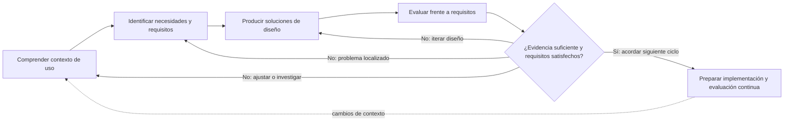

| Etapa | Propósito | Actividades realizadas o planificadas | Participantes | Evidencias | Decisiones | Producto |
|---|---|---|---|---|---|---|
| Comprensión del contexto | Conocer roles, tareas, condiciones y restricciones | Realizado: lectura de fase 1, recorrido de vistas Tkinter, inspección del cargador y validadores. Pendiente: entrevista semiestructurada a ≥3 personas relacionadas con curaduría o consulta de datos inmobiliarios | Realizado: equipo del proyecto. Pendiente: 3 personas potenciales, participación voluntaria | Disponible: código y documentos del proyecto. Pendiente: consentimiento y notas anonimizadas | Diseñar primero para analista que carga/audita; validar después entorno, dispositivos y conectividad | Contexto documentado; guía y formulario listos |
| Necesidades y requisitos | Convertir evidencia en resultados de interacción comprobables | Derivación documental de requisitos; después, codificación temática de entrevistas y priorización conjunta | Equipo; participantes de la indagación en el siguiente ciclo | Reglas exigidas por el backend y fricciones verificables en Tkinter; evidencia humana pendiente | Separar requisitos confirmados por reglas del producto de hipótesis de experiencia | Matriz RI-01 a RI-08 |
| Producción de soluciones | Hacer tangible el flujo para evaluar y revisar | Modelo conceptual, flujos de tareas, prototipo de fidelidad media HTML/CSS/JS y mejoras v2 | Equipo de diseño; revisión heurística interna | Archivo navegable de 10 pantallas y prueba funcional local | Mantener español claro, acción reversible, guía de campos y estados perceptibles; marcar todo dato simulado | Prototipo local `prototipo/index.html` |
| Evaluación frente a requisitos | Detectar problemas y decidir iteraciones | Revisión heurística del prototipo realizada. Prueba moderada con 3 personas: pendiente de ejecutar | Revisión: equipo. Prueba: 3 participantes voluntarios aún por reclutar | Tabla heurística incluida; formularios de prueba vacíos, sin observaciones atribuidas a usuarios | No publicar métricas ni conclusiones de usuario hasta completar sesiones | Hallazgos de inspección y plan medible de validación |

## 2. Indagación con usuarios

### Estado y protocolo ético

**La indagación aún no se ha realizado.** Antes de convocar participantes, el equipo explicará el propósito académico, el carácter voluntario, la duración estimada y el uso anónimo de las respuestas. Se solicitará consentimiento informado; se permitirá retirarse sin justificación. No se recopilarán nombres, documentos de identidad, correos personales, direcciones ni información médica, financiera o institucional reservada. Se registrará un código aleatorio (P01–P03), rol amplio, respuestas y observaciones de tarea. Las notas se guardarán con acceso limitado y se eliminarán al finalizar el curso según las instrucciones docentes.

### Instrumento propuesto: entrevista semiestructurada

Aplicación estimada: 15–20 minutos. Preguntar por experiencias recientes, sin solicitar datos del empleador ni datos inmobiliarios privados.

1. ¿Qué actividades realiza al recibir, revisar, corregir o consultar un conjunto de datos inmobiliarios?
2. Piense en la última vez que hizo esa tarea. ¿Cuáles fueron los pasos y qué herramientas utilizó?
3. ¿Con qué frecuencia realiza cada actividad y cuánto tiempo suele dedicarle?
4. ¿Qué información necesita tener a la vista para decidir si un archivo o registro está listo?
5. ¿Qué errores o dificultades encuentra con mayor frecuencia? ¿Cómo los detecta y resuelve hoy?
6. ¿Qué hace cuando una fila se rechaza o un procesamiento tarda más de lo esperado?
7. ¿Qué debería poder hacer el sistema después de mostrarle un error para que usted pueda continuar?
8. ¿Qué resultado espera obtener al cargar un archivo? ¿En qué formato necesita conservarlo o compartirlo?
9. ¿Qué términos utiliza para describir ubicación, atributos del inmueble y errores de calidad? ¿Qué etiquetas le resultarían ajenas?
10. ¿Qué experiencia tiene con hojas de cálculo, sistemas de datos o interfaces de escritorio/web?
11. ¿Qué dispositivo, sistema operativo, navegador o tamaño de pantalla usa habitualmente para estas tareas?
12. ¿En qué entorno físico y social trabaja (interrupciones, colaboración, consulta a colegas)?
13. ¿Hay restricciones de tiempo, conectividad, permisos o acceso a archivos que debamos considerar?
14. ¿Qué preferencias o necesidades de accesibilidad ayudarían a completar la tarea (tamaño de texto, contraste, teclado, lector de pantalla, movimiento)? Puede no responder.
15. Si pudiera cambiar una sola parte de su flujo actual, ¿cuál elegiría y por qué?

El formato de consentimiento, notas y registro individual está en [`instrumentos/PROTOCOLO_Y_REGISTRO_USUARIOS.md`](instrumentos/PROTOCOLO_Y_REGISTRO_USUARIOS.md). No se incluyen respuestas ficticias.

## 3. Contexto de uso y perfiles provisionales

### Contexto conocido e hipótesis

| Dimensión | Estado y descripción |
|---|---|
| Usuarios principales | Analista/operador de datos que selecciona archivos y revisa resultados; rol propuesto en fase 1, pendiente de confirmación con personas |
| Usuarios secundarios | Profesional inmobiliario que consulta datos consolidados; responsable de operaciones que revisa estado y métricas; roles propuestos en fase 1, aún sin evidencia de uso |
| Dispositivos | La interfaz existente es Tkinter de escritorio. El sistema operativo y el tamaño de pantalla de usuarios reales no están registrados; deben preguntarse |
| Entorno físico/social | Pendiente de entrevistas/observación. No se asume oficina, trabajo individual ni conectividad corporativa |
| Frecuencia | No medida. Carga, consulta y auditoría son tareas previstas, no frecuencias observadas |
| Restricciones de acceso | El programa usa archivos locales; SMTP es opcional y se configura por entorno. Permisos, acceso a datos y conectividad deben verificarse |
| Accesibilidad | La vista actual usa controles ttk/Tkinter, sin evaluación registrada de teclado, contraste o ampliación. Se probarán teclado, escalado de texto y legibilidad; preferencias individuales pendientes |

### Perfil provisional A — Analista/operador de datos

**Hipótesis basada en:** flujo de carga de archivos en `VistaCargaDataset`, servicio de ingesta y rol descrito en la propuesta de fase 1. No procede de entrevista.  
**Objetivo:** seleccionar uno o más archivos, entender por qué un lote pasa o se rechaza y revisar el resultado.  
**Conocimientos:** desconocidos; el sistema hoy presenta campos técnicos como factor de precio y etapas del pipeline, por lo que se debe comprobar familiaridad con datos y vocabulario de dominio.  
**Dispositivo/entorno/frecuencia:** por investigar.  
**Necesidades por validar:** validación temprana, claridad de campos obligatorios, progreso legible, salida ante rechazo y forma de recuperar/corregir un error.

### Perfil provisional B — Consultor/perito consumidor de datos

**Hipótesis basada en:** actor consumidor descrito en fase 1; la interfaz Tkinter actual no tiene explorador facetado y no acredita consulta independiente del MDM.  
**Objetivo:** consultar información consolidada, valorar su confiabilidad y exportar datos pertinentes.  
**Conocimientos:** desconocidos; no se presupone competencia técnica ni experiencia en herramientas web.  
**Dispositivo/entorno/frecuencia:** por investigar.  
**Necesidades por validar:** nombres reconocibles, filtros, explicación de certificación/calidad y exportación. La factibilidad funcional de consulta y exportación excede lo que las vistas actuales demuestran.

## 4. Necesidades y requisitos de interacción

Los requisitos siguientes son **derivaciones verificables de código/documentos**, no citas de personas. La prioridad se propone por impacto en completar el flujo. El criterio deberá probarse con participantes antes de declararlo satisfecho.

| ID | Usuario | Necesidad identificada | Evidencia que la respalda | Requisito de interacción derivado | Prioridad | Criterio de verificación |
|---|---|---|---|---|---|---|
| RI-01 | Operador | Distinguir qué archivos seleccionó antes de iniciar | La vista permite multiselección; muestra nombre y tamaño, pero no hace inspección previa del contenido | Al seleccionar archivos, mostrar nombre, extensión, tamaño legible y permitir quitar cada archivo antes de procesar | Alta | En prueba, la persona identifica el conjunto seleccionado y elimina un archivo elegido por error sin reiniciar la selección |
| RI-02 | Operador | Saber qué formatos acepta y por qué un archivo no continúa | El cargador admite CSV, JSON y Excel; la vista abre selector con esas extensiones, pero no informa rechazo local de archivo vacío | Ante formato no admitido o archivo vacío, explicar el problema y la acción siguiente antes de ejecutar el pipeline | Alta | Con un archivo vacío/no compatible, el mensaje nombra el problema y la persona puede reemplazarlo sin ejecutar |
| RI-03 | Operador | Comprender los seis atributos obligatorios | `IngestionService.REQUIRED_COLUMNS`: ubicacion, tamano_m2, habitaciones, banos, estrato, precio; el validador rechaza columnas faltantes | Antes de confirmar, mostrar los seis atributos con nombre comprensible, ejemplo y estado de presencia; permitir volver a la selección | Alta | La persona identifica los seis campos requeridos y corrige un campo faltante sin ayuda |
| RI-04 | Operador | Entender el progreso y el estado terminal del lote | El controlador emite inicio, avance por archivo, finalización y error; la vista de carga muestra solo barra indeterminada y estado general | Durante procesamiento mostrar archivo actual, etapa conocida, conteo actual/total y estado textual; indicar explícitamente completado, rechazado o error | Alta | La persona responde qué se está procesando y si terminó sin inferirlo solo por el color |
| RI-05 | Operador | Entender una causa de rechazo y el paso siguiente | `VistaResultado` muestra motivo, regla de negocio y gateway; algunos textos del dominio están en inglés y no muestran recuperación guiada | En rechazo, presentar etapa en español, motivo, regla/campo afectado y una acción segura para volver o abrir el detalle guardado | Alta | En una tarea, la persona explica el motivo y elige una acción válida sin consultar el log técnico |
| RI-06 | Operador | Recuperarse de errores sin perder configuración | El procesamiento es asíncrono; `show_error` habilita el botón, pero el mensaje es modal y no ofrece navegación a corregir la selección | Tras error, conservar archivos y parámetros y ofrecer acciones “Reintentar”, “Cambiar selección” y “Cerrar” con efectos diferenciados | Alta | Tras error simulado, la persona modifica o reintenta sin volver a introducir parámetros válidos |
| RI-07 | Operador | Comprender el efecto del factor de precio y el correo opcional | La carga expone `Factor precio` con texto pequeño y un campo email; no valida positividad ni presenta una confirmación resumida | Etiquetar el factor con unidad/efecto, validar valor numérico positivo y resumir archivo(s), correo opcional y factor antes de procesar | Media | Valores vacío, cero, negativo y no numérico generan mensajes asociados al campo; valor positivo muestra el resumen antes de ejecutar |
| RI-08 | Analista/consultor | Obtener un resultado que pueda guardar o compartir | La vista de resultados tiene botones “Descargar” y “Exportar Reporte” deshabilitados sin comandos asociados en la vista | Solo habilitar acciones realmente disponibles; cuando existan, indicar formato y destino, y confirmar archivo generado o explicar el impedimento | Media | Ningún control aparenta realizar una acción si no está conectado; exportación habilitada produce confirmación verificable |

## 5. Análisis de tareas

Las frecuencias e importancia siguientes son **estimaciones del equipo basadas en el flujo del producto**, no mediciones. Validarlas en las entrevistas.

| Tarea | Responsable y objetivo | Condición inicial | Información necesaria | Secuencia general | Errores posibles | Resultado esperado | Frecuencia estimada / importancia |
|---|---|---|---|---|---|---|---|
| T1. Iniciar carga | Operador: procesar un lote de inmuebles | Aplicación abierta; archivo local disponible | Ruta, formato, columnas requeridas, correo opcional y factor de precio | Seleccionar archivos → revisar selección → configurar parámetros → confirmar → seguir estado | Archivo vacío/no soportado, columnas ausentes, factor inválido, correo mal formado | Resultado terminal por archivo y acceso a sus detalles | Por validar / Crítica |
| T2. Revisar un rechazo | Operador: comprender un registro o lote rechazado | Un procesamiento terminó rechazado o con errores | ID del lote, etapa, motivo, regla y archivo original | Abrir resultado → localizar rechazo → leer causa → decidir corregir fuera del sistema, reintentar o archivar | Mensaje técnico, fila no identificable, no saber si hubo escritura | Causa entendida y siguiente paso seguro | Por validar / Crítica |
| T3. Revisar progreso | Operador: saber si el proceso sigue activo | Lote en ejecución | Archivo actual, avance, etapa y estado | Abrir monitor → observar evento/avance → revisar cierre | Progreso ambiguo, ventana oculta, error no anunciado | Diferenciar en curso, completado, rechazado y fallido | Por validar / Alta |
| T4. Consultar inventario | Consultor: localizar registros consolidados pertinentes | MDM contiene datos y el rol tiene acceso | Localidad, estrato, precio/área y significado de estado de calidad | Abrir consulta → establecer filtros → revisar filas → quitar filtros o exportar | Filtros sin resultados, métricas no confiables, pérdida de filtros | Lista filtrada y estado de calidad comprensible | Por validar / Alta |
| T5. Preparar salida | Operador/consultor: generar un archivo utilizable | Existe resultado limpio/MDM y función de exportación conectada | Dataset, formato de salida, destino y alcance de registros | Elegir datos → elegir formato/destino → confirmar → verificar archivo | Acción deshabilitada, formato incorrecto, salida parcial o sobrescrita | Archivo exportado y confirmación del nombre/ubicación | Por validar / Media |

### Tarea crítica T1 — Carga y procesamiento

**Responsable:** operador (hipótesis). **Objetivo:** procesar uno o más archivos válidos. **Condición inicial:** aplicación abierta y archivos legibles localmente. **Información:** CSV/JSON/XLS/XLSX; columnas `ubicacion`, `tamano_m2`, `habitaciones`, `banos`, `estrato`, `precio`; email opcional; factor de precio. **Secuencia:** seleccionar → verificar archivo(s) → configurar parámetros → confirmar → observar avance → revisar resultado. **Errores:** formato, extracción, columnas ausentes, valores no válidos, servicio de correo fallido. **Resultado:** resumen por archivo con estado y ubicación del resultado persistido. **Frecuencia/importancia:** por validar / crítica.

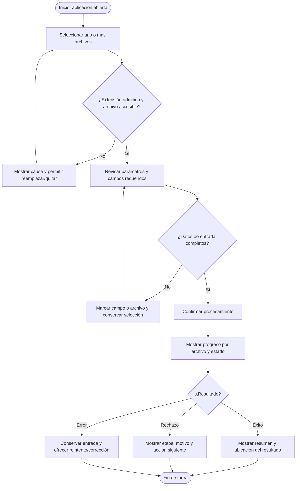

### Tarea crítica T2 — Comprender y resolver un rechazo

**Responsable:** operador (hipótesis). **Objetivo:** saber qué regla falló y tomar una acción segura. **Condición inicial:** resultado rechazado disponible. **Información:** identificador, archivo/fila si se conoce, etapa, motivo, regla y ruta de log. **Secuencia:** abrir resultado → ubicar etapa → leer motivo/regla → volver al archivo de origen o al resumen → decidir corregir y reintentar, o dejar registro. **Errores:** códigos G1–G4 sin significado, motivo técnico, confusión entre rechazo y error operativo. **Resultado:** usuario puede describir el problema y elegir una acción sin creer que el sistema corrigió datos. **Frecuencia/importancia:** por validar / crítica.

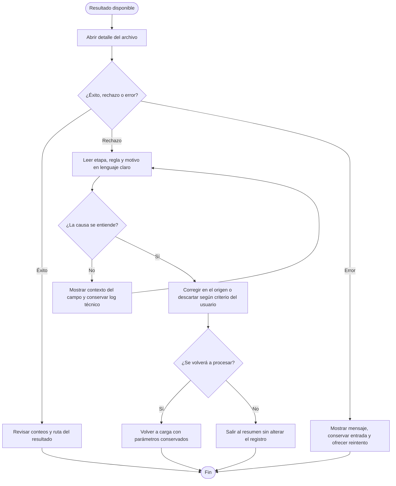

## 6. Modelo conceptual de interacción

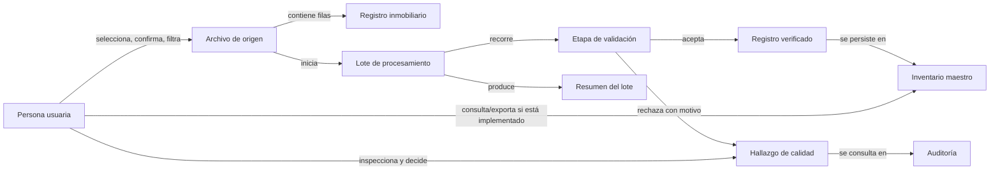

| Objeto visible | Acciones disponibles/propuestas | Relaciones y estados | Información/retroalimentación | Vocabulario |
|---|---|---|---|---|
| Archivo | Seleccionar, quitar, reemplazar, revisar vista previa | Seleccionado → compatible → procesado/rechazado | Nombre, tipo, tamaño, lectura/validación; distinguir detección de extensión de validación de contenido | Archivo, formato, columnas |
| Lote | Confirmar, observar progreso, revisar resultado | Pendiente → en curso → completado/rechazado/error | Archivo actual, etapa y resultado terminal | Lote, procesamiento |
| Etapa | Consultar etapa actual e hitos | Pendiente → en curso → completada/fallida | Nombre comprensible y detalle del evento | Lectura, validación, limpieza, revisión de calidad |
| Registro | Abrir detalle, comparar valor y regla | Verificado o con hallazgo | Identificador no sensible, campo y valor necesario para corregir | Registro, campo, valor recibido |
| Hallazgo | Filtrar, leer diagnóstico, marcar revisado (si se implementa) | Abierto → revisado; no equivale a corregido | Regla, causa, recomendación; aclarar que el usuario debe corregir el archivo fuente | Registro por revisar, motivo, regla |
| Inventario maestro | Consultar, filtrar, exportar (consulta/exportación aún no conectadas en Tkinter) | Consolidado; calidad y fecha de actualización deben provenir de datos reales | Conteo, filtros activos y resultado vacío | Inventario maestro, datos verificados |

El modelo responde a RI-01–RI-06 mediante selección identificable, estados visibles, motivos comprensibles y decisiones reversibles. RI-07–RI-08 quedan como diseño objetivo: el prototipo puede ilustrar la confirmación/exportación, pero las vistas Tkinter no prueban esas capacidades de extremo a extremo.

## 7. Prototipo navegable

**Enlace local:** [`prototipo/index.html`](prototipo/index.html). Está probado en navegador dentro del proyecto y no pide credenciales. No existe publicación externa, por lo que aún no puede afirmarse que un enlace web público esté disponible sin permisos.

Es un prototipo local de fidelidad media, HTML/CSS/JavaScript sin dependencias externas. Sus datos son ficticios y no se transmiten. La simulación no llama a `PipelineFacade`, no importa filas reales, no guarda en MDM y no genera archivos exportados. Las diez pantallas son:

| # | Pantalla | Tarea / propósito | Interacción prevista |
|---|---|---|---|
| 1 | Resumen | Estado general y accesos rápidos | Navegar a carga, auditoría o inventario |
| 2 | Selección de archivo | Seleccionar/arrastrar; validar tipo y archivo no vacío | Continuar, reemplazar o cancelar |
| 3 | Vista previa | Mostrar ejemplo de filas | Volver o asignar columnas |
| 4 | Asignación de columnas | Consultar guía de seis campos obligatorios | Confirmar revisión y retroceder |
| 5 | Confirmación | Revisar archivo y fuente antes de continuar | Editar, cancelar o simular |
| 6 | Progreso | Simular cuatro etapas y estados | Cancelar simulación o ver resumen |
| 7 | Resultados | Diferenciar éxito y alertas con conteos demostrativos | Abrir auditoría o nueva carga |
| 8 | Auditoría | Filtrar ejemplos por etapa/tipo | Limpiar filtros, abrir diagnóstico |
| 9 | Diagnóstico | Explicar causa, valor y acción sugerida | Marcar revisado o volver a la lista |
| 10 | Inventario/exportación | Mostrar filtros y acción demostrativa | Restablecer filtros y solicitar exportación simulada |

Accesibilidad básica aplicada: idioma `es`, etiquetas de formulario, región y estado anunciado, foco visible, navegación por teclado en selector de archivos, estados textuales además de color, controles nativos, contraste revisable y respeto a `prefers-reduced-motion`. Esto no equivale a una auditoría WCAG ni a compatibilidad verificada con lector de pantalla.

### Anexo visual

Las capturas siguientes corresponden a la versión local inspeccionada. Están marcadas como prototipo y usan datos ficticios. La [galería imprimible](capturas/galeria.html) presenta una pantalla por página horizontal.

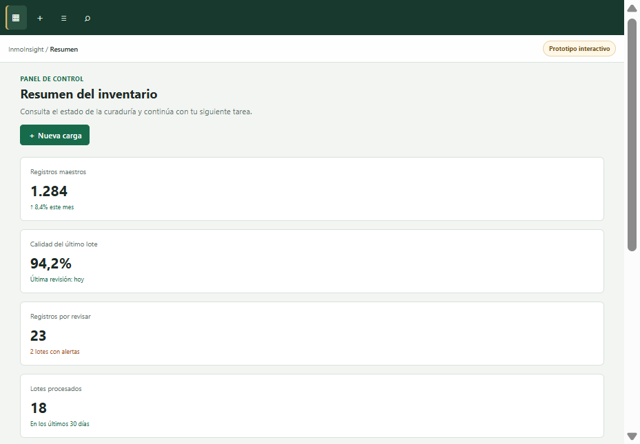

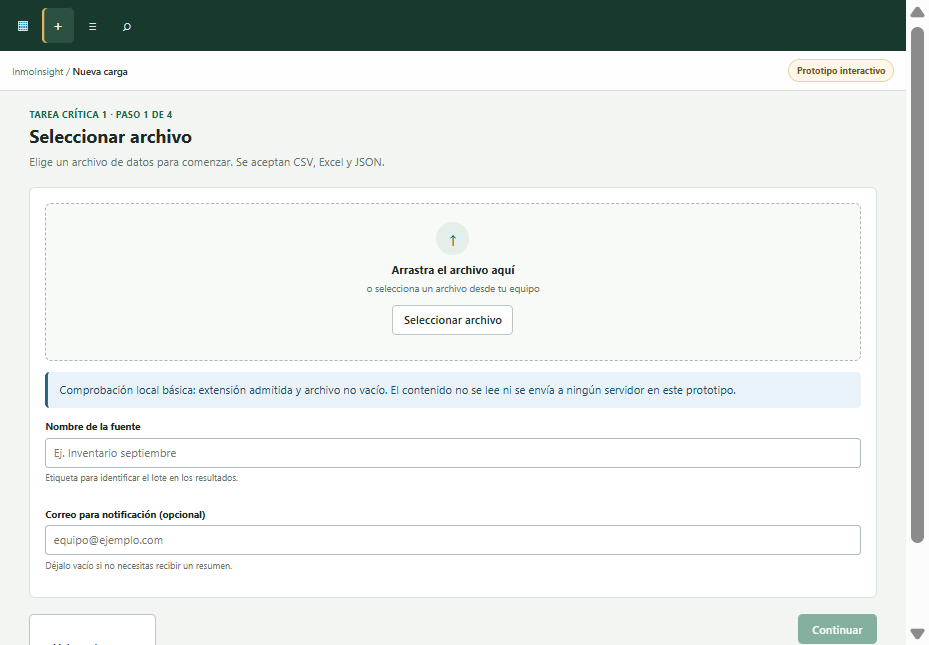

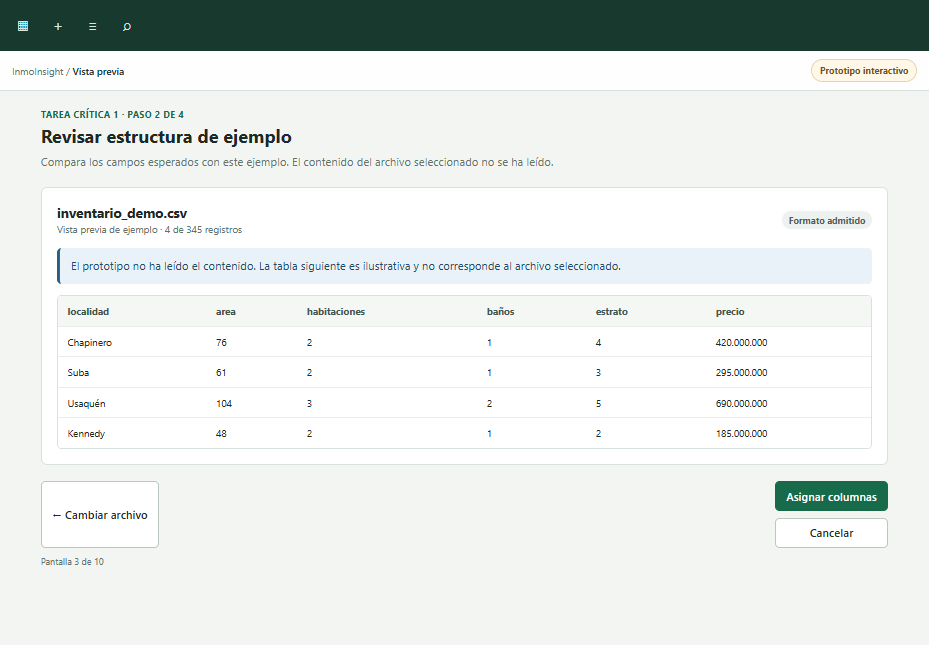

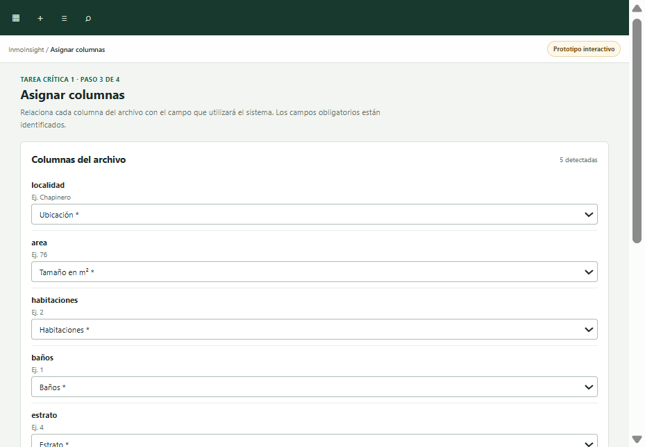

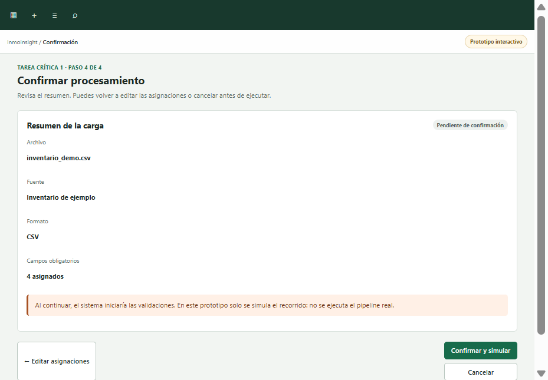

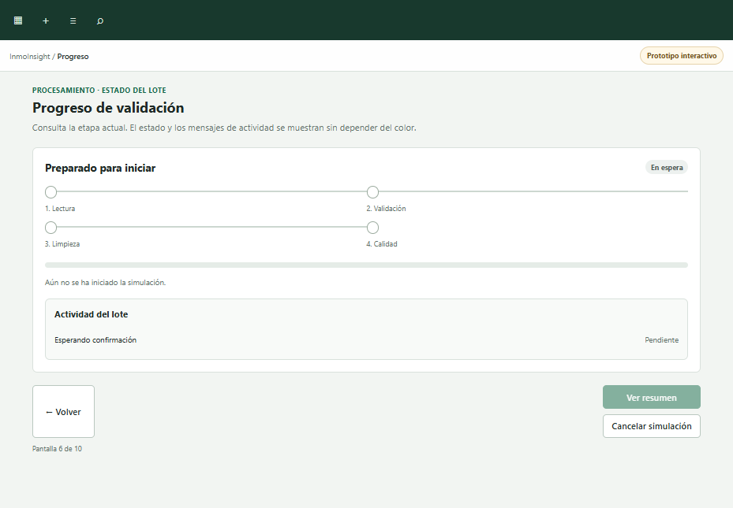

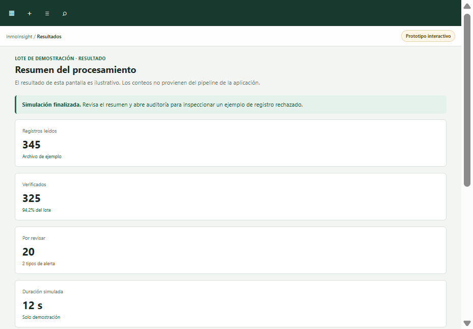

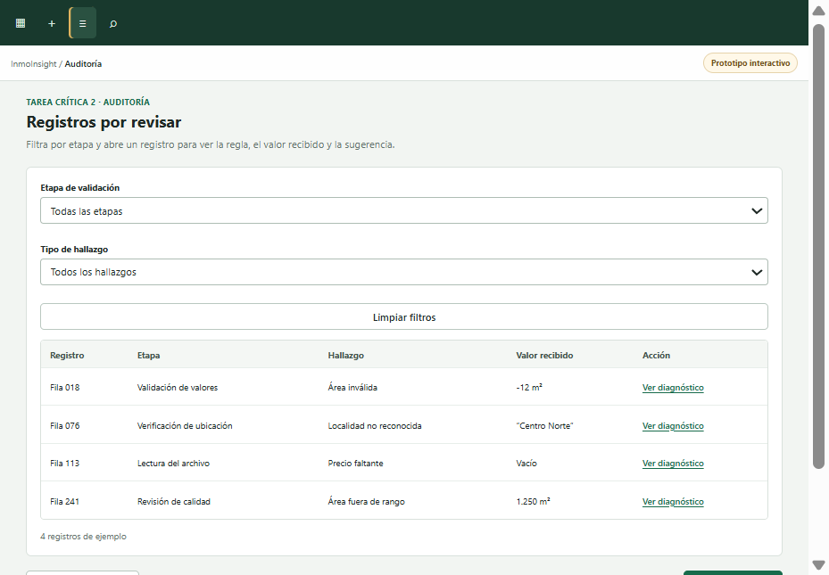

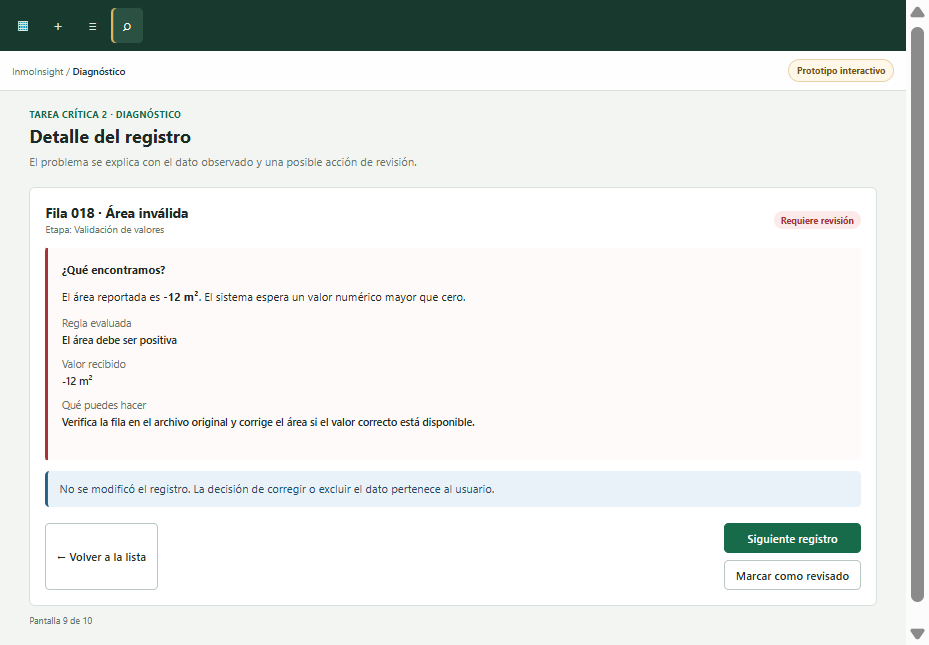

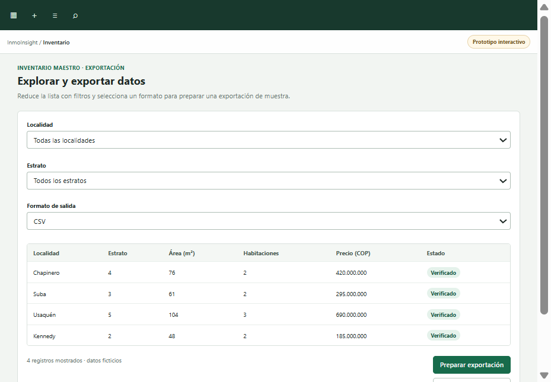

## 8. Ciclo de vida de la interfaz

| Etapa | Relación con este trabajo | Estado al cierre de fase 2 |
|---|---|---|
| Requerimientos | Roles y problema desde fase 1; requisitos de interacción derivados del backend y la UI; entrevistas para validar | Iteración documental hecha; confirmación con usuarios pendiente |
| Diseño | Flujos, modelo conceptual, vocabulario y principios de feedback, prevención y recuperación | Primera propuesta hecha; ajuste tras sesiones pendiente |
| Prototipado | Interacción representativa de carga, progreso, resultados y auditoría | Prototipo de 10 pantallas navegable; datos simulados |
| Implementación | Conectar estados/UI Tkinter o decidir arquitectura cliente y vincular casos de uso | Parcial: existe interfaz de escritorio Tkinter. El prototipo web no es implementación y no está conectado |
| Verificación y evaluación | Pruebas funcionales, heurísticas, tareas moderadas y accesibilidad | Inspección heurística de escritorio realizada; prueba con ≥3 personas pendiente |
| Mantenimiento y mejora | Priorizar hallazgos, comprobar regresiones, revisar usuarios y mantener reglas/ayuda | Backlog propuesto; ciclo de mejora continua aún no iniciado |

Al finalizar la fase 2, el proyecto se encuentra en **prototipado y evaluación inicial**. No se afirma que la implementación esté terminada. Próximos pasos: realizar las entrevistas, completar la prueba moderada con tres personas, iterar los tres cambios de mayor prioridad y decidir qué pantallas pasan a la interfaz productiva en la fase 3.

## 9. Plan de evaluación

| Elemento | Definición |
|---|---|
| Objetivo | Comprobar si tres personas potenciales pueden seleccionar una entrada, comprender el estado/resultados y diagnosticar un rechazo, e identificar barreras de comprensión y control |
| Preguntas de evaluación | 1) ¿Puede la persona determinar si el archivo seleccionado puede continuar? 2) ¿Identifica los seis campos requeridos? 3) ¿Sabe en qué etapa está el lote y cuál fue su estado final? 4) ¿Puede explicar un rechazo y elegir una acción segura? 5) ¿Encuentra y restablece filtros sin ayuda? |
| Participantes | Mínimo 3 voluntarios potenciales: al menos una persona que gestione datos y una que consulte/analice datos inmobiliarios; evitar reclutar subordinados directos cuando sea posible. Códigos P01–P03 |
| Tareas | T1 cargar archivo, T2 comprender un rechazo, T3 localizar un registro aplicando filtros. Cada participante realiza las tres con la versión del prototipo que se evalúe |
| Métodos | Entrevista semiestructurada breve; prueba moderada de tareas con pensamiento en voz alta; evaluación heurística separada |
| Instrumentos | Consentimiento, guion de tareas, hoja de observación, cronómetro, escala de satisfacción 1–5 y checklist heurístico incluidos en `instrumentos/` |
| Métricas | Éxito completo/parcial/no completado; tiempo por tarea; errores observables; ayudas solicitadas; dudas/citas anonimizadas; satisfacción 1–5. Informar numerador y denominador |
| Responsabilidades | Integrante facilitador lee guion y no enseña la solución; integrante observador registra acciones/tiempos sin inferir intención. Alternar roles entre sesiones; registrar nombres de integrantes al aplicar |
| Procedimiento | 1) Confirmar consentimiento (2 min). 2) Preguntar rol/experiencia/dispositivo sin identificadores (4 min). 3) Presentar escenario neutral y tareas una por una (15–20 min). 4) Observar en silencio; solo ayudar si la persona lo solicita y registrar la ayuda. 5) Aplicar satisfacción por tarea y cierre (5 min). 6) Anonimizar notas, calcular métricas y revisar hallazgos en equipo |

No grabar audio/video salvo autorización separada y necesidad aprobada por el curso. No utilizar datos reales con información personal; trabajar solo con los ejemplos incluidos en el prototipo.

## 10. Evaluación heurística de Nielsen

**Método y alcance:** inspección de escritorio del prototipo navegable realizada por el equipo el 29-09-2026. Los hallazgos se refieren a esta propuesta, no a la aplicación productiva ni a observaciones de participantes. Escala de severidad: 0 = sin problema; 1 = cosmético; 2 = menor; 3 = grave; 4 = catastrófico/bloquea la tarea.

| # / heurística | Pantalla o elemento | Hallazgo y consecuencia | Severidad | Recomendación |
|---|---|---|---:|---|
| H1. Visibilidad del estado | Pantalla 6, progreso | El estado terminal se presenta con porcentaje y texto, pero el tiempo estimado no existe; el usuario no puede anticipar duración | 2 | Añadir duración real solo cuando backend la mida; no mostrar estimaciones inventadas |
| H2. Correspondencia con el mundo real | Pantallas 4, 6 y 8 | Los nombres son mayormente del dominio, pero “MDM” y “calidad” todavía pueden ser ambiguos para perfiles sin formación en datos | 2 | Validar vocabulario con participantes y explicar siglas en contexto |
| H3. Control y libertad | Pantallas 5–6 | Se permite cancelar la simulación y volver a editar; cancelar no pide confirmación aunque el usuario pueda activarlo accidentalmente | 1 | Mantener cancelación reversible en la demo; en implementación real confirmar solo si hay trabajo no recuperable |
| H4. Consistencia y estándares | Navegación y acciones | Jerarquía de botones y etiquetas principales es consistente; los iconos de navegación dependen de glifos y no todos son universalmente reconocibles | 1 | Acompañar los iconos por texto accesible y comprobar renderizado en los sistemas objetivo |
| H5. Prevención de errores | Pantallas 2 y 4 | La carga comprueba extensión/tamaño, no que el contenido sea legible; “Archivo legible” puede generar falsa confianza. La confirmación del mapeo depende de una casilla, no valida asignaciones | 3 | Decir “Formato admitido; contenido aún sin validar”; impedir avanzar si un campo requerido queda sin asignar |
| H6. Reconocimiento mejor que recuerdo | Pantalla 4 | Guía con campos y ejemplos reduce recuerdo, pero selectores no presentan sugerencias de correspondencia por cada alias | 2 | Mostrar campo detectado → campo destino y resultado de cada asignación, no solo etiquetas |
| H7. Flexibilidad y eficiencia | Pantallas 8–10 | No hay búsqueda textual ni filtros guardados; la lista de auditoría de muestra es pequeña y solo demuestra filtros discretos | 2 | Añadir búsqueda, conservar filtros al volver y evaluar atajos/presets para trabajo frecuente |
| H8. Diseño estético y minimalista | Pantallas 1 y 7 | Resumen prioriza métricas; sin embargo, indicadores ficticios podrían confundirse con métricas reales si se reutiliza la pantalla fuera del prototipo | 3 | Mantener marca “Datos de ejemplo” visible en cada pantalla que muestre conteos simulados |
| H9. Reconocer, diagnosticar y recuperarse | Pantalla 9 | Diagnóstico y sugerencia son claros, pero la corrección ocurre fuera del sistema y no hay acción directa para reintentar el lote con datos corregidos | 2 | Explicitar que la fila no se modifica y ofrecer volver a carga cuando la integración lo permita |
| H10. Ayuda y documentación | Pantalla 4 y global | No hay ayuda contextual para explicar reglas de dominio ni glosario de etapas | 2 | Agregar ayuda contextual breve con ejemplo y acceso a glosario; medir si reduce consultas durante prueba |

La priorización heurística propone resolver primero H5, luego H8 y H6. La evaluación por usuarios debe comprobar si la severidad percibida coincide; no se sustituye por esta inspección.

## 11. Prueba de usabilidad con personas

**Estado: pendiente.** No hay sesiones observadas, participantes reclutados ni métricas empíricas en el repositorio. La hoja está vacía a propósito; completarla durante sesiones reales y conservar el consentimiento por separado.

| Participante anónimo | Tarea | Resultado (completa/parcial/no) | Tiempo | Errores | Ayudas | Duda/comentario textual anonimizado | Satisfacción (1–5) |
|---|---|---|---|---|---|---|---:|
| P01 | T1 / T2 / T3 | Pendiente | Pendiente | Pendiente | Pendiente | Pendiente | — |
| P02 | T1 / T2 / T3 | Pendiente | Pendiente | Pendiente | Pendiente | Pendiente | — |
| P03 | T1 / T2 / T3 | Pendiente | Pendiente | Pendiente | Pendiente | Pendiente | — |

### Cálculo e interpretación

- Tasa de finalización por tarea = tareas completadas ÷ intentos válidos × 100. Reportar también las parciales por separado.
- Tiempo aproximado = mediana y rango de segundos de intentos completados; incluir resultados parciales como dato separado.
- Frecuencia de errores = total de errores observados por tarea y errores por intento. Definir un error como acción que impide avanzar o requiere corregir una acción, no como exploración normal.
- Ayuda = número de solicitudes y tipo de pista proporcionada; no contar explicación inicial del protocolo.
- Satisfacción = promedio y distribución de puntuaciones, con n explícito. Con tres personas, describir como indicio cualitativo, no generalización estadística.

**Resultados actuales:** no calculables hasta realizar las sesiones. No se reutilizan porcentajes ni tiempos del borrador anterior porque no hay evidencia de origen.

## 12. Hallazgos, priorización e iteración

Los tres estados “Aplicada” siguientes indican cambios verificables en el prototipo después de la inspección, no mejoras validadas por participantes.

| ID | Problema | Evidencia | Usuario/tarea | Impacto | Mejora | Prioridad | Estado |
|---|---|---|---|---:|---|---|---|
| M1 | La etapa podía identificarse por código técnico o ser ambigua | Vista real del pipeline usa etapas en inglés; prototipo compara términos con reglas del dominio | Operador / T1–T2 | Alto | Etiquetar pasos con nombres legibles, conservar etapas distintas de ingesta, validación, limpieza y calidad | Alta | Aplicada en prototipo; validar con personas |
| M2 | No se mostraban los seis campos obligatorios reales | `IngestionService.REQUIRED_COLUMNS`; el borrador de prototipo omitía baños y usaba alias no soportados | Operador / T1 | Bloqueante | Incluir ubicación, tamaño, habitaciones, baños, estrato y precio con nombres fuente admitidos y guía de validación | Alta | Aplicada en prototipo; validar con personas |
| M3 | Mensaje de carga podía prometer lectura válida tras validar solo extensión/tamaño | Inspección de `validateFile()` del prototipo | Operador / T1 | Alto | Cambiar lenguaje a “formato admitido”, aclarar que el contenido se valida al procesar y mostrar límites de la simulación | Alta | Aplicada en prototipo |
| M4 | No se previene continuar con un campo requerido sin asignar | Selectores del mapeo son demostrativos y la casilla no valida el mapeo | Operador / T1 | Alto | Implementar verificación individual del mapeo obligatorio y resumen de faltantes | Alta | Pendiente |
| M5 | No hay búsqueda o guardado de filtros | Pantallas de auditoría/inventario | Analista / T2–T4 | Medio | Añadir búsqueda y conservar filtros al navegar; evaluar búsquedas guardadas si hay uso frecuente | Media | Pendiente |
| M6 | Las instrucciones para corregir una fila no tienen una ruta de reintento | Pantalla de diagnóstico | Operador / T2 | Medio | Añadir enlace de retorno a carga preservando el contexto; no autoeditar registros | Media | Pendiente |
| M7 | Conteos ficticios pueden parecer productivos | Panel y resumen del prototipo | Todos / T3 | Alto | Mantener marca persistente de datos ficticios y eliminarla solo cuando se conecten métricas reales | Alta | Aplicada; mantener en toda iteración |

### Comparación antes/después (evidencia del artefacto)

| Cambio | Antes | Después | Evidencia comprobable |
|---|---|---|---|
| M1 — Nombres de etapas | El borrador nombraba compuertas G1–G4 o etapas genéricas | El prototipo usa Lectura del archivo, Validación de valores, Limpieza de datos y Revisión de calidad | Pantalla 6 y tabla de auditoría, con nomenclatura consistente con el flujo del backend |
| M2 — Campos | Muestra anterior omitía baños y usaba `area_m2`/`precio_cop`, no reconocidos por el mapa del servicio | Mapeo contiene seis campos, presenta alias de origen `localidad`, `area`, `habitaciones`, `baños`, `estrato`, `precio` y rangos | Pantallas 3–4; contrastado con `IngestionService` y `QualityValidator` |
| M3 — Mensajes | “Archivo legible” sugería que el contenido había sido leído | Se informa “formato compatible/admitido” y que no se procesa ni envía contenido | Pantalla 2; la validación se limita a extensión y archivo no vacío |

Estas comparaciones describen cambios en el artefacto, no una mejora medida en eficacia, eficiencia o satisfacción. Medir impacto en la siguiente iteración con el mismo guion y tareas comparables.

## 13. Conclusiones provisionales (228 palabras)

El análisis de la propuesta, las vistas Tkinter y el flujo de ingesta permitió aprender algo sobre el sistema, pero todavía no sobre la experiencia de personas usuarias: esa distinción es central en esta fase. El flujo real exige seis campos de datos y distingue lectura, validación, limpieza, control de calidad, persistencia y notificación. La interfaz actual permite seleccionar varios archivos y muestra un estado general, mientras que la vista de resultados conserva motivos y reglas de rechazo; la consulta del inventario y la exportación aparecen como necesidades de la propuesta, pero no están acreditadas como acciones completas en las vistas existentes.

Cambió un supuesto del diseño inicial: no bastaba con mostrar una guía de columnas “inmobiliarias”; era necesario contrastar cada ejemplo con los nombres y restricciones que el cargador admite. La primera versión de este prototipo mostraba alias no reconocidos y omitía baños, así que se corrigió antes de proponerlo para evaluación. También se acotaron mensajes que podían hacer creer que se había validado el contenido del archivo cuando solo se comprobaba su extensión y tamaño.

La versión actual representa diez pantallas, estados de procesamiento simulados, navegación de ida y vuelta, diagnóstico y filtros, y marca sus datos de ejemplo. No es una implementación conectada ni una evaluación con usuarios. En fase 3 deben realizarse las entrevistas y tres pruebas moderadas, completar métricas y conclusiones con registros anónimos, corregir el mapeo obligatorio, validar accesibilidad y decidir la integración con Tkinter/backend. Solo después de esa iteración podrá afirmarse qué necesidades son compartidas y qué mejoras aumentan la usabilidad.

## 14. Referencias (APA 7.ª edición)

International Organization for Standardization. (2018). *Ergonomics of human-system interaction—Part 11: Usability: Definitions and concepts (ISO Standard No. 9241-11:2018).* https://www.iso.org/standard/63500.html

International Organization for Standardization. (2019). *Ergonomics of human-system interaction—Part 210: Human-centred design for interactive systems (ISO Standard No. 9241-210:2019).* https://www.iso.org/standard/77520.html

Nielsen, J. (1994). *Usability engineering*. Morgan Kaufmann.

Nielsen, J. (2024, January 30). *10 usability heuristics for user interface design*. Nielsen Norman Group. https://www.nngroup.com/articles/ten-usability-heuristics/

Norman, D. A. (2013). *The design of everyday things: Revised and expanded edition*. Basic Books.

World Wide Web Consortium. (2018). *Web content accessibility guidelines (WCAG) 2.1*. https://www.w3.org/TR/WCAG21/