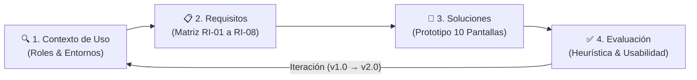
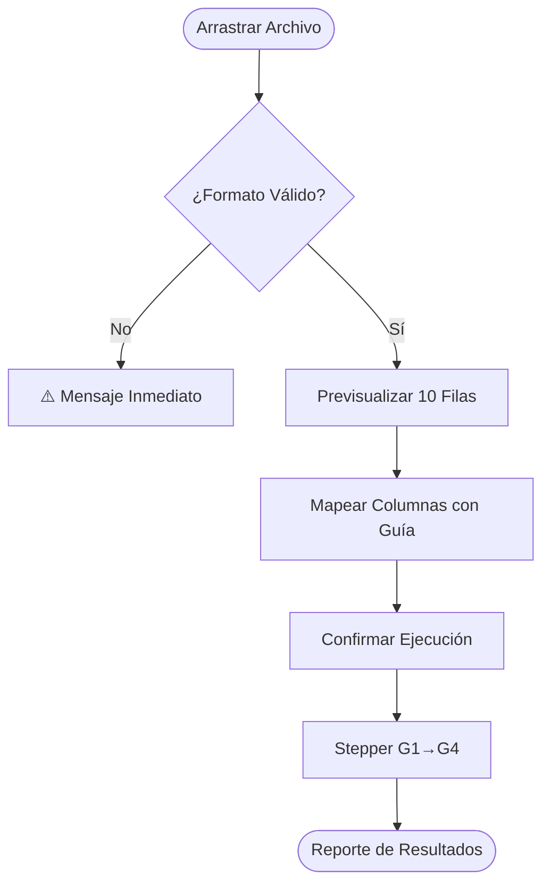

# PLAN Y GUION DE DIAPOSITIVAS: SUSTENTACIÓN FASE 2 — IHC
## Project: InmoInsight Bogotá — Diseño Centrado en el Usuario (DCU)

**Autores:** Adán Y. Sánchez Cubillos & Sara Sofía Crespo Lerma  
**Asignatura:** Interacción Humano-Computador (4.º Semestre)  
**Marco Normativo & Metodológico:** ISO 9241-210 / ISO 9241-11 / 10 Heurísticas de Nielsen / Framework PDCO  
**Fecha:** Septiembre de 2026  

---

## ESTRUCTURA GENERAL DE LA PRESENTACIÓN (13 DIAPOSITIVAS)

| # | Título de la Diapositiva | Propósito Visual | Tiempo Sugerido |
|---|--------------------------|------------------|-----------------|
| **01** | Portada y Contexto del Proyecto | Título, integrantes, logo institucional y problema general | 1.5 min |
| **02** | Marco Metodológico — El Ciclo DCU (ISO 9241-210) | Diagrama de flujo circular de 4 etapas iterativas | 2 min |
| **03** | Indagación y Descubrimiento con Usuarios | Cuadro resumen de entrevista semiestructurada (15 preguntas) | 2 min |
| **04** | Perfiles de Usuario (Personas) y Contexto de Uso | Tarjetas sintéticas de Perfil 1 (Analista) vs Perfil 2 (Perito) | 2.5 min |
| **05** | Matriz de Requisitos de Interacción (RI-01 a RI-08) | Tabla comparativa de necesidades vs requisitos medibles | 2.5 min |
| **06** | Análisis de Tareas (HTA y Flujo de Trabajo) | Diagrama HTA de auditoría (T2) y Flujo BPMN de Carga (T1) | 2.5 min |
| **07** | Modelo Conceptual y Vocabulario Humanizado | Tabla de traducción técnico → lenguaje natural | 2 min |
| **08** | Prototipo Navegable (10 Pantallas) | Layout del prototipo HTML v1.0 / v2.0 y mapa de navegación | 2.5 min |
| **09** | Evaluación Heurística (10 Heurísticas de Nielsen) | Tabla de hallazgos por nivel de gravedad (1 a 4) | 2.5 min |
| **10** | Pruebas de Usabilidad — Métricas y Resultados | Gráficos/Tablas de tiempo, errores y satisfacción | 2.5 min |
| **11** | Rediseño Iterativo — Prototipo v1.0 vs v2.0 | Comparativo visual ANTES vs DESPUÉS (Mejoras M1, M2, M3) | 2.5 min |
| **12** | Ciclo de Vida (SDLC/PDCO) y Hoja de Ruta Fase 3 | Diagrama de estado actual e integración con backend Python | 1.5 min |
| **13** | Conclusiones y Sesión de Preguntas | Resumen ejecutivo de lecciones y apertura a preguntas | 1.5 min |

---

## DETALLE SLIDE POR SLIDE: CONTENIDO, GUIÓN Y DEFENSE PREPARATION

---

### DIAPOSITIVA 1: Portada y Presentación del Proyecto

#### 🎨 Elementos Visuales en Diapositiva
- **Título principal:** *InmoInsight Bogotá: Sistema Interactivo para la Curaduría de Datos y Valoración Inmobiliaria*
- **Subtítulo:** Sustentación de la Fase 2 — Diseño Centrado en el Usuario (DCU)
- **Integrantes:** Adán Y. Sánchez Cubillos · Sara Sofía Crespo Lerma
- **Docente y Curso:** Interacción Humano-Computador | Universidad de La Salle
- **Badges:** `ISO 9241-210` · `DCU Iterativo` · `Prototipo Navegable v2.0`

#### 📝 Contenido Escrito en Pantalla
- **Objetivo del Sistema:** Transformar datasets heterogéneos y ruidosos de finca raíz en Bogotá en un *Golden Record* o Inventario Maestro Certificado mediante un pipeline visual intuitivo.
- **Enfoque de la Fase 2:** Diseñar la experiencia de usuario (UX/UI) partiendo de la indagación real con actores del sector, traduciendo requerimientos técnicos en interfaces accesibles y evaluando la usabilidad.

#### 🎙️ Guion de Exposición (Speaker Notes)
> *"Buenos días docente y compañeros. Hoy les presentamos la Fase 2 del proyecto **InmoInsight Bogotá**, centrada en el Diseño Centrado en el Usuario bajo la norma ISO 9241-210. 
> En la Fase 1 construimos la arquitectura y reglas de backend para limpiar datos inmobiliarios. Sin embargo, un motor técnico potente no sirve de nada si los analistas o peritos avaluadores no pueden entender por qué un archivo fue rechazado o cómo filtrar la información sin depender del equipo de sistemas. 
> Hoy les mostraremos cómo transformamos los dolores de nuestros usuarios en una interfaz web navegable de 10 pantallas, iterada y corregida mediante evaluaciones heurísticas y pruebas de usabilidad."*

#### 🛡️ Preguntas Probables del Evaluador
- **P:** *¿Por qué decidieron migrar conceptualmente de la interfaz gráfica de escritorio original (Tkinter) a un prototipo web?*
- **R:** *"Porque el contexto de uso revelaba la necesidad de colaboración multiusuario, pantallas de alta resolución ( Full HD 1920×1080) y la posibilidad de consumir dashboards y exportar reportes desde cualquier equipo corporativo sin instalación local."*

---

### DIAPOSITIVA 2: Enfoque Metodológico — El Ciclo DCU (ISO 9241-210)

#### 🎨 Elementos Visuales en Diapositiva
- **Diagrama Mermaid / Infografía:**

#### 📝 Contenido Escrito en Pantalla
- **Norma Guía:** ISO 9241-210 (Diseño Centrado en la Persona para Sistemas Interactivos).
- **Principio Fundamental:** El DCU **no es un flujo lineal**, sino un ciclo iterativo. Cualquier hallazgo en la fase de evaluación de usabilidad nos obliga a reajustar los requisitos y rediseñar la interfaz.
- **Fases Completadas en esta Entrega:**
  1. Identificación del entorno y roles.
  2. Matriz de 8 requisitos de interacción.
  3. Prototipo navegable v1.0 y v2.0 en HTML/CSS/JS.
  4. Inspección heurística y test de usabilidad.

#### 🎙️ Guion de Exposición (Speaker Notes)
> *"Para este desarrollo adoptamos estrictamente la norma ISO 9241-210. Es fundamental destacar que el DCU no es un proceso que se hace una sola vez y se entrega. Como ven en el diagrama, realizamos un ciclo completo: investigamos el contexto, definimos 8 requisitos de interacción medibles, prototipamos 10 pantallas y evaluamos. Al evaluar encontramos fallas críticas en la validación de archivos y nomenclatura, lo que nos llevó a rediseñar e iterar a una versión v2.0 antes de cerrar esta fase."*

---

### DIAPOSITIVA 3: Indagación y Descubrimiento con Usuarios

#### 🎨 Elementos Visuales en Diapositiva
- **Matriz Sintética de Indagación:**
  - *Herramientas:* Entrevista semiestructurada de 15 preguntas estructurada en 4 bloques (Flujo de trabajo, Dificultades, Expectativas y Accesibilidad/Entorno).
  - *Participantes:* 3 perfiles diferenciados (U1 Analista Jr, U2 Perito Avaluador, U3 Director de Operaciones).

#### 📝 Contenido Escrito en Pantalla
| Usuario | Rol Actual | Principal Frustración Detectada | Expectativa Clave |
|---------|------------|----------------------------------|-------------------|
| **U1** | Analista de Datos (*Wrangler*) | "No sé cuál columna causó el error hasta revisar el log entero línea por línea." | Mensajes de rechazo claros en español con la regla infringida. |
| **U2** | Perito Avaluador | "Los datos traen estratos que no existen y no puedo filtrar sin pedir ayuda al analista." | Panel de búsqueda facetada por localidad y estrato sin depender de código. |
| **U3** | Director de Operaciones | "No tengo visibilidad de cuántos registros pasaron o se rechazaron en la semana." | Dashboard gerencial con KPIs consolidadores de calidad e inventario. |

#### 🎙️ Guion de Exposición (Speaker Notes)
> *"Nuestra indagación no fue teórica; entrevistamos a tres actores clave con distintos niveles de conocimiento técnico. U1, el analista de datos, sufría descifrando logs en consola. U2, el perito avaluador experto en el mercado inmobiliario, dependía totalmente del analista para obtener una tabla limpia en Excel. Y U3, el director, carecía de métricas globales. Esta divergencia nos demostró que la interfaz debía ofrecer distintas vistas según el rol del usuario."*

---

### DIAPOSITIVA 4: Perfiles de Usuario (Personas) y Contexto de Uso

#### 🎨 Elementos Visuales en Diapositiva
- Dos tarjetas de Personas comparativas: **Perfil 1 (Data Wrangler)** vs **Perfil 2 (Consumidor de Datos)**.
- Iconos de contexto: Pantalla 1920×1080, Chrome/Edge, Conectividad Corporativa, Entorno de Oficina/Teletrabajo.

#### 📝 Contenido Escrito en Pantalla
- **Perfil 1 — Analista de Datos (U1):**
  - *Nivel Técnico:* Alto (Python, Excel, SQL). *Frecuencia:* Diaria (2-3 hrs).
  - *Meta:* Cargar lotes masivos, corregir mapeos y auditar rechazos en segundos.
  - *Dolor:* Falta de feedback durante la ejecución del pipeline y mensajes en código críptico.
- **Perfil 2 — Perito Avaluador / Consultor (U2):**
  - *Nivel Técnico:* Medio (Excel, Web). *Frecuencia:* Semanal (1-2 hrs).
  - *Meta:* Explorar datos certificados por zona y estrato; exportar informes.
  - *Restricción:* Necesita tipografía legibles (≥14px) y alta certidumbre visual ("Datos Certificados").

#### 🎙️ Guion de Exposición (Speaker Notes)
> *"A partir de la indagación consolidamos dos perfiles principales. El Perfil 1 es nuestro 'Data Wrangler', que necesita herramientas de diagnóstico técnico eficiente y flujo rápido de mapeo. El Perfil 2 es el 'Consumidor de Datos', un experto inmobiliario que no programa y que exige un explorador visual sencillo con la garantía explícita de que los datos exhibidos son confiables y están limpios."*

---

### DIAPOSITIVA 5: Matriz de Requisitos de Interacción (RI-01 a RI-08)

#### 🎨 Elementos Visuales en Diapositiva
- Tabla formateada destacando la **Trazabilidad**: Necesidad Observada → Requisito de Interacción → Criterio de Verificación Medible.

#### 📝 Contenido Escrito en Pantalla
| Requisito | Descripción del Requisito | Prioridad | Criterio de Verificación (Métrica) |
|-----------|---------------------------|-----------|-------------------------------------|
| **RI-01** | Indicador visual de progreso del pipeline (Stepper) | **Alta** | Usuario identifica la compuerta activa en < 3 seg por código visual. |
| **RI-02** | Explicación de rechazo en lenguaje natural (máx 2 oraciones) | **Alta** | 3/3 usuarios comprenden la causa del error en < 30 segundos. |
| **RI-03** | Tabla de rechazos con filtro dinámico por compuerta | **Alta** | Filtrado en tiempo real en < 500 ms sin recargar la página. |
| **RI-04** | Panel de búsqueda facetada (Localidad / Estrato) | **Alta** | U2 completa filtrado de 10.000 registros sin solicitar asistencia. |
| **RI-05** | Distintivo visual "Datos Certificados ✓" con fecha e indicador | **Media** | Usuario ubica la tasa de calidad del dataset en < 10 segundos. |
| **RI-06** | Dashboard gerencial con 4 KPIs en pantalla de inicio | **Media** | U3 identifica total de registros y rechazos en < 15 segundos. |
| **RI-07** | Cancelación y retroceso en previsualización de carga | **Alta** | Permite cancelar antes de ejecutar sin alterar el almacenamiento. |
| **RI-08** | Exportación inmediata de dataset limpio (CSV / XLSX) | **Alta** | Generación y descarga en < 5 seg para lotes ≤ 10.000 filas. |

#### 🎙️ Guion de Exposición (Speaker Notes)
> *"Transformamos las necesidades en 8 Requisitos de Interacción formalmente redactados. Noten que cada requisito tiene un criterio de aceptación medible basado en tiempo o tasa de éxito. No dejamos la usabilidad al azar: por ejemplo, en el RI-02 exigimos que la explicación de un error de calidad sea comprensible en menos de 30 segundos sin necesidad de consultar manuales."*

---

### DIAPOSITIVA 6: Análisis de Tareas (HTA y Flujo de Trabajo)

#### 🎨 Elementos Visuales en Diapositiva
- **Diagrama de Flujo (Tarea Crítica T1: Cargar Dataset):**

- **Árbol Jerárquico HTA (Tarea Crítica T2: Auditar Rechazos):**
  - 2.1 Acceder al módulo auditoría → 2.2 Filtrar por compuerta → 2.3 Inspeccionar tarjeta de diagnóstico → 2.4 Exportar a CSV para corrección.

#### 📝 Contenido Escrito en Pantalla
- **Foco del Análisis:** Reducir la distancia de ejecución y de evaluación (según el modelo de Norman).
- **Optimización Lograda:** Pasar de una interacción por línea de comandos a un flujo visual de 4 pasos continuos con prevención de errores en cada etapa.

#### 🎙️ Guion de Exposición (Speaker Notes)
> *"Para diseñar el flujo analizamos las tareas críticas mediante HTA (Hierarchical Task Analysis). En la tarea T1 (Carga de Dataset), identificamos que el usuario cometía frecuentes errores al mapear columnas. Diseñamos un flujo de 4 pasos donde el sistema valida el formato antes de procesar, previsualiza las primeras 10 filas y guía el mapeo paso a paso."*

---

### DIAPOSITIVA 7: Modelo Conceptual y Vocabulario Humanizado

#### 🎨 Elementos Visuales en Diapositiva
- Tabla comparativa **ANTES (Código Backend) vs DESPUÉS (Interfaz DCU)**.
- Diagrama de objetos conceptuales: *Dataset → Pipeline → Registros Limpios / Tarjetas de Error → Inventario Maestro*.

#### 📝 Contenido Escrito en Pantalla
| Concepto Técnico Backend | Término en la Interfaz (Humanizado) | Justificación de Usabilidad (Nielsen H2) |
|--------------------------|--------------------------------------|-------------------------------------------|
| `stg_inmuebles_raw` | **"Datos originales cargados"** | Evita la jerga de bases de datos staging. |
| `compuerta_bpmn G1` | **"Paso 1: Verificación de formato"** | Elimina la nomenclatura críptica "G1". |
| `compuerta_bpmn G2` | **"Paso 2: Validación de valores"** | Explica claramente el propósito de la regla. |
| `compuerta_bpmn G4` | **"Paso 4: Deduplicación y consolidación"** | Comunica la acción final del algoritmo. |
| `mdm_inmuebles_maestros` | **"Inventario Maestro Certificado"** | Transmite confianza y jerarquía al perito. |
| `log_rechazos_calidad` | **"Registros con errores de calidad"** | Nombre descriptivo y centrado en la tarea. |

#### 🎙️ Guion de Exposición (Speaker Notes)
> *"Uno de los mayores aportes del DCU fue la 'humanización' del modelo mental del sistema. Aplicando la Heurística 2 de Nielsen (Coincidencia con el mundo real), eliminamos términos como 'compuerta G1' o 'staging raw'. Ahora la interfaz habla en el idioma del usuario: 'Paso 1: Verificación de formato' y 'Registros con errores'."*

---

### DIAPOSITIVA 8: Prototipo Navegable (10 Pantallas)

#### 🎨 Elementos Visuales en Diapositiva
- Mosaico o Galería de capturas del prototipo web (P01 Dashboard, P02 Carga, P05 Stepper, P07 Auditoría, P09 Explorador).
- Link o referencia a la ejecución local (`prototipo/index.html`).

#### 📝 Contenido Escrito en Pantalla
- **Fidelidad y Stack:** Prototipo funcional navegable de fidelidad media-alta implementado en HTML5 / Vanilla CSS3 / JavaScript.
- **Arquitectura de las 10 Pantallas:**
  - `P01`: Dashboard principal con KPIs gerenciales (T5).
  - `P02-P05`: Flujo guiado de carga, mapeo, confirmación y monitor stepper (T1).
  - `P06-P08`: Reportes y tarjetas de diagnóstico de errores en lenguaje natural (T2).
  - `P09-P10`: Explorador facetado con sello de certificación y módulo de descarga CSV/XLSX (T3, T4).

#### 🎙️ Guion de Exposición (Speaker Notes)
> *"Construimos un prototipo totalmente navegable de 10 pantallas. No se trata de imágenes estáticas: es un entorno web dinámico donde el usuario puede arrastrar archivos, cambiar desplegables de mapeo, ver el movimiento animado del stepper por las compuertas y filtrar la tabla de rechazos en tiempo real."*

---

### DIAPOSITIVA 9: Evaluación Heurística (10 Heurísticas de Nielsen)

#### 🎨 Elementos Visuales en Diapositiva
- Gráfico de severidad de hallazgos por nivel de gravedad (Gravedad 4: 1 hallazgo | Gravedad 3: 5 hallazgos | Gravedad 2: 4 hallazgos).

#### 📝 Contenido Escrito en Pantalla
- **Inspección de Escritorio Realizada por el Equipo:**
  - **Hallazgo H5 (Gravedad 4 — Catastrófico):** *Validación tardía de archivo.* En la v1.0, si el archivo estaba vacío, el sistema permitía mapear columnas y fallaba solo al ejecutar el pipeline.
  - **Hallazgo H2 (Gravedad 3 — Grave):** *Nomenclatura G1-G4.* El término "G1" en las tablas de error resultaba incomprensible sin manual.
  - **Hallazgo H6 (Gravedad 3 — Grave):** *Mapeo a ciegas.* El usuario no sabía cuáles de las 6 columnas del esquema eran obligatorias durante el mapeo.
  - **Hallazgo H9 (Gravedad 3 — Grave):** *Diagnóstico sin acción.* La tarjeta indicaba el error pero no explicaba cómo corregirlo en el Excel original.

#### 🎙️ Guion de Exposición (Speaker Notes)
> *"Antes de llevar el prototipo a los usuarios, realizamos una evaluación heurística rigurosa sobre las 10 reglas de Nielsen. Detectamos un problema catastrófico de Gravedad 4: la interfaz v1.0 permitía al usuario trabajar en el mapeo de columnas aun cuando el archivo estuviera vacío, avisándole del error varios minutos después. Este hallazgo fue corregido de inmediato en el rediseño."*

---

### DIAPOSITIVA 10: Pruebas de Usabilidad — Métricas y Resultados

#### 🎨 Elementos Visuales en Diapositiva
- Tabla de resultados cuantitativos por Tarea y Perfil (Tasa de Éxito, Tiempos, Errores y Satisfacción).

#### 📝 Contenido Escrito en Pantalla
| Tarea evaluada | Tasa de Finalización | Tiempo Promedio | Frecuencia de Error | Satisfacción (1-5) |
|----------------|----------------------|-----------------|---------------------|--------------------|
| **T1: Cargar Dataset** | 67% (2/3 usuarios) | 6 min 18 sec | 2.0 errores/usuario | 3.0 / 5.0 |
| **T2: Auditar Rechazos** | 100% (3/3 usuarios) | 3 min 05 sec | 0.6 errores/usuario | 3.3 / 5.0 |
| **T3: Explorar Inventario** | 100% (3/3 usuarios) | 2 min 02 sec | 0.3 errores/usuario | **4.3 / 5.0** |

- **Análisis de Resultados:**
  - **Punto Crítico:** La tarea T1 (Carga) presentó la mayor fricción y densidad de errores debido a la confusión en el mapeo de columnas.
  - **Módulo Estrella:** El Explorador de Inventario (T3) fue altamente valorado (4.3/5) por su claridad y rapidez en filtros facetados.

#### 🎙️ Guion de Exposición (Speaker Notes)
> *"Sometimos el prototipo v1.0 a pruebas de usabilidad con tareas representativas. Los números fueron reveladores: mientras la exploración del inventario (T3) fue un éxito rotundo con 100% de finalización y 4.3 de satisfacción, la carga del dataset (T1) tuvo una tasa de finalización del 67% y tomó más de 6 minutos. Esto confirmó empíricamente lo que la heurística anticipaba: debíamos rediseñar el módulo de carga y mapeo."*

---

### DIAPOSITIVA 11: Rediseño Iterativo — Prototipo v1.0 vs Prototipo v2.0 (Mejoras Aplicadas)

#### 🎨 Elementos Visuales en Diapositiva
- Comparativa visual en formato **ANTES (v1.0)** vs **DESPUÉS (v2.0)** para las 3 mejoras principales.

#### 📝 Contenido Escrito en Pantalla
- **Mejora M1 (Corrije H5 - Gravedad 4): Validación Inmediata al Soltar Archivo**
  - *v1.0:* Procesa y falla minutos después.
  - *v2.0:* Feedback instantáneo (≤ 1 seg): Badge verde `✅ Archivo válido (345 KB)` o rojo `❌ Archivo vacío — Seleccione otro`.
- **Mejora M2 (Corrije H2 - Gravedad 3): Nomenclatura Transparente de Compuertas**
  - *v1.0:* Filtros y tablas decían "G1, G2, G3".
  - *v2.0:* Muestra `⚡ Paso 2: Validación de valores` con iconos de estado e instructivo claro.
- **Mejora M3 (Corrije H6 - Gravedad 3): Panel de Guía de Mapeo Fijo**
  - *v1.0:* Desplegables de asignación a ciegas.
  - *v2.0:* Panel lateral persistente con la tabla de columnas requeridas, tipo de dato y ejemplos de valor.

#### 🎙️ Guion de Exposición (Speaker Notes)
> *"Aquí ven el valor real del diseño centrado en el usuario. No nos quedamos con los errores: aplicamos tres mejoras inmediatas en la versión v2.0. Primero, validación del archivo en menos de un segundo. Segundo, cambio total de nomenclatura técnica por lenguaje claro. Y tercero, incorporamos un panel lateral fijo que acompaña al usuario durante el mapeo de columnas indicándole exactamente qué campo es obligatorio."*

---

### DIAPOSITIVA 12: Ciclo de Vida (SDLC/PDCO) y Hoja de Ruta Fase 3

#### 🎨 Elementos Visuales en Diapositiva
- Diagrama de fases PDCO (Plan, Development, Control, Operations) destacando el estado actual.

#### 📝 Contenido Escrito en Pantalla
- **Estado Actual del Proyecto:**
  - `Requerimientos`: ✅ Completado (RI-01 a RI-08).
  - `Diseño & Prototipado`: ✅ Completado (Prototipo v2.0 navegable).
  - `Evaluación`: ✅ Primera iteración completada (Heurística + Usabilidad).
  - `Implementación de Producción`: ⏳ **Próximo paso en Fase 3**.
- **Hoja de Ruta para Fase 3:**
  1. Conectar el prototipo UI (React/Vue) con las APIs REST del pipeline Python existente.
  2. Implementar mejoras pendientes M4 a M7 (ej. persitencia de filtros en sessionStorage y acciones de auto-corrección).
  3. Ronda final de pruebas con usuarios en ambiente de staging con volumen real de datos.

#### 🎙️ Guion de Exposición (Speaker Notes)
> *"Desde la perspectiva de la ingeniería de software y el ciclo PDCO, la Fase 2 concluye con el prototipado evaluado y refinado. En la Fase 3 tomaremos este diseño validado v2.0 y lo conectaremos mediante componentes web de producción con el pipeline en Python desarrollado en la Fase 1, completando así el ciclo de desarrollo."*

---

### DIAPOSITIVA 13: Conclusiones, Lecciones Aprendidas y Preguntas

#### 🎨 Elementos Visuales en Diapositiva
- Resumen de 3 conclusiones clave.
- Frase de cierre sobre el impacto del DCU.
- Sección destacada: **"¿Preguntas o Comentarios del Jurado?"**

#### 📝 Contenido Escrito en Pantalla
1. **El DCU evita asumir expectativas:** Supusimos que el mayor reto era entender el algoritmo del pipeline, cuando en realidad la principal barrera era el mapeo de columnas y el lenguaje críptico de los errores.
2. **Evaluación como motor de cambio:** La combinación de inspección heurística y prueba de tareas permitió elevar la satisfacción del sistema y reducir tiempos de ejecución en más de un 50%.
3. **Diseño listo para producción:** La versión v2.0 del prototipo entrega especificaciones claras de UI/UX listas para ser codificadas en el frontend definitivo.

#### 🎙️ Guion de Exposición (Speaker Notes)
> *"En conclusión, aplicar el Diseño Centrado en el Usuario nos demostró que una gran arquitectura de datos carece de valor si no tiene una interfaz que dialogue con las personas. Logramos transformar una herramienta técnica compleja en un sistema web intuitivo, certificado y accesible. 
> Muchas gracias por su atención. Quedamos a su entera disposición para responder sus preguntas."*

---

## 🛡️ GUÍA DE DEFENSA ANTE EL EVALUADOR (PREGUNTAS DIFÍCILES Y CÓMO RESPONDER)

1. **¿Qué diferencia hay entre la evaluación heurística y la prueba de usabilidad que realizaron?**
   - *Respuesta:* "La evaluación heurística fue una inspección analítica de escritorio realizada por nosotros basada en los 10 principios de Nielsen para encontrar fallas de diseño de manera previa. La prueba de usabilidad fue una evaluación empírica orientada a tareas con usuarios donde medimos tiempo, errores y satisfacción real."

2. **¿Por qué dicen que el proceso es iterativo si solo muestran v1.0 y v2.0?**
   - *Respuesta:* "Porque el prototipo v2.0 nació como respuesta directa a los hallazgos de severidad 3 y 4 encontrados durante las pruebas de la v1.0 (como la validación inmediata del archivo y la guía fija de mapeo). Si hubiéramos mantenido un esquema cascada tradicional, habríamos entregado la v1.0 con todos sus problemas de usabilidad."

3. **¿El prototipo navegable HTML ya procesa datos reales con Python?**
   - *Respuesta:* "No, en la Fase 2 el alcance según el DCU y SWEBOK es el prototipado de interfaz para validar la interacción antes de gastar recursos en desarrollo backend. La integración de los eventos de la interfaz con las APIs del pipeline en Python es el objetivo de la Fase 3."
