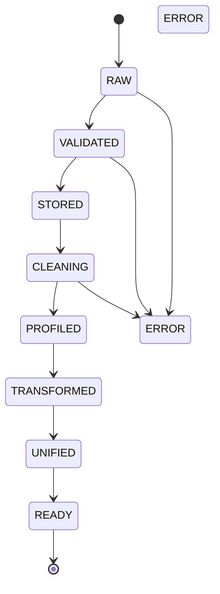
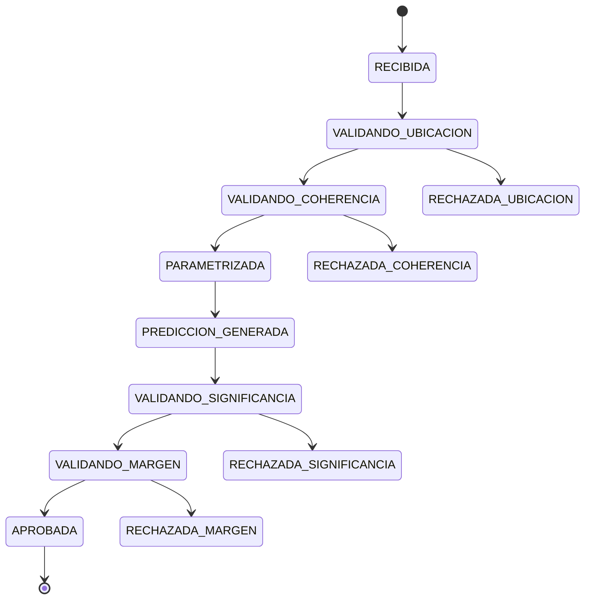

# State Diagrams (Mermaid)

## Dataset lifecycle

```mermaid
stateDiagram-v2
    [*] --> RAW
    RAW --> VALIDATED
    VALIDATED --> STORED
    STORED --> CLEANING
    CLEANING --> PROFILED
    PROFILED --> TRANSFORMED
    TRANSFORMED --> UNIFIED
    UNIFIED --> READY
    READY --> [*]
    anyState: ERROR
    RAW --> ERROR
    VALIDATED --> ERROR
    CLEANING --> ERROR
```

## Solicitud lifecycle

```mermaid
stateDiagram-v2
    [*] --> RECIBIDA
    RECIBIDA --> VALIDANDO_UBICACION
    VALIDANDO_UBICACION --> VALIDANDO_COHERENCIA
    VALIDANDO_COHERENCIA --> PARAMETRIZADA
    PARAMETRIZADA --> PREDICCION_GENERADA
    PREDICCION_GENERADA --> VALIDANDO_SIGNIFICANCIA
    VALIDANDO_SIGNIFICANCIA --> VALIDANDO_MARGEN
    VALIDANDO_MARGEN --> APROBADA
    APROBADA --> [*]

    VALIDANDO_UBICACION --> RECHAZADA_UBICACION
    VALIDANDO_COHERENCIA --> RECHAZADA_COHERENCIA
    VALIDANDO_SIGNIFICANCIA --> RECHAZADA_SIGNIFICANCIA
    VALIDANDO_MARGEN --> RECHAZADA_MARGEN
```
