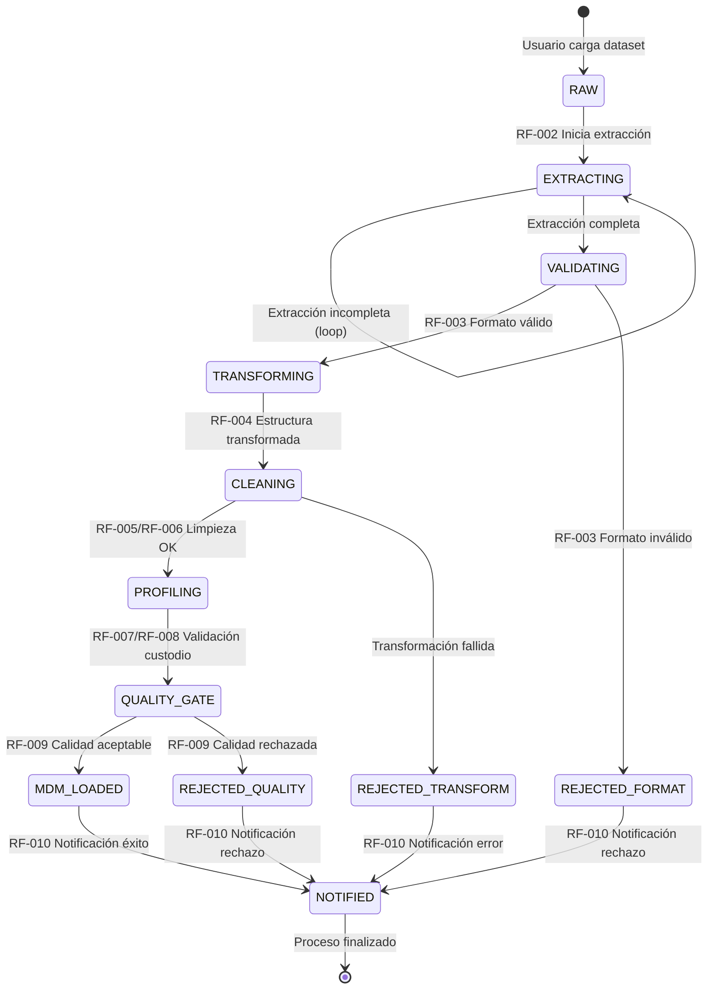

### Diagrama de Estados

```mermaid
stateDiagram-v2
    [*] --> RAW: Usuario carga dataset
    
    RAW --> EXTRACTING: RF-002 Inicia extracción
    EXTRACTING --> EXTRACTING: Extracción incompleta (loop)
    EXTRACTING --> VALIDATING: Extracción completa
    
    VALIDATING --> TRANSFORMING: RF-003 Formato válido
    VALIDATING --> REJECTED_FORMAT: RF-003 Formato inválido
    
    TRANSFORMING --> CLEANING: RF-004 Estructura transformada
    CLEANING --> PROFILING: RF-005/RF-006 Limpieza OK
    CLEANING --> REJECTED_TRANSFORM: Transformación fallida
    
    PROFILING --> QUALITY_GATE: RF-007/RF-008 Validación custodio
    QUALITY_GATE --> MDM_LOADED: RF-009 Calidad aceptable
    QUALITY_GATE --> REJECTED_QUALITY: RF-009 Calidad rechazada
    
    MDM_LOADED --> NOTIFIED: RF-010 Notificación éxito
    REJECTED_FORMAT --> NOTIFIED: RF-010 Notificación rechazo
    REJECTED_TRANSFORM --> NOTIFIED: RF-010 Notificación error
    REJECTED_QUALITY --> NOTIFIED: RF-010 Notificación rechazo
    
    NOTIFIED --> [*]: Proceso finalizado
```