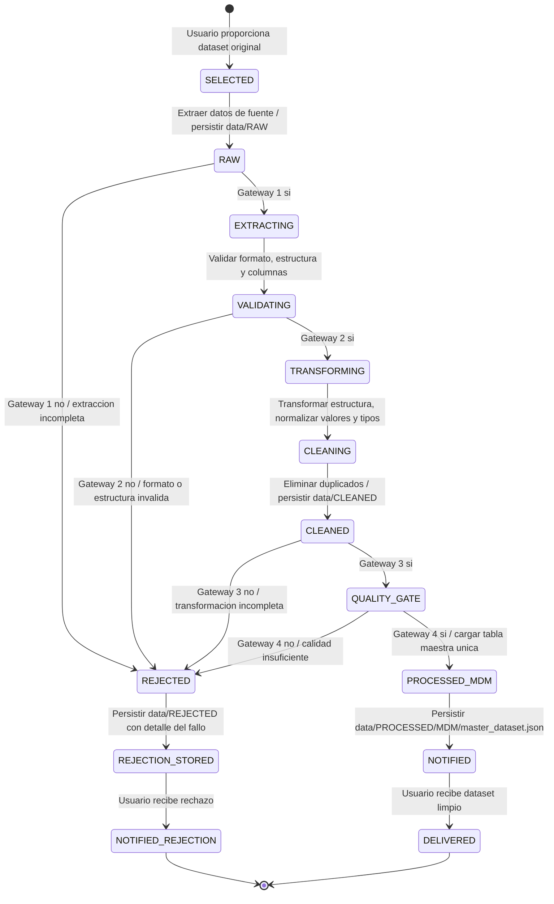

# State Diagram - Pipeline ETL BPMN

## Data Storages BPMN

- `data/RAW/`: datasets originales extraidos.
- `data/CLEANED/`: datasets transformados, normalizados y deduplicados.
- `data/PROCESSED/MDM/master_dataset.json`: tabla maestra unica.
- `data/REJECTED/`: rechazos con gateway, regla y detalle del fallo.
