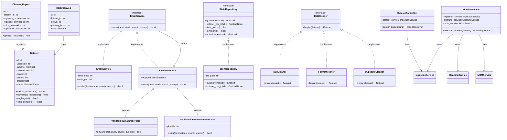

```mermaid
classDiagram
    class IDataRepository {
        <<interface>>
        +guardar(entidad)~Entidad
        +obtener_por_id(id)~Entidad|None
        +listar_todos()~list
        +eliminar(id)~bool
        +actualizar(entidad)~Entidad
    }

    class IEmailService {
        <<interface>>
        +enviar(destinatario, asunto, cuerpo)~bool
    }

    class IDataCleaner {
        <<interface>>
        +limpiar(dataset)~Dataset
    }

    class Dataset {
        -id: str
        -ubicacion: str
        -tamano_m2: float
        -habitaciones: int
        -banos: int
        -estrato: int
        -precio: float
        -status: DatasetStatus
        +validar_estructura()~bool
        +normalizar_ubicacion()~void
        +es_bogota()~bool
        +esta_completo()~bool
    }

    class CleaningReport {
        -id: str
        -dataset_id: str
        -registros_procesados: int
        -registros_eliminados: int
        -nulos_removidos: int
        -duplicados_removidos: int
        +generar_resumen()~str
    }

    class RejectionLog {
        -id: str
        -dataset_id: str
        -motivo: str
        -gateway_bpmn: str
        -fecha: datetime
    }

    class EmailService {
        -smtp_host: str
        -smtp_port: int
        +enviar(destinatario, asunto, cuerpo)~bool
    }

    class EmailDecorator {
        #wrapped: IEmailService
        +enviar(destinatario, asunto, cuerpo)~bool
    }

    class ValidacionEmailDecorator {
        +enviar(destinatario, asunto, cuerpo)~bool
    }

    class NotificacionInsercionDecorator {
        -plantilla: str
        +enviar(destinatario, asunto, cuerpo)~bool
    }

    class JsonRepository {
        -file_path: str
        +guardar(entidad)~Entidad
        +obtener_por_id(id)~Entidad|None
    }

    class NullCleaner {
        +limpiar(dataset)~Dataset
    }

    class FormatCleaner {
        +limpiar(dataset)~Dataset
    }

    class DuplicateCleaner {
        +limpiar(dataset)~Dataset
    }

    class PipelineFacade {
        -ingestion_service: IngestionService
        -cleaning_service: CleaningService
        -mdm_service: MDMService
        +ejecutar_pipeline(dataset)~CleaningReport
    }

    class DatasetController {
        -dataset_service: IngestionService
        +cargar_dataset(ruta)~ResponseDTO
    }

    IDataRepository <|.. JsonRepository : implements
    IEmailService <|.. EmailService : implements
    IEmailService <|.. EmailDecorator : implements
    EmailDecorator <|-- ValidacionEmailDecorator : extends
    EmailDecorator <|-- NotificacionInsercionDecorator : extends
    EmailDecorator o-- IEmailService : wraps
    DatasetController --> IngestionService : uses
    PipelineFacade --> IngestionService : uses
    PipelineFacade --> CleaningService : uses
    PipelineFacade --> MDMService : uses
    CleaningReport --> Dataset : reports on
    RejectionLog --> Dataset : logs
    IDataCleaner <|.. NullCleaner : implements
    IDataCleaner <|.. FormatCleaner : implements
    IDataCleaner <|.. DuplicateCleaner : implements
```
