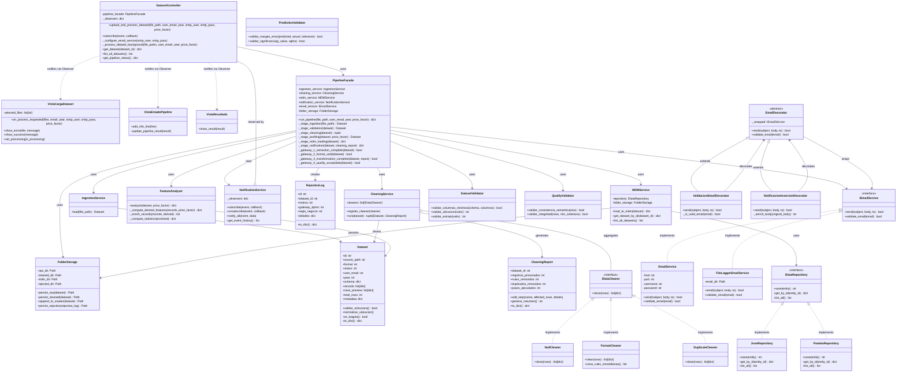

# UML Class Diagram - Sistema Data Wrangling

```mermaid
classDiagram
    class VistaCargaDataset {
        -selected_files: list[str]
        +on_process_requested(files, email, year, smtp_user, smtp_pass, price_factor)
        +show_error(title, message)
        +show_success(message)
        +set_processing(is_processing)
    }

    class VistaEstadoPipeline {
        +add_info_line(line)
        +update_pipeline_result(result)
    }

    class VistaResultado {
        +show_result(result)
    }

    class DatasetController {
        -pipeline_facade: PipelineFacade
        -_observers: dict
        +upload_and_process_dataset(file_path, user_email, year, smtp_user, smtp_pass, price_factor)
        +subscribe(event, callback)
        -_configure_email_service(smtp_user, smtp_pass)
        -_process_dataset_background(file_paths, user_email, year, price_factor)
        +get_dataset(dataset_id) dict
        +list_all_datasets() list
        +get_pipeline_status() dict
    }

    class PipelineFacade {
        -ingestion_service: IngestionService
        -cleaning_service: CleaningService
        -mdm_service: MDMService
        -notification_service: NotificationService
        -email_service: IEmailService
        -folder_storage: FolderStorage
        +run_pipeline(file_path, user_email, year, price_factor) dict
        -_stage_ingestion(file_path) Dataset
        -_stage_validation(dataset) Dataset
        -_stage_cleaning(dataset) tuple
        -_stage_profiling(dataset, price_factor) Dataset
        -_stage_mdm_loading(dataset) dict
        -_stage_notification(dataset, cleaning_report) dict
        -_gateway_1_extraction_complete(dataset) bool
        -_gateway_2_format_valid(dataset) bool
        -_gateway_3_transformation_complete(dataset, report) bool
        -_gateway_4_quality_acceptable(dataset) bool
    }

    class IngestionService {
        +load(file_path) Dataset
    }

    class CleaningService {
        -cleaners: list[IDataCleaner]
        +register_cleaner(cleaner)
        +run(dataset) tuple[Dataset, CleaningReport]
    }

    class MDMService {
        -repository: IDataRepository
        -folder_storage: FolderStorage
        +load_to_mdm(dataset) dict
        +get_dataset_by_id(dataset_id) dict
        +list_all_datasets() list
    }

    class FolderStorage {
        -raw_dir: Path
        -cleaned_dir: Path
        -mdm_dir: Path
        -rejected_dir: Path
        +persist_raw(dataset) Path
        +persist_cleaned(dataset) Path
        +append_to_master(dataset) Path
        +persist_rejection(rejection_log) Path
    }

    class NotificationService {
        -_observers: dict
        +subscribe(event, callback)
        +unsubscribe(event, callback)
        +notify_all(event, data)
        +get_event_history() list
    }

    class Dataset {
        +id: str
        +source_path: str
        +format: str
        +status: str
        +user_email: str
        +year: int
        +schema: dict
        +records: list[dict]
        +rows_preview: list[dict]
        +total_rows: int
        +metadata: dict
        +validar_estructura() bool
        +normalizar_ubicacion()
        +es_bogota() bool
        +to_dict() dict
    }

    class CleaningReport {
        +dataset_id: str
        +registros_procesados: int
        +nulos_removidos: int
        +duplicados_removidos: int
        +pasos_ejecutados: int
        +add_step(name, affected_rows, details)
        +generar_resumen() str
        +to_dict() dict
    }

    class RejectionLog {
        +id: str
        +dataset_id: str
        +motivo: str
        +gateway_bpmn: int
        +regla_negocio: str
        +detalles: dict
        +to_dict() dict
    }

    class FeatureAnalyzer {
        +analyze(dataset, price_factor) dict
        -_compute_derived_features(records, price_factor) dict
        -_enrich_records(records, derived) list
        -_compute_statistics(enriched) dict
    }

    class DatasetValidator {
        +validar_columnas_minimas(schema, columnas) bool
        +validar_ubicacion(valor) str
        +validar_estrato(valor) int
    }

    class QualityValidator {
        +validar_consistencia_semantica(row) bool
        +validar_integridad(rows, min_cobertura) bool
    }

    class PredictionValidator {
        +validar_margen_error(predicted, actual, tolerance) bool
        +validar_significancia(p_value, alpha) bool
    }

    class IDataCleaner {
        <<interface>>
        +clean(rows) list[dict]
    }

    class NullCleaner {
        +clean(rows) list[dict]
    }

    class FormatCleaner {
        +clean(rows) list[dict]
        +crear_rules_inmobiliarias() list
    }

    class DuplicateCleaner {
        +clean(rows) list[dict]
    }

    class IEmailService {
        <<interface>>
        +send(subject, body, to) bool
        +validate_email(email) bool
    }

    class EmailService {
        -host: str
        -port: int
        -username: str
        -password: str
        +send(subject, body, to) bool
        +validate_email(email) bool
    }

    class FileLoggerEmailService {
        -email_dir: Path
        +send(subject, body, to) bool
        +validate_email(email) bool
    }

    class EmailDecorator {
        <<abstract>>
        -_wrapped: IEmailService
        +send(subject, body, to) bool
        +validate_email(email) bool
    }

    class ValidacionEmailDecorator {
        +send(subject, body, to) bool
        -_is_valid_email(email) bool
    }

    class NotificacionInsercionDecorator {
        +send(subject, body, to) bool
        -_enrich_body(original_body) str
    }

    class IDataRepository {
        <<interface>>
        +save(entity) str
        +get_by_id(entity_id) dict
        +list_all() list
    }

    class JsonRepository {
        +save(entity) str
        +get_by_id(entity_id) dict
        +list_all() list
    }

    class PandasRepository {
        +save(entity) str
        +get_by_id(entity_id) dict
        +list_all() list
    }

    DatasetController --> PipelineFacade : uses
    DatasetController ..> VistaCargaDataset : notifies via Observer
    DatasetController ..> VistaEstadoPipeline : notifies via Observer
    DatasetController ..> VistaResultado : notifies via Observer

    PipelineFacade --> IngestionService : uses
    PipelineFacade --> CleaningService : uses
    PipelineFacade --> MDMService : uses
    PipelineFacade --> FolderStorage : uses
    PipelineFacade --> NotificationService : uses
    PipelineFacade --> IEmailService : uses
    PipelineFacade --> DatasetValidator : uses
    PipelineFacade --> QualityValidator : uses
    PipelineFacade --> FeatureAnalyzer : uses
    PipelineFacade --> RejectionLog : creates

    IngestionService --> Dataset : creates
    CleaningService --> Dataset : cleans
    CleaningService --> CleaningReport : generates
    CleaningService o-- IDataCleaner : aggregates

    IDataCleaner <|.. NullCleaner : implements
    IDataCleaner <|.. FormatCleaner : implements
    IDataCleaner <|.. DuplicateCleaner : implements

    FeatureAnalyzer --> Dataset : analyzes

    NotificationService o-- DatasetController : observed by

    IEmailService <|.. EmailService : implements
    IEmailService <|.. FileLoggerEmailService : implements
    EmailDecorator --> IEmailService : wraps
    EmailDecorator <|-- ValidacionEmailDecorator : extends
    EmailDecorator <|-- NotificacionInsercionDecorator : extends
    ValidacionEmailDecorator --> EmailDecorator : decorates
    NotificacionInsercionDecorator --> EmailDecorator : decorates

    MDMService --> IDataRepository : uses
    IDataRepository <|.. JsonRepository : implements
    IDataRepository <|.. PandasRepository : implements
    MDMService --> FolderStorage : persists
```
