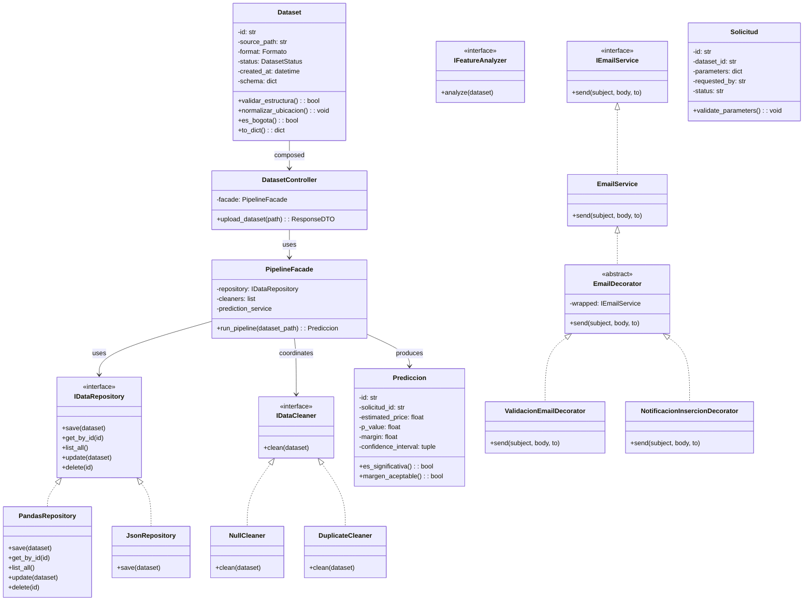

# UML Class Diagram (Mermaid)

```mermaid
classDiagram
    %% Interfaces
    class IDataRepository {
        <<interface>>
        +save(dataset)
        +get_by_id(id)
        +list_all()
        +update(dataset)
        +delete(id)
    }

    class IEmailService {
        <<interface>>
        +send(subject, body, to)
    }

    class IDataCleaner {
        <<interface>>
        +clean(dataset)
    }

    class IFeatureAnalyzer {
        <<interface>>
        +analyze(dataset)
    }

    %% Domain Entities
    class Dataset {
        -id: str
        -source_path: str
        -format: Formato
        -status: DatasetStatus
        -created_at: datetime
        -schema: dict
        +validar_estructura(): bool
        +normalizar_ubicacion(): void
        +es_bogota(): bool
        +to_dict(): dict
    }

    class Solicitud {
        -id: str
        -dataset_id: str
        -parameters: dict
        -requested_by: str
        -status: str
        +validate_parameters(): void
    }

    class Prediccion {
        -id: str
        -solicitud_id: str
        -estimated_price: float
        -p_value: float
        -margin: float
        -confidence_interval: tuple
        +es_significativa(): bool
        +margen_aceptable(): bool
    }

    %% Infrastructure implementations
    class PandasRepository {
        +save(dataset)
        +get_by_id(id)
        +list_all()
        +update(dataset)
        +delete(id)
    }

    class JsonRepository {
        +save(dataset)
    }

    class EmailService {
        +send(subject, body, to)
    }

    class EmailDecorator {
        <<abstract>>
        -wrapped: IEmailService
        +send(subject, body, to)
    }

    class ValidacionEmailDecorator {
        +send(subject, body, to)
    }

    class NotificacionInsercionDecorator {
        +send(subject, body, to)
    }

    class NullCleaner {
        +clean(dataset)
    }

    class DuplicateCleaner {
        +clean(dataset)
    }

    class PipelineFacade {
        -repository: IDataRepository
        -cleaners: list
        -prediction_service
        +run_pipeline(dataset_path): Prediccion
    }

    class DatasetController {
        -facade: PipelineFacade
        +upload_dataset(path): ResponseDTO
    }

    %% Relationships
    IDataRepository <|.. PandasRepository
    IDataRepository <|.. JsonRepository
    IEmailService <|.. EmailService
    EmailService <|.. EmailDecorator
    EmailDecorator <|.. ValidacionEmailDecorator
    EmailDecorator <|.. NotificacionInsercionDecorator
    IDataCleaner <|.. NullCleaner
    IDataCleaner <|.. DuplicateCleaner
    PipelineFacade --> IDataRepository : uses
    PipelineFacade --> IDataCleaner : coordinates
    DatasetController --> PipelineFacade : uses
    PipelineFacade --> Prediccion : produces
    Dataset --> DatasetController : composed

```
